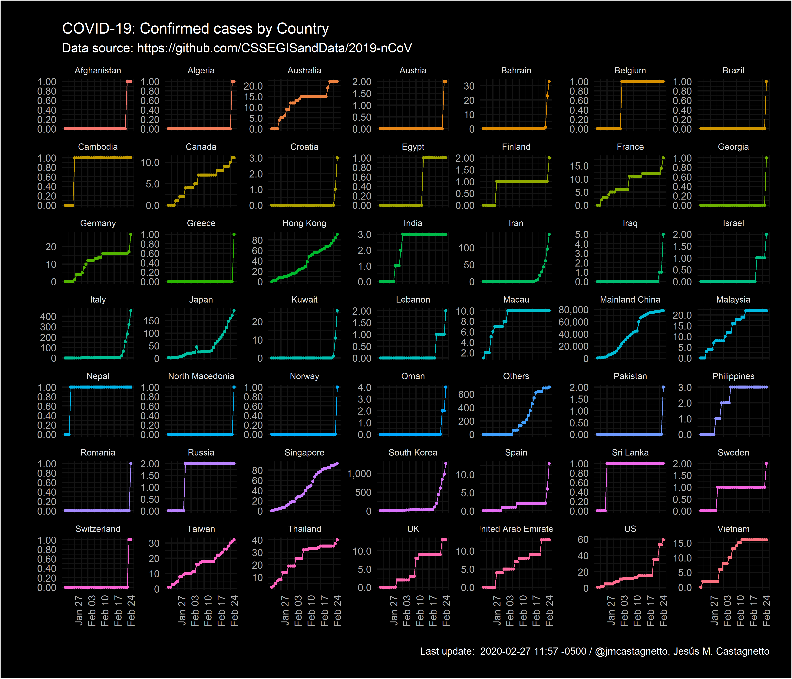
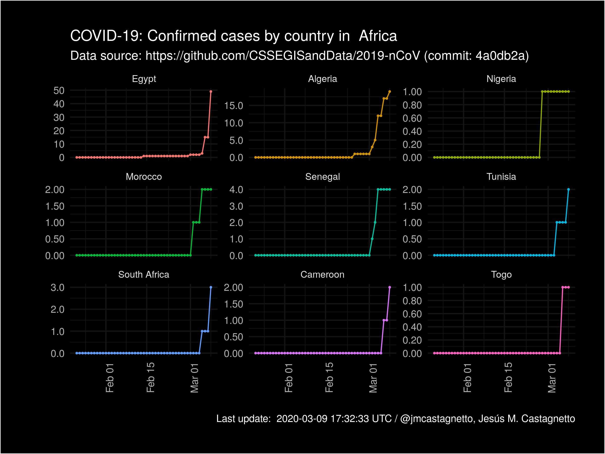
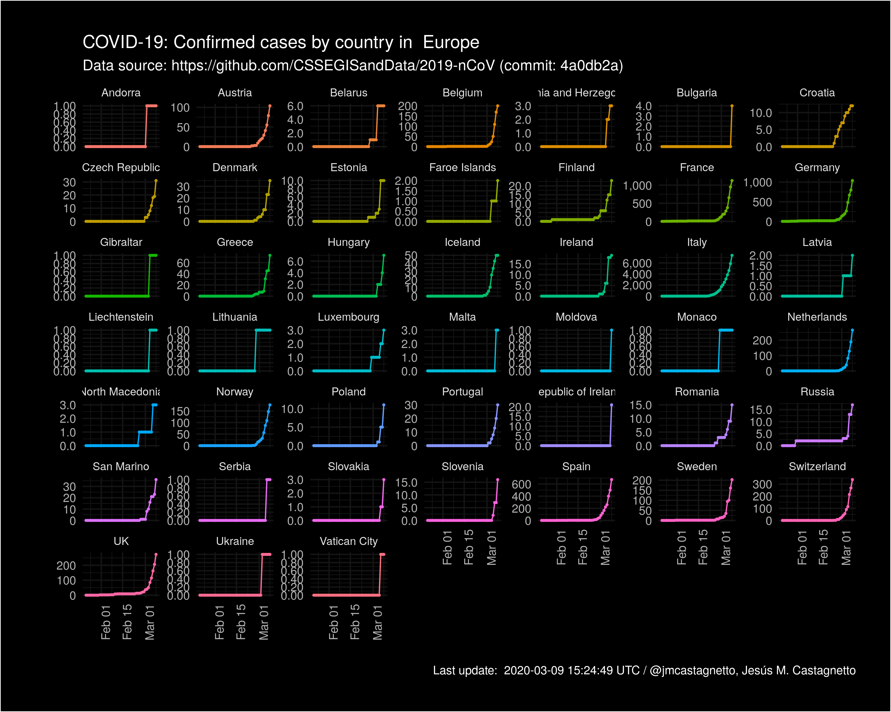
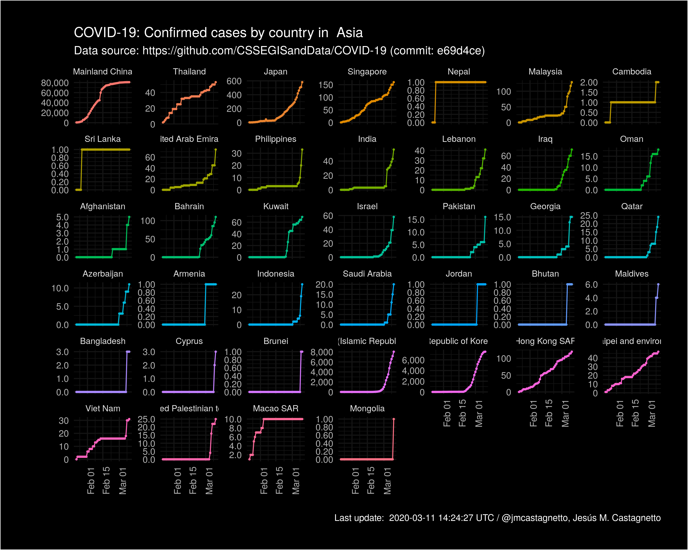
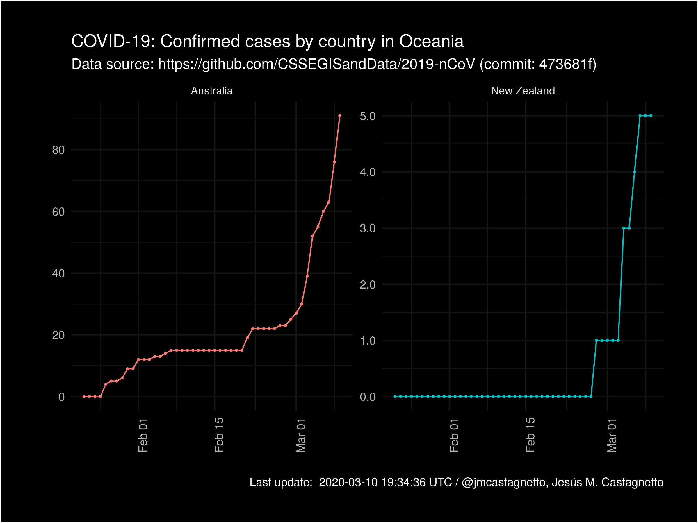
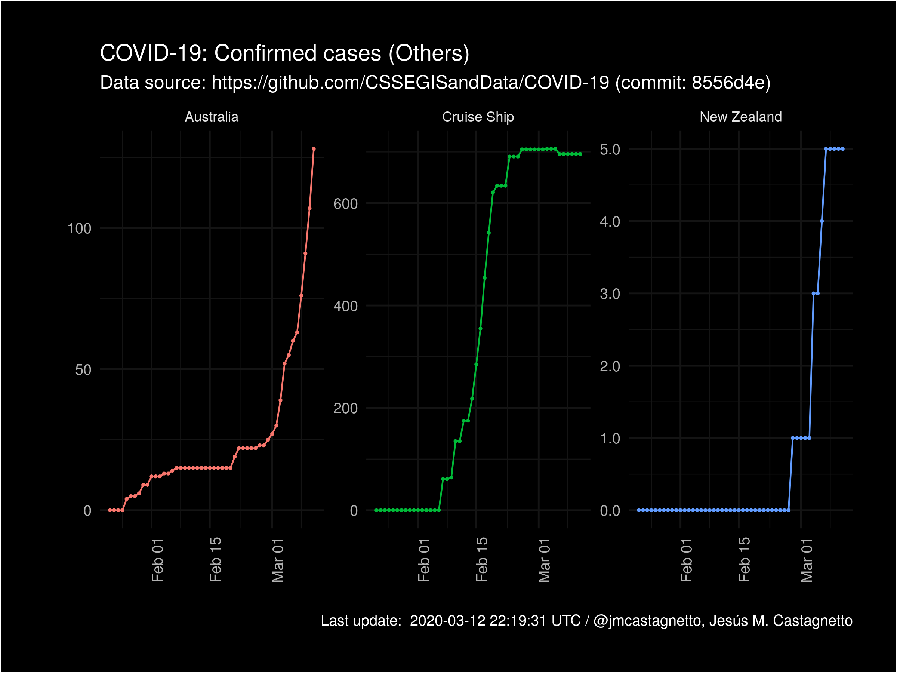

R scripts to process/cleanup data from the repo: https://github.com/CSSEGISandData/COVID-19

**Last updated on** `r Sys.time()`

**Data source commit reference**: [`r latest_commit_sha`](`r latest_commit_url`) 

*Notes*
- For the cases, I've used the filename to to get the timestamp, because that is more reliable
- **2020-02-14**: the original data source has changed its data structure, the timeseries data is empty as of the commit referred below.
- **2020-02-27**: changed code to reflect changes in source data files.
- **2020-03-04**: added Continents and ISO-3 country codes, using the `countrycode` R package.


```{r echo=FALSE}
library(tidyverse)
library(gh)

meta <- gh("GET /repos/:owner/:repo/git/refs",
           owner = "CSSEGISandData",
           repo = "COVID-19")

latest_commit_sha <- meta[[1]]$object$sha
latest_commit_url <- meta[[1]]$object$url
```

Here are couple of quick tables (with naive rate estimates):

```{r echo=FALSE}
ts_confirmed <- readRDS("data/covid-19_ts_confirmed.rds")
ts_deaths <- readRDS("data/covid-19_ts_deaths.rds")
ts_recovered <- readRDS("data/covid-19_ts_recovered.rds")

# Naive rates, need to account for lag ~ 14d (estimated)
latest_rates <- as_tibble(ts_confirmed) %>%
  filter(ts == max(ts)) %>%
  select(-lat, -long, -ts) %>%
  left_join(
    as_tibble(ts_deaths) %>%
      filter(ts == max(ts)) %>%
      select(-lat, -long, -ts),
    by = c("continent", "iso3c", "country_region", "province_state")
  ) %>%
  left_join(
    as_tibble(ts_recovered) %>%
      filter(ts == max(ts)) %>%
      select(-lat, -long, -ts),
    by = c("continent", "iso3c", "country_region", "province_state")
  ) %>%
  arrange(desc(confirmed), country_region) %>%
  mutate(
    confirmed_pct = 100 * confirmed / sum(confirmed, na.rm = TRUE),
    death_rate = 100 * ifelse(is.na(deaths), 0, deaths) / confirmed,
    recovery_rate = 100 * ifelse(is.na(recovered), 0, recovered) / confirmed
  )

china <- latest_rates %>%
  filter(iso3c == "CHN")

not_china <- latest_rates %>%
  filter(iso3c != "CHN")
```

[For cases in China](https://github.com/jmcastagnetto/covid-19-data-cleanup/blob/master/latest_china_rates.md)

```{r echo=FALSE, results="markup"}
knitr::kable(china,
             format = "markdown", digits = 2,
             caption = paste("Latest rates in China:", max(ts_confirmed$ts))
)
```

[For cases outside China](https://github.com/jmcastagnetto/covid-19-data-cleanup/blob/master/latest_not_china_rates.md) 

```{r echo=FALSE, results="markup"}
knitr::kable(not_china,
               format = "markdown", digits = 2,
               caption = paste("Latest rates outside China:", max(ts_confirmed$ts))
               )
```

Confirmed cases by country (Worldwide):



Confirmed cases by country (Africa):



Confirmed cases by country (Americas):



Confirmed cases by country (Asia):



Confirmed cases by country (Europe):


Confirmed cases by country (Oceania):



Confirmed cases by country (Others):



