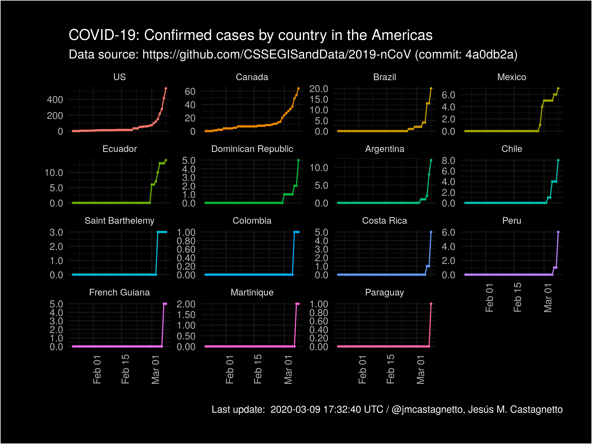

```{r echo=FALSE, include=FALSE}
library(tidyverse)
library(gh)

meta <- gh("GET /repos/:owner/:repo/git/refs",
           owner = "CSSEGISandData",
           repo = "COVID-19")

latest_commit_sha <- meta[[1]]$object$sha
latest_commit_api_url <- meta[[1]]$object$url
commit_details <- jsonlite::fromJSON(latest_commit_api_url)
latest_commit_url <- commit_details$html_url

ts_confirmed <- readRDS("data/covid-19_ts_confirmed.rds")
ts_deaths <- readRDS("data/covid-19_ts_deaths.rds")
ts_recovered <- readRDS("data/covid-19_ts_recovered.rds")

zero_na <- function(x) {
	ifelse(is.na(x), 0, x)
}

# global percentages
latest_ratios <- as_tibble(ts_confirmed) %>%
  filter(ts == max(ts)) %>%
  select(-lat, -lon, -ts) %>%
  left_join(
    as_tibble(ts_deaths) %>%
      filter(ts == max(ts)) %>%
      select(-lat, -lon, -ts),
    by = c("continent", 
           "iso3c", "country_region", 
           "province_state",
           "who_region_code", "who_region",
           "world_bank_income_group",
           "world_bank_income_group_code",
           "world_bank_income_group_gni_reference_year",
           "world_bank_income_group_release_date")
  ) %>%
  left_join(
    as_tibble(ts_recovered) %>%
      filter(ts == max(ts)) %>%
      select(-lat, -lon, -ts),
    by = c("continent", 
           "iso3c", "country_region", 
           "province_state",
           "who_region_code", "who_region",
           "world_bank_income_group",
           "world_bank_income_group_code",
           "world_bank_income_group_gni_reference_year",
           "world_bank_income_group_release_date")
  ) %>%
  arrange(desc(confirmed), country_region) %>%
  mutate(
    global_confirmed_pct = 100 * zero_na(confirmed) / sum(confirmed, na.rm = TRUE),
    global_death_pct = 100 * zero_na(deaths) / sum(deaths, na.rm = TRUE),
    global_recovered_pct = 100 * zero_na(recovered) / sum(recovered, na.m = TRUE)
  ) %>% 
  select(
    1:5,12:16,6:11
  )

china <- latest_ratios %>%
  filter(iso3c == "CHN")

not_china <- latest_ratios %>%
  filter(iso3c != "CHN")

```


R scripts to process/cleanup data from the repo: https://github.com/CSSEGISandData/COVID-19 into tidy datasets[^tidypaper]

[^tidypaper]: "Tidy Data" H. Wickham, https://www.jstatsoft.org/article/view/v059i10

**Last updated on** `r format(lubridate::now(tzone = "UTC"), "%F %T %Z")`

**Data source commit reference**: [`r latest_commit_sha`](`r latest_commit_url`) 

*Notes*

  - For the cases, I've used the filename to to get the timestamp, because that is more reliable
  - **2020-02-14**: the original data source has changed its data structure, the timeseries data is empty as of the commit referred below.
  - **2020-02-27**: changed code to reflect changes in source data files.
  - **2020-03-04**: added Continents and ISO-3 country codes, using the `countrycode` R package.
  - **2020-03-05**: 
	- Latitude and longitude information started appearing in cases files in March, used that to add that information the rest of the cases.
	- Added code to tidy the WHO situation report timeseries
  - **2020-03-12**: source data no longer has the classification "Others" for locations not corresponding to countries (i.e. Cruise Ships), so the code has been modified to account for that change.

-----

### Confirmed cases by country (Worldwide):


### Confirmed cases by country in Africa:


### Confirmed cases by country in the Americas:



### Confirmed cases by country in Asia:


### Confirmed cases by country in Europe:


### Confirmed cases by country in Oceania:


### Confirmed cases (Other locations):


-----

Here are couple of quick tables:

[For cases in China](https://github.com/jmcastagnetto/covid-19-data-cleanup/blob/master/latest_china_ratios.md)

```{r echo=FALSE, results="asis"}
knitr::kable(china,
             format = "pandoc", digits = 3,
             caption = paste("Latest rates in China:", max(ts_confirmed$ts))
)
```

[For cases outside China](https://github.com/jmcastagnetto/covid-19-data-cleanup/blob/master/latest_not_china_ratios.md) 

```{r echo=FALSE, results="asis"}
knitr::kable(not_china,
               format = "pandoc", digits = 3,
               caption = paste("Latest rates outside China:", max(ts_confirmed$ts))
               )
```

