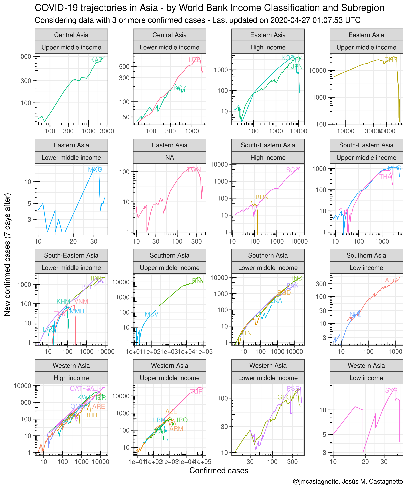

R scripts to process/cleanup data from the repo:
<a href="https://github.com/CSSEGISandData/COVID-19" class="uri">https://github.com/CSSEGISandData/COVID-19</a>
into tidy datasets[1]

**Last updated on** 2020-07-06 01:03:07 UTC

**Data source commit reference**:
[3200a6b24301ff12cf13ac969e3c60c8e245c4ce](https://github.com/CSSEGISandData/COVID-19/commit/3200a6b24301ff12cf13ac969e3c60c8e245c4ce)

*Notes*

-   For the cases, I’ve used the filename to to get the timestamp,
    because that is more reliable
-   **2020-02-14**: the original data source has changed its data
    structure, the timeseries data is empty as of the commit referred
    below.
-   **2020-02-27**: changed code to reflect changes in source data
    files.
-   **2020-03-04**: added Continents and ISO-3 country codes, using the
    `countrycode` R package.
-   **2020-03-05**:
    -   Latitude and longitude information started appearing in cases
        files in March, used that to add that information the rest of
        the cases.
    -   Added code to tidy the WHO situation report timeseries
-   **2020-03-12**: source data no longer has the classification
    “Others” for locations not corresponding to countries (i.e. Cruise
    Ships), so the code has been modified to account for that change.
-   **2020-04-01**: the new US only timeseries data files from the
    source, have different number of columns, the file containing the
    deaths has a `Population` column that is not present in the cofirmed
    cases file.
-   **2020-04-05**: csv files are now gzip compressed to avoid hitting
    github’s max file size

------------------------------------------------------------------------

About the processed data files
------------------------------

### Cases

**Files**

-   `covid-19_cases_raw.csv.gz`: CSV with processed cases file
-   `covid-19_cases_raw.RDS`: RDS format version

**Data structure**:

-   continent: Geographical continent
-   who\_region: WHO region
-   country\_region: Country (or region)
-   iso3c: ISO 3166-1 alpha-3 country code
-   province\_state: Province/State/Subnational division
-   confirmed: Cummulative number of confirmed cases
-   dead: Cummulative number of deaths
-   recovered: Cummulative number of recovered cases
-   lat: Latitude
-   lon: Longitude
-   update: Entry timestamp update in “YYYY-MM-DD hh:mm:ss” format
-   data\_update: Data file update date in “YYYY-MM-DD” format
-   who\_region\_code: WHO region code
-   who\_region: WHO region
-   world\_bank\_income\_group: World Bank Income Group
-   world\_bank\_income\_group\_code: World Bank Income Group code
-   world\_bank\_income\_group\_gni\_reference\_year: World Bank Income
    Group GNI reference year
-   world\_bank\_income\_group\_release\_date: World Bank Income Group
    release year

### Global timeseries data

**Files**

-   `covid-19_ts_combined.csv.gz`: CSV with combined timeseries data
-   `covid-19_ts_combined.rds`: RDS version (`tsibble`)

**Data structure**:

-   continent: Geographical continent
-   iso3c: ISO 3166-1 alpha-3 country code
-   country\_region: Country (or region)
-   province\_state: Province/State/Subnational division
-   ts: UTC date in “YYYY-MM-DD” format
-   status: “confirmed”, “deaths”, “recovered”
-   number: number of cases
-   lat: Latitude
-   lon: Longitude
-   who\_region: WHO region
-   who\_region\_code: WHO region code
-   world\_bank\_income\_group: World Bank Income Group
-   world\_bank\_income\_group\_code: World Bank Income Group code
-   world\_bank\_income\_group\_gni\_reference\_year: World Bank Income
    Group GNI reference year
-   world\_bank\_income\_group\_release\_date: World Bank Income Group
    release year

**Files**

-   `covid-19_ts_confirmed.csv.gz`: CSV file with confirmed cases
-   `covid-19_ts_confirmed.rds`: RDS version (`tsibble`)

**Data structure**:

-   continent: Geographical continent
-   iso3c: ISO 3166-1 alpha-3 country code
-   country\_region: Country (or region)
-   province\_state: Province/State/Subnational division
-   ts: UTC date in “YYYY-MM-DD” format
-   confirmed: number of confirmed cases
-   lat: Latitude
-   lon: Longitude
-   who\_region: WHO region
-   who\_region\_code: WHO region code
-   world\_bank\_income\_group: World Bank Income Group
-   world\_bank\_income\_group\_code: World Bank Income Group code
-   world\_bank\_income\_group\_gni\_reference\_year: World Bank Income
    Group GNI reference year
-   world\_bank\_income\_group\_release\_date: World Bank Income Group
    release year

**Files**

-   `covid-19_ts_deaths.csv.gz`: CSV file with deaths
-   `covid-19_ts_deaths.rds`: RDS version (`tsibble`)

**Data structure**:

-   continent: Geographical continent
-   iso3c: ISO 3166-1 alpha-3 country code
-   country\_region: Country (or region)
-   province\_state: Province/State/Subnational division
-   ts: UTC date in “YYYY-MM-DD” format
-   deaths: number of deaths
-   lat: Latitude
-   lon: Longitude
-   who\_region: WHO region
-   who\_region\_code: WHO region code
-   world\_bank\_income\_group: World Bank Income Group
-   world\_bank\_income\_group\_code: World Bank Income Group code
-   world\_bank\_income\_group\_gni\_reference\_year: World Bank Income
    Group GNI reference year
-   world\_bank\_income\_group\_release\_date: World Bank Income Group
    release year

**Files**

-   `covid-19_ts_recovered.csv.gz`: CSV file with recovered cases
-   `covid-19_ts_recovered.rds`: RDS version (`tsibble`)

**Data structure**:

-   continent: Geographical continent
-   iso3c: ISO 3166-1 alpha-3 country code
-   country\_region: Country (or region)
-   province\_state: Province/State/Subnational division
-   ts: UTC date in “YYYY-MM-DD” format
-   recovered: number of people who recovered
-   lat: Latitude
-   lon: Longitude
-   who\_region: WHO region
-   who\_region\_code: WHO region code
-   world\_bank\_income\_group: World Bank Income Group
-   world\_bank\_income\_group\_code: World Bank Income Group code
-   world\_bank\_income\_group\_gni\_reference\_year: World Bank Income
    Group GNI reference year
-   world\_bank\_income\_group\_release\_date: World Bank Income Group
    release year

### US timeseries data

**Files**

-   `covid-19_ts_us_combined.csv.gz`: CSV with combined timeseries data
-   `covid-19_ts_us_combined.rds`: RDS version (`tsibble`)

**Data structure**:

-   continent: Geographical continent
-   iso3c: ISO 3166-1 alpha-3 country code
-   country\_region: Country (or region)
-   province\_state: Province/State/Subnational division
-   ts: UTC date in “YYYY-MM-DD” format
-   status: “confirmed”, “deaths”, “recovered”
-   number: number of cases
-   lat: Latitude
-   lon: Longitude
-   who\_region: WHO region
-   who\_region\_code: WHO region code
-   world\_bank\_income\_group: World Bank Income Group
-   world\_bank\_income\_group\_code: World Bank Income Group code
-   world\_bank\_income\_group\_gni\_reference\_year: World Bank Income
    Group GNI reference year
-   world\_bank\_income\_group\_release\_date: World Bank Income Group
    release year

**Files**

-   `covid-19_ts_us_confirmed.csv.gz`: CSV file with confirmed cases for
    US
-   `covid-19_ts_us_confirmed.rds`: RDS version (`tsibble`)

**Data structure**:

-   continent: Geographical continent
-   iso3c: ISO 3166-1 alpha-3 country code
-   country\_region: Country (or region)
-   province\_state: Province/State/Subnational division
-   ts: UTC date in “YYYY-MM-DD” format
-   confirmed: number of confirmed cases
-   lat: Latitude
-   lon: Longitude
-   who\_region: WHO region
-   who\_region\_code: WHO region code
-   world\_bank\_income\_group: World Bank Income Group
-   world\_bank\_income\_group\_code: World Bank Income Group code
-   world\_bank\_income\_group\_gni\_reference\_year: World Bank Income
    Group GNI reference year
-   world\_bank\_income\_group\_release\_date: World Bank Income Group
    release year

**Files**

-   `covid-19_ts_us_deaths.csv.gz`: CSV file with deaths for US
-   `covid-19_ts_us_deaths.rds`: RDS version (`tsibble`)

**Data structure**:

-   continent: Geographical continent
-   iso3c: ISO 3166-1 alpha-3 country code
-   country\_region: Country (or region)
-   province\_state: Province/State/Subnational division
-   ts: UTC date in “YYYY-MM-DD” format
-   deaths: number of deaths
-   lat: Latitude
-   lon: Longitude
-   who\_region: WHO region
-   who\_region\_code: WHO region code
-   world\_bank\_income\_group: World Bank Income Group
-   world\_bank\_income\_group\_code: World Bank Income Group code
-   world\_bank\_income\_group\_gni\_reference\_year: World Bank Income
    Group GNI reference year
-   world\_bank\_income\_group\_release\_date: World Bank Income Group
    release year

### WHO situation report data:

**Files**:

-   `covid-19_who_sitrep_raw.rds`: Lightly cleaned WHO situation report
    in RDS format
-   `covid-19_ts_who_sitrep.csv.gz`: Timeseries from WHO situation
    reports
-   `covid-19_ts_who_sitrep.rds`: RDS version (`tsibble`)

**Data structure**:

-   continent: Geographical continent
-   iso3c: ISO 3166-1 alpha-3 country code
-   country\_region: Country (or region)
-   province\_state: Province/State/Subnational division
-   ts: UTC date in “YYYY-MM-DD” format
-   cases: number of cases at ts
-   who\_region: WHO region
-   who\_region\_code: WHO region code
-   world\_bank\_income\_group: World Bank Income Group
-   world\_bank\_income\_group\_code: World Bank Income Group code
-   world\_bank\_income\_group\_gni\_reference\_year: World Bank Income
    Group GNI reference year
-   world\_bank\_income\_group\_release\_date: World Bank Income Group
    release year

### WHO metadata

**Source**:
<a href="https://apps.who.int/gho/data/node.metadata.COUNTRY?lang=en" class="uri">https://apps.who.int/gho/data/node.metadata.COUNTRY?lang=en</a>
(CSV Xmart format)

**Files**:

-   `xmart.csv`: CSV Xmart format (downloaded on 2020-03-09)
-   `who_metadata.Rdata`: Rdata format version

**Data structure**:

-   continent: Geographical continent
-   who\_region: WHO region
-   country\_region: Country (or region)
-   iso3c: ISO 3166-1 alpha-3 country code
-   province\_state: Province/State/Subnational division
-   ts: UTC timestamp in “YYYY-MM-DD hh:mm:ss” format
-   cases: Number of cases
-   who\_region\_code: Code for WHO region
-   world\_bank\_income\_group: World Bank Income Group
-   world\_bank\_income\_group\_code: World Bank Income Group code
-   world\_bank\_income\_group\_gni\_reference\_year: World Bank Income
    Group GNI reference year
-   world\_bank\_income\_group\_release\_date: World Bank Income Group
    release year

### World Bank population estimate for 2020

**Source**:
<a href="https://databank.worldbank.org/source/population-estimates-and-projections" class="uri">https://databank.worldbank.org/source/population-estimates-and-projections</a>

**Files**: -
`Data_Extract_From_Population_estimates_and_projections.zip`: data and
metadata from World Bank (dowloaded on 2020-03-14) -
`wb_population.Rdata`: Rdata format

**Data Structure** (Rdata file):

-   country\_name: Country name
-   country\_code: ISO 3166-1 alpha-3 country code
-   series\_name: World Bank variable name
-   series\_code: World Bank variable code
-   population\_2020: Estimated polution for 2020

------------------------------------------------------------------------

Plots of confirmed cases
------------------------

### Confirmed cases by country (Worldwide):

### Africa

#### Confirmed cases by country in Africa:

#### Confirmed cases by country in Africa (per million inhabitants):

#### Trajectories in Africa

### Americas

#### Confirmed cases by country in the Americas:

#### Confirmed cases by country in the Americas per million inhabitants:

#### Trajectories in the Americas

### Asia

#### Confirmed cases by country in Asia:

#### Confirmed cases by country in Asia per million inhabitants:

#### Trajectories in Asia

### Europe

#### Confirmed cases by country in Europe:

#### Confirmed cases by country in Europe per million inhabitants:

#### Trajectories in Europe

### Oceania

#### Confirmed cases by country in Oceania:

#### Confirmed cases by country in Oceania per million inhabitants:

#### Trajectories in Oceania

### Confirmed cases (Other locations):

------------------------------------------------------------------------

Here are couple of quick tables:

[For cases in
China](https://github.com/jmcastagnetto/covid-19-data-cleanup/blob/master/latest_china_ratios.md)

<table>
<caption>Latest rates in China: 2020-07-04</caption>
<colgroup>
<col style="width: 3%" />
<col style="width: 2%" />
<col style="width: 5%" />
<col style="width: 5%" />
<col style="width: 3%" />
<col style="width: 2%" />
<col style="width: 3%" />
<col style="width: 7%" />
<col style="width: 5%" />
<col style="width: 7%" />
<col style="width: 5%" />
<col style="width: 5%" />
<col style="width: 8%" />
<col style="width: 9%" />
<col style="width: 14%" />
<col style="width: 12%" />
</colgroup>
<thead>
<tr class="header">
<th style="text-align: left;">continent</th>
<th style="text-align: left;">iso3c</th>
<th style="text-align: left;">country_region</th>
<th style="text-align: left;">province_state</th>
<th style="text-align: right;">confirmed</th>
<th style="text-align: right;">deaths</th>
<th style="text-align: right;">recovered</th>
<th style="text-align: right;">global_confirmed_pct</th>
<th style="text-align: right;">global_death_pct</th>
<th style="text-align: right;">global_recovered_pct</th>
<th style="text-align: left;">who_region_code</th>
<th style="text-align: left;">who_region</th>
<th style="text-align: left;">world_bank_income_group</th>
<th style="text-align: left;">world_bank_income_group_code</th>
<th style="text-align: left;">world_bank_income_group_gni_reference_year</th>
<th style="text-align: left;">world_bank_income_group_release_date</th>
</tr>
</thead>
<tbody>
<tr class="odd">
<td style="text-align: left;">Asia</td>
<td style="text-align: left;">CHN</td>
<td style="text-align: left;">China</td>
<td style="text-align: left;">Hubei</td>
<td style="text-align: right;">68135</td>
<td style="text-align: right;">4512</td>
<td style="text-align: right;">63623</td>
<td style="text-align: right;">0.605</td>
<td style="text-align: right;">0.850</td>
<td style="text-align: right;">1.062</td>
<td style="text-align: left;">WPR</td>
<td style="text-align: left;">Western Pacific</td>
<td style="text-align: left;">Upper middle income</td>
<td style="text-align: left;">WB_UMI</td>
<td style="text-align: left;">2017</td>
<td style="text-align: left;">2018</td>
</tr>
<tr class="even">
<td style="text-align: left;">Asia</td>
<td style="text-align: left;">CHN</td>
<td style="text-align: left;">China</td>
<td style="text-align: left;">Guangdong</td>
<td style="text-align: right;">1643</td>
<td style="text-align: right;">8</td>
<td style="text-align: right;">1631</td>
<td style="text-align: right;">0.015</td>
<td style="text-align: right;">0.002</td>
<td style="text-align: right;">0.027</td>
<td style="text-align: left;">WPR</td>
<td style="text-align: left;">Western Pacific</td>
<td style="text-align: left;">Upper middle income</td>
<td style="text-align: left;">WB_UMI</td>
<td style="text-align: left;">2017</td>
<td style="text-align: left;">2018</td>
</tr>
<tr class="odd">
<td style="text-align: left;">Asia</td>
<td style="text-align: left;">CHN</td>
<td style="text-align: left;">China</td>
<td style="text-align: left;">Henan</td>
<td style="text-align: right;">1276</td>
<td style="text-align: right;">22</td>
<td style="text-align: right;">1254</td>
<td style="text-align: right;">0.011</td>
<td style="text-align: right;">0.004</td>
<td style="text-align: right;">0.021</td>
<td style="text-align: left;">WPR</td>
<td style="text-align: left;">Western Pacific</td>
<td style="text-align: left;">Upper middle income</td>
<td style="text-align: left;">WB_UMI</td>
<td style="text-align: left;">2017</td>
<td style="text-align: left;">2018</td>
</tr>
<tr class="even">
<td style="text-align: left;">Asia</td>
<td style="text-align: left;">CHN</td>
<td style="text-align: left;">China</td>
<td style="text-align: left;">Zhejiang</td>
<td style="text-align: right;">1269</td>
<td style="text-align: right;">1</td>
<td style="text-align: right;">1267</td>
<td style="text-align: right;">0.011</td>
<td style="text-align: right;">0.000</td>
<td style="text-align: right;">0.021</td>
<td style="text-align: left;">WPR</td>
<td style="text-align: left;">Western Pacific</td>
<td style="text-align: left;">Upper middle income</td>
<td style="text-align: left;">WB_UMI</td>
<td style="text-align: left;">2017</td>
<td style="text-align: left;">2018</td>
</tr>
<tr class="odd">
<td style="text-align: left;">Asia</td>
<td style="text-align: left;">CHN</td>
<td style="text-align: left;">China</td>
<td style="text-align: left;">Hong Kong</td>
<td style="text-align: right;">1258</td>
<td style="text-align: right;">7</td>
<td style="text-align: right;">1145</td>
<td style="text-align: right;">0.011</td>
<td style="text-align: right;">0.001</td>
<td style="text-align: right;">0.019</td>
<td style="text-align: left;">WPR</td>
<td style="text-align: left;">Western Pacific</td>
<td style="text-align: left;">Upper middle income</td>
<td style="text-align: left;">WB_UMI</td>
<td style="text-align: left;">2017</td>
<td style="text-align: left;">2018</td>
</tr>
<tr class="even">
<td style="text-align: left;">Asia</td>
<td style="text-align: left;">CHN</td>
<td style="text-align: left;">China</td>
<td style="text-align: left;">Hunan</td>
<td style="text-align: right;">1019</td>
<td style="text-align: right;">4</td>
<td style="text-align: right;">1015</td>
<td style="text-align: right;">0.009</td>
<td style="text-align: right;">0.001</td>
<td style="text-align: right;">0.017</td>
<td style="text-align: left;">WPR</td>
<td style="text-align: left;">Western Pacific</td>
<td style="text-align: left;">Upper middle income</td>
<td style="text-align: left;">WB_UMI</td>
<td style="text-align: left;">2017</td>
<td style="text-align: left;">2018</td>
</tr>
<tr class="odd">
<td style="text-align: left;">Asia</td>
<td style="text-align: left;">CHN</td>
<td style="text-align: left;">China</td>
<td style="text-align: left;">Anhui</td>
<td style="text-align: right;">991</td>
<td style="text-align: right;">6</td>
<td style="text-align: right;">985</td>
<td style="text-align: right;">0.009</td>
<td style="text-align: right;">0.001</td>
<td style="text-align: right;">0.016</td>
<td style="text-align: left;">WPR</td>
<td style="text-align: left;">Western Pacific</td>
<td style="text-align: left;">Upper middle income</td>
<td style="text-align: left;">WB_UMI</td>
<td style="text-align: left;">2017</td>
<td style="text-align: left;">2018</td>
</tr>
<tr class="even">
<td style="text-align: left;">Asia</td>
<td style="text-align: left;">CHN</td>
<td style="text-align: left;">China</td>
<td style="text-align: left;">Heilongjiang</td>
<td style="text-align: right;">947</td>
<td style="text-align: right;">13</td>
<td style="text-align: right;">934</td>
<td style="text-align: right;">0.008</td>
<td style="text-align: right;">0.002</td>
<td style="text-align: right;">0.016</td>
<td style="text-align: left;">WPR</td>
<td style="text-align: left;">Western Pacific</td>
<td style="text-align: left;">Upper middle income</td>
<td style="text-align: left;">WB_UMI</td>
<td style="text-align: left;">2017</td>
<td style="text-align: left;">2018</td>
</tr>
<tr class="odd">
<td style="text-align: left;">Asia</td>
<td style="text-align: left;">CHN</td>
<td style="text-align: left;">China</td>
<td style="text-align: left;">Jiangxi</td>
<td style="text-align: right;">932</td>
<td style="text-align: right;">1</td>
<td style="text-align: right;">931</td>
<td style="text-align: right;">0.008</td>
<td style="text-align: right;">0.000</td>
<td style="text-align: right;">0.016</td>
<td style="text-align: left;">WPR</td>
<td style="text-align: left;">Western Pacific</td>
<td style="text-align: left;">Upper middle income</td>
<td style="text-align: left;">WB_UMI</td>
<td style="text-align: left;">2017</td>
<td style="text-align: left;">2018</td>
</tr>
<tr class="even">
<td style="text-align: left;">Asia</td>
<td style="text-align: left;">CHN</td>
<td style="text-align: left;">China</td>
<td style="text-align: left;">Beijing</td>
<td style="text-align: right;">928</td>
<td style="text-align: right;">9</td>
<td style="text-align: right;">595</td>
<td style="text-align: right;">0.008</td>
<td style="text-align: right;">0.002</td>
<td style="text-align: right;">0.010</td>
<td style="text-align: left;">WPR</td>
<td style="text-align: left;">Western Pacific</td>
<td style="text-align: left;">Upper middle income</td>
<td style="text-align: left;">WB_UMI</td>
<td style="text-align: left;">2017</td>
<td style="text-align: left;">2018</td>
</tr>
<tr class="odd">
<td style="text-align: left;">Asia</td>
<td style="text-align: left;">CHN</td>
<td style="text-align: left;">China</td>
<td style="text-align: left;">Shandong</td>
<td style="text-align: right;">792</td>
<td style="text-align: right;">7</td>
<td style="text-align: right;">785</td>
<td style="text-align: right;">0.007</td>
<td style="text-align: right;">0.001</td>
<td style="text-align: right;">0.013</td>
<td style="text-align: left;">WPR</td>
<td style="text-align: left;">Western Pacific</td>
<td style="text-align: left;">Upper middle income</td>
<td style="text-align: left;">WB_UMI</td>
<td style="text-align: left;">2017</td>
<td style="text-align: left;">2018</td>
</tr>
<tr class="even">
<td style="text-align: left;">Asia</td>
<td style="text-align: left;">CHN</td>
<td style="text-align: left;">China</td>
<td style="text-align: left;">Shanghai</td>
<td style="text-align: right;">716</td>
<td style="text-align: right;">7</td>
<td style="text-align: right;">681</td>
<td style="text-align: right;">0.006</td>
<td style="text-align: right;">0.001</td>
<td style="text-align: right;">0.011</td>
<td style="text-align: left;">WPR</td>
<td style="text-align: left;">Western Pacific</td>
<td style="text-align: left;">Upper middle income</td>
<td style="text-align: left;">WB_UMI</td>
<td style="text-align: left;">2017</td>
<td style="text-align: left;">2018</td>
</tr>
<tr class="odd">
<td style="text-align: left;">Asia</td>
<td style="text-align: left;">CHN</td>
<td style="text-align: left;">China</td>
<td style="text-align: left;">Jiangsu</td>
<td style="text-align: right;">654</td>
<td style="text-align: right;">0</td>
<td style="text-align: right;">654</td>
<td style="text-align: right;">0.006</td>
<td style="text-align: right;">0.000</td>
<td style="text-align: right;">0.011</td>
<td style="text-align: left;">WPR</td>
<td style="text-align: left;">Western Pacific</td>
<td style="text-align: left;">Upper middle income</td>
<td style="text-align: left;">WB_UMI</td>
<td style="text-align: left;">2017</td>
<td style="text-align: left;">2018</td>
</tr>
<tr class="even">
<td style="text-align: left;">Asia</td>
<td style="text-align: left;">CHN</td>
<td style="text-align: left;">China</td>
<td style="text-align: left;">Sichuan</td>
<td style="text-align: right;">596</td>
<td style="text-align: right;">3</td>
<td style="text-align: right;">581</td>
<td style="text-align: right;">0.005</td>
<td style="text-align: right;">0.001</td>
<td style="text-align: right;">0.010</td>
<td style="text-align: left;">WPR</td>
<td style="text-align: left;">Western Pacific</td>
<td style="text-align: left;">Upper middle income</td>
<td style="text-align: left;">WB_UMI</td>
<td style="text-align: left;">2017</td>
<td style="text-align: left;">2018</td>
</tr>
<tr class="odd">
<td style="text-align: left;">Asia</td>
<td style="text-align: left;">CHN</td>
<td style="text-align: left;">China</td>
<td style="text-align: left;">Chongqing</td>
<td style="text-align: right;">582</td>
<td style="text-align: right;">6</td>
<td style="text-align: right;">574</td>
<td style="text-align: right;">0.005</td>
<td style="text-align: right;">0.001</td>
<td style="text-align: right;">0.010</td>
<td style="text-align: left;">WPR</td>
<td style="text-align: left;">Western Pacific</td>
<td style="text-align: left;">Upper middle income</td>
<td style="text-align: left;">WB_UMI</td>
<td style="text-align: left;">2017</td>
<td style="text-align: left;">2018</td>
</tr>
<tr class="even">
<td style="text-align: left;">Asia</td>
<td style="text-align: left;">CHN</td>
<td style="text-align: left;">China</td>
<td style="text-align: left;">Fujian</td>
<td style="text-align: right;">363</td>
<td style="text-align: right;">1</td>
<td style="text-align: right;">360</td>
<td style="text-align: right;">0.003</td>
<td style="text-align: right;">0.000</td>
<td style="text-align: right;">0.006</td>
<td style="text-align: left;">WPR</td>
<td style="text-align: left;">Western Pacific</td>
<td style="text-align: left;">Upper middle income</td>
<td style="text-align: left;">WB_UMI</td>
<td style="text-align: left;">2017</td>
<td style="text-align: left;">2018</td>
</tr>
<tr class="odd">
<td style="text-align: left;">Asia</td>
<td style="text-align: left;">CHN</td>
<td style="text-align: left;">China</td>
<td style="text-align: left;">Hebei</td>
<td style="text-align: right;">349</td>
<td style="text-align: right;">6</td>
<td style="text-align: right;">337</td>
<td style="text-align: right;">0.003</td>
<td style="text-align: right;">0.001</td>
<td style="text-align: right;">0.006</td>
<td style="text-align: left;">WPR</td>
<td style="text-align: left;">Western Pacific</td>
<td style="text-align: left;">Upper middle income</td>
<td style="text-align: left;">WB_UMI</td>
<td style="text-align: left;">2017</td>
<td style="text-align: left;">2018</td>
</tr>
<tr class="even">
<td style="text-align: left;">Asia</td>
<td style="text-align: left;">CHN</td>
<td style="text-align: left;">China</td>
<td style="text-align: left;">Shaanxi</td>
<td style="text-align: right;">320</td>
<td style="text-align: right;">3</td>
<td style="text-align: right;">311</td>
<td style="text-align: right;">0.003</td>
<td style="text-align: right;">0.001</td>
<td style="text-align: right;">0.005</td>
<td style="text-align: left;">WPR</td>
<td style="text-align: left;">Western Pacific</td>
<td style="text-align: left;">Upper middle income</td>
<td style="text-align: left;">WB_UMI</td>
<td style="text-align: left;">2017</td>
<td style="text-align: left;">2018</td>
</tr>
<tr class="odd">
<td style="text-align: left;">Asia</td>
<td style="text-align: left;">CHN</td>
<td style="text-align: left;">China</td>
<td style="text-align: left;">Guangxi</td>
<td style="text-align: right;">254</td>
<td style="text-align: right;">2</td>
<td style="text-align: right;">252</td>
<td style="text-align: right;">0.002</td>
<td style="text-align: right;">0.000</td>
<td style="text-align: right;">0.004</td>
<td style="text-align: left;">WPR</td>
<td style="text-align: left;">Western Pacific</td>
<td style="text-align: left;">Upper middle income</td>
<td style="text-align: left;">WB_UMI</td>
<td style="text-align: left;">2017</td>
<td style="text-align: left;">2018</td>
</tr>
<tr class="even">
<td style="text-align: left;">Asia</td>
<td style="text-align: left;">CHN</td>
<td style="text-align: left;">China</td>
<td style="text-align: left;">Inner Mongolia</td>
<td style="text-align: right;">238</td>
<td style="text-align: right;">1</td>
<td style="text-align: right;">237</td>
<td style="text-align: right;">0.002</td>
<td style="text-align: right;">0.000</td>
<td style="text-align: right;">0.004</td>
<td style="text-align: left;">WPR</td>
<td style="text-align: left;">Western Pacific</td>
<td style="text-align: left;">Upper middle income</td>
<td style="text-align: left;">WB_UMI</td>
<td style="text-align: left;">2017</td>
<td style="text-align: left;">2018</td>
</tr>
<tr class="odd">
<td style="text-align: left;">Asia</td>
<td style="text-align: left;">CHN</td>
<td style="text-align: left;">China</td>
<td style="text-align: left;">Tianjin</td>
<td style="text-align: right;">199</td>
<td style="text-align: right;">3</td>
<td style="text-align: right;">194</td>
<td style="text-align: right;">0.002</td>
<td style="text-align: right;">0.001</td>
<td style="text-align: right;">0.003</td>
<td style="text-align: left;">WPR</td>
<td style="text-align: left;">Western Pacific</td>
<td style="text-align: left;">Upper middle income</td>
<td style="text-align: left;">WB_UMI</td>
<td style="text-align: left;">2017</td>
<td style="text-align: left;">2018</td>
</tr>
<tr class="even">
<td style="text-align: left;">Asia</td>
<td style="text-align: left;">CHN</td>
<td style="text-align: left;">China</td>
<td style="text-align: left;">Shanxi</td>
<td style="text-align: right;">198</td>
<td style="text-align: right;">0</td>
<td style="text-align: right;">198</td>
<td style="text-align: right;">0.002</td>
<td style="text-align: right;">0.000</td>
<td style="text-align: right;">0.003</td>
<td style="text-align: left;">WPR</td>
<td style="text-align: left;">Western Pacific</td>
<td style="text-align: left;">Upper middle income</td>
<td style="text-align: left;">WB_UMI</td>
<td style="text-align: left;">2017</td>
<td style="text-align: left;">2018</td>
</tr>
<tr class="odd">
<td style="text-align: left;">Asia</td>
<td style="text-align: left;">CHN</td>
<td style="text-align: left;">China</td>
<td style="text-align: left;">Yunnan</td>
<td style="text-align: right;">186</td>
<td style="text-align: right;">2</td>
<td style="text-align: right;">183</td>
<td style="text-align: right;">0.002</td>
<td style="text-align: right;">0.000</td>
<td style="text-align: right;">0.003</td>
<td style="text-align: left;">WPR</td>
<td style="text-align: left;">Western Pacific</td>
<td style="text-align: left;">Upper middle income</td>
<td style="text-align: left;">WB_UMI</td>
<td style="text-align: left;">2017</td>
<td style="text-align: left;">2018</td>
</tr>
<tr class="even">
<td style="text-align: left;">Asia</td>
<td style="text-align: left;">CHN</td>
<td style="text-align: left;">China</td>
<td style="text-align: left;">Hainan</td>
<td style="text-align: right;">171</td>
<td style="text-align: right;">6</td>
<td style="text-align: right;">165</td>
<td style="text-align: right;">0.002</td>
<td style="text-align: right;">0.001</td>
<td style="text-align: right;">0.003</td>
<td style="text-align: left;">WPR</td>
<td style="text-align: left;">Western Pacific</td>
<td style="text-align: left;">Upper middle income</td>
<td style="text-align: left;">WB_UMI</td>
<td style="text-align: left;">2017</td>
<td style="text-align: left;">2018</td>
</tr>
<tr class="odd">
<td style="text-align: left;">Asia</td>
<td style="text-align: left;">CHN</td>
<td style="text-align: left;">China</td>
<td style="text-align: left;">Gansu</td>
<td style="text-align: right;">167</td>
<td style="text-align: right;">2</td>
<td style="text-align: right;">154</td>
<td style="text-align: right;">0.001</td>
<td style="text-align: right;">0.000</td>
<td style="text-align: right;">0.003</td>
<td style="text-align: left;">WPR</td>
<td style="text-align: left;">Western Pacific</td>
<td style="text-align: left;">Upper middle income</td>
<td style="text-align: left;">WB_UMI</td>
<td style="text-align: left;">2017</td>
<td style="text-align: left;">2018</td>
</tr>
<tr class="even">
<td style="text-align: left;">Asia</td>
<td style="text-align: left;">CHN</td>
<td style="text-align: left;">China</td>
<td style="text-align: left;">Liaoning</td>
<td style="text-align: right;">156</td>
<td style="text-align: right;">2</td>
<td style="text-align: right;">150</td>
<td style="text-align: right;">0.001</td>
<td style="text-align: right;">0.000</td>
<td style="text-align: right;">0.003</td>
<td style="text-align: left;">WPR</td>
<td style="text-align: left;">Western Pacific</td>
<td style="text-align: left;">Upper middle income</td>
<td style="text-align: left;">WB_UMI</td>
<td style="text-align: left;">2017</td>
<td style="text-align: left;">2018</td>
</tr>
<tr class="odd">
<td style="text-align: left;">Asia</td>
<td style="text-align: left;">CHN</td>
<td style="text-align: left;">China</td>
<td style="text-align: left;">Jilin</td>
<td style="text-align: right;">155</td>
<td style="text-align: right;">2</td>
<td style="text-align: right;">153</td>
<td style="text-align: right;">0.001</td>
<td style="text-align: right;">0.000</td>
<td style="text-align: right;">0.003</td>
<td style="text-align: left;">WPR</td>
<td style="text-align: left;">Western Pacific</td>
<td style="text-align: left;">Upper middle income</td>
<td style="text-align: left;">WB_UMI</td>
<td style="text-align: left;">2017</td>
<td style="text-align: left;">2018</td>
</tr>
<tr class="even">
<td style="text-align: left;">Asia</td>
<td style="text-align: left;">CHN</td>
<td style="text-align: left;">China</td>
<td style="text-align: left;">Guizhou</td>
<td style="text-align: right;">147</td>
<td style="text-align: right;">2</td>
<td style="text-align: right;">145</td>
<td style="text-align: right;">0.001</td>
<td style="text-align: right;">0.000</td>
<td style="text-align: right;">0.002</td>
<td style="text-align: left;">WPR</td>
<td style="text-align: left;">Western Pacific</td>
<td style="text-align: left;">Upper middle income</td>
<td style="text-align: left;">WB_UMI</td>
<td style="text-align: left;">2017</td>
<td style="text-align: left;">2018</td>
</tr>
<tr class="odd">
<td style="text-align: left;">Asia</td>
<td style="text-align: left;">CHN</td>
<td style="text-align: left;">China</td>
<td style="text-align: left;">Xinjiang</td>
<td style="text-align: right;">76</td>
<td style="text-align: right;">3</td>
<td style="text-align: right;">73</td>
<td style="text-align: right;">0.001</td>
<td style="text-align: right;">0.001</td>
<td style="text-align: right;">0.001</td>
<td style="text-align: left;">WPR</td>
<td style="text-align: left;">Western Pacific</td>
<td style="text-align: left;">Upper middle income</td>
<td style="text-align: left;">WB_UMI</td>
<td style="text-align: left;">2017</td>
<td style="text-align: left;">2018</td>
</tr>
<tr class="even">
<td style="text-align: left;">Asia</td>
<td style="text-align: left;">CHN</td>
<td style="text-align: left;">China</td>
<td style="text-align: left;">Ningxia</td>
<td style="text-align: right;">75</td>
<td style="text-align: right;">0</td>
<td style="text-align: right;">75</td>
<td style="text-align: right;">0.001</td>
<td style="text-align: right;">0.000</td>
<td style="text-align: right;">0.001</td>
<td style="text-align: left;">WPR</td>
<td style="text-align: left;">Western Pacific</td>
<td style="text-align: left;">Upper middle income</td>
<td style="text-align: left;">WB_UMI</td>
<td style="text-align: left;">2017</td>
<td style="text-align: left;">2018</td>
</tr>
<tr class="odd">
<td style="text-align: left;">Asia</td>
<td style="text-align: left;">CHN</td>
<td style="text-align: left;">China</td>
<td style="text-align: left;">Macau</td>
<td style="text-align: right;">46</td>
<td style="text-align: right;">0</td>
<td style="text-align: right;">45</td>
<td style="text-align: right;">0.000</td>
<td style="text-align: right;">0.000</td>
<td style="text-align: right;">0.001</td>
<td style="text-align: left;">WPR</td>
<td style="text-align: left;">Western Pacific</td>
<td style="text-align: left;">Upper middle income</td>
<td style="text-align: left;">WB_UMI</td>
<td style="text-align: left;">2017</td>
<td style="text-align: left;">2018</td>
</tr>
<tr class="even">
<td style="text-align: left;">Asia</td>
<td style="text-align: left;">CHN</td>
<td style="text-align: left;">China</td>
<td style="text-align: left;">Qinghai</td>
<td style="text-align: right;">18</td>
<td style="text-align: right;">0</td>
<td style="text-align: right;">18</td>
<td style="text-align: right;">0.000</td>
<td style="text-align: right;">0.000</td>
<td style="text-align: right;">0.000</td>
<td style="text-align: left;">WPR</td>
<td style="text-align: left;">Western Pacific</td>
<td style="text-align: left;">Upper middle income</td>
<td style="text-align: left;">WB_UMI</td>
<td style="text-align: left;">2017</td>
<td style="text-align: left;">2018</td>
</tr>
<tr class="odd">
<td style="text-align: left;">Asia</td>
<td style="text-align: left;">CHN</td>
<td style="text-align: left;">China</td>
<td style="text-align: left;">Tibet</td>
<td style="text-align: right;">1</td>
<td style="text-align: right;">0</td>
<td style="text-align: right;">1</td>
<td style="text-align: right;">0.000</td>
<td style="text-align: right;">0.000</td>
<td style="text-align: right;">0.000</td>
<td style="text-align: left;">WPR</td>
<td style="text-align: left;">Western Pacific</td>
<td style="text-align: left;">Upper middle income</td>
<td style="text-align: left;">WB_UMI</td>
<td style="text-align: left;">2017</td>
<td style="text-align: left;">2018</td>
</tr>
</tbody>
</table>

[For cases outside
China](https://github.com/jmcastagnetto/covid-19-data-cleanup/blob/master/latest_not_china_ratios.md)

<table>
<caption>Latest rates outside China: 2020-07-04</caption>
<colgroup>
<col style="width: 4%" />
<col style="width: 4%" />
<col style="width: 9%" />
<col style="width: 9%" />
<col style="width: 2%" />
<col style="width: 1%" />
<col style="width: 2%" />
<col style="width: 5%" />
<col style="width: 4%" />
<col style="width: 5%" />
<col style="width: 4%" />
<col style="width: 6%" />
<col style="width: 6%" />
<col style="width: 8%" />
<col style="width: 12%" />
<col style="width: 10%" />
</colgroup>
<thead>
<tr class="header">
<th style="text-align: left;">continent</th>
<th style="text-align: left;">iso3c</th>
<th style="text-align: left;">country_region</th>
<th style="text-align: left;">province_state</th>
<th style="text-align: right;">confirmed</th>
<th style="text-align: right;">deaths</th>
<th style="text-align: right;">recovered</th>
<th style="text-align: right;">global_confirmed_pct</th>
<th style="text-align: right;">global_death_pct</th>
<th style="text-align: right;">global_recovered_pct</th>
<th style="text-align: left;">who_region_code</th>
<th style="text-align: left;">who_region</th>
<th style="text-align: left;">world_bank_income_group</th>
<th style="text-align: left;">world_bank_income_group_code</th>
<th style="text-align: left;">world_bank_income_group_gni_reference_year</th>
<th style="text-align: left;">world_bank_income_group_release_date</th>
</tr>
</thead>
<tbody>
<tr class="odd">
<td style="text-align: left;">Americas</td>
<td style="text-align: left;">USA</td>
<td style="text-align: left;">US</td>
<td style="text-align: left;">NA</td>
<td style="text-align: right;">2839436</td>
<td style="text-align: right;">129676</td>
<td style="text-align: right;">894325</td>
<td style="text-align: right;">25.201</td>
<td style="text-align: right;">24.432</td>
<td style="text-align: right;">14.933</td>
<td style="text-align: left;">AMR</td>
<td style="text-align: left;">Americas</td>
<td style="text-align: left;">High income</td>
<td style="text-align: left;">WB_HI</td>
<td style="text-align: left;">2017</td>
<td style="text-align: left;">2018</td>
</tr>
<tr class="even">
<td style="text-align: left;">Americas</td>
<td style="text-align: left;">BRA</td>
<td style="text-align: left;">Brazil</td>
<td style="text-align: left;">NA</td>
<td style="text-align: right;">1577004</td>
<td style="text-align: right;">64265</td>
<td style="text-align: right;">990731</td>
<td style="text-align: right;">13.996</td>
<td style="text-align: right;">12.108</td>
<td style="text-align: right;">16.542</td>
<td style="text-align: left;">AMR</td>
<td style="text-align: left;">Americas</td>
<td style="text-align: left;">Upper middle income</td>
<td style="text-align: left;">WB_UMI</td>
<td style="text-align: left;">2017</td>
<td style="text-align: left;">2018</td>
</tr>
<tr class="odd">
<td style="text-align: left;">Europe</td>
<td style="text-align: left;">RUS</td>
<td style="text-align: left;">Russia</td>
<td style="text-align: left;">NA</td>
<td style="text-align: right;">673564</td>
<td style="text-align: right;">10011</td>
<td style="text-align: right;">446127</td>
<td style="text-align: right;">5.978</td>
<td style="text-align: right;">1.886</td>
<td style="text-align: right;">7.449</td>
<td style="text-align: left;">EUR</td>
<td style="text-align: left;">Europe</td>
<td style="text-align: left;">Upper middle income</td>
<td style="text-align: left;">WB_UMI</td>
<td style="text-align: left;">2017</td>
<td style="text-align: left;">2018</td>
</tr>
<tr class="even">
<td style="text-align: left;">Asia</td>
<td style="text-align: left;">IND</td>
<td style="text-align: left;">India</td>
<td style="text-align: left;">NA</td>
<td style="text-align: right;">673165</td>
<td style="text-align: right;">19268</td>
<td style="text-align: right;">409083</td>
<td style="text-align: right;">5.974</td>
<td style="text-align: right;">3.630</td>
<td style="text-align: right;">6.831</td>
<td style="text-align: left;">SEAR</td>
<td style="text-align: left;">South-East Asia</td>
<td style="text-align: left;">Lower middle income</td>
<td style="text-align: left;">WB_LMI</td>
<td style="text-align: left;">2017</td>
<td style="text-align: left;">2018</td>
</tr>
<tr class="odd">
<td style="text-align: left;">Americas</td>
<td style="text-align: left;">PER</td>
<td style="text-align: left;">Peru</td>
<td style="text-align: left;">NA</td>
<td style="text-align: right;">299080</td>
<td style="text-align: right;">10412</td>
<td style="text-align: right;">189621</td>
<td style="text-align: right;">2.654</td>
<td style="text-align: right;">1.962</td>
<td style="text-align: right;">3.166</td>
<td style="text-align: left;">AMR</td>
<td style="text-align: left;">Americas</td>
<td style="text-align: left;">Upper middle income</td>
<td style="text-align: left;">WB_UMI</td>
<td style="text-align: left;">2017</td>
<td style="text-align: left;">2018</td>
</tr>
<tr class="even">
<td style="text-align: left;">Americas</td>
<td style="text-align: left;">CHL</td>
<td style="text-align: left;">Chile</td>
<td style="text-align: left;">NA</td>
<td style="text-align: right;">291847</td>
<td style="text-align: right;">6192</td>
<td style="text-align: right;">257451</td>
<td style="text-align: right;">2.590</td>
<td style="text-align: right;">1.167</td>
<td style="text-align: right;">4.299</td>
<td style="text-align: left;">AMR</td>
<td style="text-align: left;">Americas</td>
<td style="text-align: left;">High income</td>
<td style="text-align: left;">WB_HI</td>
<td style="text-align: left;">2017</td>
<td style="text-align: left;">2018</td>
</tr>
<tr class="odd">
<td style="text-align: left;">Europe</td>
<td style="text-align: left;">GBR</td>
<td style="text-align: left;">United Kingdom</td>
<td style="text-align: left;">NA</td>
<td style="text-align: right;">284900</td>
<td style="text-align: right;">44198</td>
<td style="text-align: right;">0</td>
<td style="text-align: right;">2.529</td>
<td style="text-align: right;">8.327</td>
<td style="text-align: right;">0.000</td>
<td style="text-align: left;">EUR</td>
<td style="text-align: left;">Europe</td>
<td style="text-align: left;">High income</td>
<td style="text-align: left;">WB_HI</td>
<td style="text-align: left;">2017</td>
<td style="text-align: left;">2018</td>
</tr>
<tr class="even">
<td style="text-align: left;">Americas</td>
<td style="text-align: left;">MEX</td>
<td style="text-align: left;">Mexico</td>
<td style="text-align: left;">NA</td>
<td style="text-align: right;">252165</td>
<td style="text-align: right;">30366</td>
<td style="text-align: right;">195724</td>
<td style="text-align: right;">2.238</td>
<td style="text-align: right;">5.721</td>
<td style="text-align: right;">3.268</td>
<td style="text-align: left;">AMR</td>
<td style="text-align: left;">Americas</td>
<td style="text-align: left;">Upper middle income</td>
<td style="text-align: left;">WB_UMI</td>
<td style="text-align: left;">2017</td>
<td style="text-align: left;">2018</td>
</tr>
<tr class="odd">
<td style="text-align: left;">Europe</td>
<td style="text-align: left;">ESP</td>
<td style="text-align: left;">Spain</td>
<td style="text-align: left;">NA</td>
<td style="text-align: right;">250545</td>
<td style="text-align: right;">28385</td>
<td style="text-align: right;">150376</td>
<td style="text-align: right;">2.224</td>
<td style="text-align: right;">5.348</td>
<td style="text-align: right;">2.511</td>
<td style="text-align: left;">EUR</td>
<td style="text-align: left;">Europe</td>
<td style="text-align: left;">High income</td>
<td style="text-align: left;">WB_HI</td>
<td style="text-align: left;">2017</td>
<td style="text-align: left;">2018</td>
</tr>
<tr class="even">
<td style="text-align: left;">Europe</td>
<td style="text-align: left;">ITA</td>
<td style="text-align: left;">Italy</td>
<td style="text-align: left;">NA</td>
<td style="text-align: right;">241419</td>
<td style="text-align: right;">34854</td>
<td style="text-align: right;">191944</td>
<td style="text-align: right;">2.143</td>
<td style="text-align: right;">6.567</td>
<td style="text-align: right;">3.205</td>
<td style="text-align: left;">EUR</td>
<td style="text-align: left;">Europe</td>
<td style="text-align: left;">High income</td>
<td style="text-align: left;">WB_HI</td>
<td style="text-align: left;">2017</td>
<td style="text-align: left;">2018</td>
</tr>
<tr class="odd">
<td style="text-align: left;">Asia</td>
<td style="text-align: left;">IRN</td>
<td style="text-align: left;">Iran</td>
<td style="text-align: left;">NA</td>
<td style="text-align: right;">237878</td>
<td style="text-align: right;">11408</td>
<td style="text-align: right;">198949</td>
<td style="text-align: right;">2.111</td>
<td style="text-align: right;">2.149</td>
<td style="text-align: right;">3.322</td>
<td style="text-align: left;">EMR</td>
<td style="text-align: left;">Eastern Mediterranean</td>
<td style="text-align: left;">Upper middle income</td>
<td style="text-align: left;">WB_UMI</td>
<td style="text-align: left;">2017</td>
<td style="text-align: left;">2018</td>
</tr>
<tr class="even">
<td style="text-align: left;">Asia</td>
<td style="text-align: left;">PAK</td>
<td style="text-align: left;">Pakistan</td>
<td style="text-align: left;">NA</td>
<td style="text-align: right;">225283</td>
<td style="text-align: right;">4619</td>
<td style="text-align: right;">125094</td>
<td style="text-align: right;">1.999</td>
<td style="text-align: right;">0.870</td>
<td style="text-align: right;">2.089</td>
<td style="text-align: left;">EMR</td>
<td style="text-align: left;">Eastern Mediterranean</td>
<td style="text-align: left;">Lower middle income</td>
<td style="text-align: left;">WB_LMI</td>
<td style="text-align: left;">2017</td>
<td style="text-align: left;">2018</td>
</tr>
<tr class="odd">
<td style="text-align: left;">Asia</td>
<td style="text-align: left;">SAU</td>
<td style="text-align: left;">Saudi Arabia</td>
<td style="text-align: left;">NA</td>
<td style="text-align: right;">205929</td>
<td style="text-align: right;">1858</td>
<td style="text-align: right;">143256</td>
<td style="text-align: right;">1.828</td>
<td style="text-align: right;">0.350</td>
<td style="text-align: right;">2.392</td>
<td style="text-align: left;">EMR</td>
<td style="text-align: left;">Eastern Mediterranean</td>
<td style="text-align: left;">High income</td>
<td style="text-align: left;">WB_HI</td>
<td style="text-align: left;">2017</td>
<td style="text-align: left;">2018</td>
</tr>
<tr class="even">
<td style="text-align: left;">Asia</td>
<td style="text-align: left;">TUR</td>
<td style="text-align: left;">Turkey</td>
<td style="text-align: left;">NA</td>
<td style="text-align: right;">204610</td>
<td style="text-align: right;">5206</td>
<td style="text-align: right;">179492</td>
<td style="text-align: right;">1.816</td>
<td style="text-align: right;">0.981</td>
<td style="text-align: right;">2.997</td>
<td style="text-align: left;">EUR</td>
<td style="text-align: left;">Europe</td>
<td style="text-align: left;">Upper middle income</td>
<td style="text-align: left;">WB_UMI</td>
<td style="text-align: left;">2017</td>
<td style="text-align: left;">2018</td>
</tr>
<tr class="odd">
<td style="text-align: left;">Europe</td>
<td style="text-align: left;">DEU</td>
<td style="text-align: left;">Germany</td>
<td style="text-align: left;">NA</td>
<td style="text-align: right;">197198</td>
<td style="text-align: right;">9020</td>
<td style="text-align: right;">181000</td>
<td style="text-align: right;">1.750</td>
<td style="text-align: right;">1.699</td>
<td style="text-align: right;">3.022</td>
<td style="text-align: left;">EUR</td>
<td style="text-align: left;">Europe</td>
<td style="text-align: left;">High income</td>
<td style="text-align: left;">WB_HI</td>
<td style="text-align: left;">2017</td>
<td style="text-align: left;">2018</td>
</tr>
<tr class="even">
<td style="text-align: left;">Europe</td>
<td style="text-align: left;">FRA</td>
<td style="text-align: left;">France</td>
<td style="text-align: left;">NA</td>
<td style="text-align: right;">195546</td>
<td style="text-align: right;">29812</td>
<td style="text-align: right;">72092</td>
<td style="text-align: right;">1.736</td>
<td style="text-align: right;">5.617</td>
<td style="text-align: right;">1.204</td>
<td style="text-align: left;">EUR</td>
<td style="text-align: left;">Europe</td>
<td style="text-align: left;">High income</td>
<td style="text-align: left;">WB_HI</td>
<td style="text-align: left;">2017</td>
<td style="text-align: left;">2018</td>
</tr>
<tr class="odd">
<td style="text-align: left;">Africa</td>
<td style="text-align: left;">ZAF</td>
<td style="text-align: left;">South Africa</td>
<td style="text-align: left;">NA</td>
<td style="text-align: right;">187977</td>
<td style="text-align: right;">3026</td>
<td style="text-align: right;">91227</td>
<td style="text-align: right;">1.668</td>
<td style="text-align: right;">0.570</td>
<td style="text-align: right;">1.523</td>
<td style="text-align: left;">AFR</td>
<td style="text-align: left;">Africa</td>
<td style="text-align: left;">Upper middle income</td>
<td style="text-align: left;">WB_UMI</td>
<td style="text-align: left;">2017</td>
<td style="text-align: left;">2018</td>
</tr>
<tr class="even">
<td style="text-align: left;">Asia</td>
<td style="text-align: left;">BGD</td>
<td style="text-align: left;">Bangladesh</td>
<td style="text-align: left;">NA</td>
<td style="text-align: right;">159679</td>
<td style="text-align: right;">1997</td>
<td style="text-align: right;">70721</td>
<td style="text-align: right;">1.417</td>
<td style="text-align: right;">0.376</td>
<td style="text-align: right;">1.181</td>
<td style="text-align: left;">SEAR</td>
<td style="text-align: left;">South-East Asia</td>
<td style="text-align: left;">Lower middle income</td>
<td style="text-align: left;">WB_LMI</td>
<td style="text-align: left;">2017</td>
<td style="text-align: left;">2018</td>
</tr>
<tr class="odd">
<td style="text-align: left;">Americas</td>
<td style="text-align: left;">COL</td>
<td style="text-align: left;">Colombia</td>
<td style="text-align: left;">NA</td>
<td style="text-align: right;">109793</td>
<td style="text-align: right;">4001</td>
<td style="text-align: right;">45409</td>
<td style="text-align: right;">0.974</td>
<td style="text-align: right;">0.754</td>
<td style="text-align: right;">0.758</td>
<td style="text-align: left;">AMR</td>
<td style="text-align: left;">Americas</td>
<td style="text-align: left;">Upper middle income</td>
<td style="text-align: left;">WB_UMI</td>
<td style="text-align: left;">2017</td>
<td style="text-align: left;">2018</td>
</tr>
<tr class="even">
<td style="text-align: left;">Asia</td>
<td style="text-align: left;">QAT</td>
<td style="text-align: left;">Qatar</td>
<td style="text-align: left;">NA</td>
<td style="text-align: right;">99183</td>
<td style="text-align: right;">123</td>
<td style="text-align: right;">90387</td>
<td style="text-align: right;">0.880</td>
<td style="text-align: right;">0.023</td>
<td style="text-align: right;">1.509</td>
<td style="text-align: left;">EMR</td>
<td style="text-align: left;">Eastern Mediterranean</td>
<td style="text-align: left;">High income</td>
<td style="text-align: left;">WB_HI</td>
<td style="text-align: left;">2017</td>
<td style="text-align: left;">2018</td>
</tr>
<tr class="odd">
<td style="text-align: left;">Americas</td>
<td style="text-align: left;">ARG</td>
<td style="text-align: left;">Argentina</td>
<td style="text-align: left;">NA</td>
<td style="text-align: right;">75376</td>
<td style="text-align: right;">1481</td>
<td style="text-align: right;">25930</td>
<td style="text-align: right;">0.669</td>
<td style="text-align: right;">0.279</td>
<td style="text-align: right;">0.433</td>
<td style="text-align: left;">AMR</td>
<td style="text-align: left;">Americas</td>
<td style="text-align: left;">High income</td>
<td style="text-align: left;">WB_HI</td>
<td style="text-align: left;">2017</td>
<td style="text-align: left;">2018</td>
</tr>
<tr class="even">
<td style="text-align: left;">Africa</td>
<td style="text-align: left;">EGY</td>
<td style="text-align: left;">Egypt</td>
<td style="text-align: left;">NA</td>
<td style="text-align: right;">74035</td>
<td style="text-align: right;">3280</td>
<td style="text-align: right;">20103</td>
<td style="text-align: right;">0.657</td>
<td style="text-align: right;">0.618</td>
<td style="text-align: right;">0.336</td>
<td style="text-align: left;">EMR</td>
<td style="text-align: left;">Eastern Mediterranean</td>
<td style="text-align: left;">Lower middle income</td>
<td style="text-align: left;">WB_LMI</td>
<td style="text-align: left;">2017</td>
<td style="text-align: left;">2018</td>
</tr>
<tr class="odd">
<td style="text-align: left;">Europe</td>
<td style="text-align: left;">SWE</td>
<td style="text-align: left;">Sweden</td>
<td style="text-align: left;">NA</td>
<td style="text-align: right;">71419</td>
<td style="text-align: right;">5420</td>
<td style="text-align: right;">0</td>
<td style="text-align: right;">0.634</td>
<td style="text-align: right;">1.021</td>
<td style="text-align: right;">0.000</td>
<td style="text-align: left;">EUR</td>
<td style="text-align: left;">Europe</td>
<td style="text-align: left;">High income</td>
<td style="text-align: left;">WB_HI</td>
<td style="text-align: left;">2017</td>
<td style="text-align: left;">2018</td>
</tr>
<tr class="even">
<td style="text-align: left;">Europe</td>
<td style="text-align: left;">BLR</td>
<td style="text-align: left;">Belarus</td>
<td style="text-align: left;">NA</td>
<td style="text-align: right;">63270</td>
<td style="text-align: right;">418</td>
<td style="text-align: right;">50669</td>
<td style="text-align: right;">0.562</td>
<td style="text-align: right;">0.079</td>
<td style="text-align: right;">0.846</td>
<td style="text-align: left;">EUR</td>
<td style="text-align: left;">Europe</td>
<td style="text-align: left;">Upper middle income</td>
<td style="text-align: left;">WB_UMI</td>
<td style="text-align: left;">2017</td>
<td style="text-align: left;">2018</td>
</tr>
<tr class="odd">
<td style="text-align: left;">Asia</td>
<td style="text-align: left;">IDN</td>
<td style="text-align: left;">Indonesia</td>
<td style="text-align: left;">NA</td>
<td style="text-align: right;">62142</td>
<td style="text-align: right;">3089</td>
<td style="text-align: right;">28219</td>
<td style="text-align: right;">0.552</td>
<td style="text-align: right;">0.582</td>
<td style="text-align: right;">0.471</td>
<td style="text-align: left;">SEAR</td>
<td style="text-align: left;">South-East Asia</td>
<td style="text-align: left;">Lower middle income</td>
<td style="text-align: left;">WB_LMI</td>
<td style="text-align: left;">2017</td>
<td style="text-align: left;">2018</td>
</tr>
<tr class="even">
<td style="text-align: left;">Europe</td>
<td style="text-align: left;">BEL</td>
<td style="text-align: left;">Belgium</td>
<td style="text-align: left;">NA</td>
<td style="text-align: right;">61838</td>
<td style="text-align: right;">9771</td>
<td style="text-align: right;">17091</td>
<td style="text-align: right;">0.549</td>
<td style="text-align: right;">1.841</td>
<td style="text-align: right;">0.285</td>
<td style="text-align: left;">EUR</td>
<td style="text-align: left;">Europe</td>
<td style="text-align: left;">High income</td>
<td style="text-align: left;">WB_HI</td>
<td style="text-align: left;">2017</td>
<td style="text-align: left;">2018</td>
</tr>
<tr class="odd">
<td style="text-align: left;">Americas</td>
<td style="text-align: left;">ECU</td>
<td style="text-align: left;">Ecuador</td>
<td style="text-align: left;">NA</td>
<td style="text-align: right;">61535</td>
<td style="text-align: right;">4769</td>
<td style="text-align: right;">28507</td>
<td style="text-align: right;">0.546</td>
<td style="text-align: right;">0.899</td>
<td style="text-align: right;">0.476</td>
<td style="text-align: left;">AMR</td>
<td style="text-align: left;">Americas</td>
<td style="text-align: left;">Upper middle income</td>
<td style="text-align: left;">WB_UMI</td>
<td style="text-align: left;">2017</td>
<td style="text-align: left;">2018</td>
</tr>
<tr class="even">
<td style="text-align: left;">Asia</td>
<td style="text-align: left;">IRQ</td>
<td style="text-align: left;">Iraq</td>
<td style="text-align: left;">NA</td>
<td style="text-align: right;">58354</td>
<td style="text-align: right;">2368</td>
<td style="text-align: right;">31077</td>
<td style="text-align: right;">0.518</td>
<td style="text-align: right;">0.446</td>
<td style="text-align: right;">0.519</td>
<td style="text-align: left;">EMR</td>
<td style="text-align: left;">Eastern Mediterranean</td>
<td style="text-align: left;">Upper middle income</td>
<td style="text-align: left;">WB_UMI</td>
<td style="text-align: left;">2017</td>
<td style="text-align: left;">2018</td>
</tr>
<tr class="odd">
<td style="text-align: left;">Americas</td>
<td style="text-align: left;">CAN</td>
<td style="text-align: left;">Canada</td>
<td style="text-align: left;">Quebec</td>
<td style="text-align: right;">55784</td>
<td style="text-align: right;">5566</td>
<td style="text-align: right;">NA</td>
<td style="text-align: right;">0.495</td>
<td style="text-align: right;">1.049</td>
<td style="text-align: right;">0.000</td>
<td style="text-align: left;">AMR</td>
<td style="text-align: left;">Americas</td>
<td style="text-align: left;">High income</td>
<td style="text-align: left;">WB_HI</td>
<td style="text-align: left;">2017</td>
<td style="text-align: left;">2018</td>
</tr>
<tr class="even">
<td style="text-align: left;">Asia</td>
<td style="text-align: left;">ARE</td>
<td style="text-align: left;">United Arab Emirates</td>
<td style="text-align: left;">NA</td>
<td style="text-align: right;">50857</td>
<td style="text-align: right;">321</td>
<td style="text-align: right;">39857</td>
<td style="text-align: right;">0.451</td>
<td style="text-align: right;">0.060</td>
<td style="text-align: right;">0.665</td>
<td style="text-align: left;">EMR</td>
<td style="text-align: left;">Eastern Mediterranean</td>
<td style="text-align: left;">High income</td>
<td style="text-align: left;">WB_HI</td>
<td style="text-align: left;">2017</td>
<td style="text-align: left;">2018</td>
</tr>
<tr class="odd">
<td style="text-align: left;">Europe</td>
<td style="text-align: left;">NLD</td>
<td style="text-align: left;">Netherlands</td>
<td style="text-align: left;">NA</td>
<td style="text-align: right;">50335</td>
<td style="text-align: right;">6113</td>
<td style="text-align: right;">0</td>
<td style="text-align: right;">0.447</td>
<td style="text-align: right;">1.152</td>
<td style="text-align: right;">0.000</td>
<td style="text-align: left;">EUR</td>
<td style="text-align: left;">Europe</td>
<td style="text-align: left;">High income</td>
<td style="text-align: left;">WB_HI</td>
<td style="text-align: left;">2017</td>
<td style="text-align: left;">2018</td>
</tr>
<tr class="even">
<td style="text-align: left;">Asia</td>
<td style="text-align: left;">KWT</td>
<td style="text-align: left;">Kuwait</td>
<td style="text-align: left;">NA</td>
<td style="text-align: right;">49303</td>
<td style="text-align: right;">365</td>
<td style="text-align: right;">39943</td>
<td style="text-align: right;">0.438</td>
<td style="text-align: right;">0.069</td>
<td style="text-align: right;">0.667</td>
<td style="text-align: left;">EMR</td>
<td style="text-align: left;">Eastern Mediterranean</td>
<td style="text-align: left;">High income</td>
<td style="text-align: left;">WB_HI</td>
<td style="text-align: left;">2017</td>
<td style="text-align: left;">2018</td>
</tr>
<tr class="odd">
<td style="text-align: left;">Europe</td>
<td style="text-align: left;">UKR</td>
<td style="text-align: left;">Ukraine</td>
<td style="text-align: left;">NA</td>
<td style="text-align: right;">48628</td>
<td style="text-align: right;">1243</td>
<td style="text-align: right;">21907</td>
<td style="text-align: right;">0.432</td>
<td style="text-align: right;">0.234</td>
<td style="text-align: right;">0.366</td>
<td style="text-align: left;">EUR</td>
<td style="text-align: left;">Europe</td>
<td style="text-align: left;">Lower middle income</td>
<td style="text-align: left;">WB_LMI</td>
<td style="text-align: left;">2017</td>
<td style="text-align: left;">2018</td>
</tr>
<tr class="even">
<td style="text-align: left;">Asia</td>
<td style="text-align: left;">KAZ</td>
<td style="text-align: left;">Kazakhstan</td>
<td style="text-align: left;">NA</td>
<td style="text-align: right;">47171</td>
<td style="text-align: right;">188</td>
<td style="text-align: right;">15556</td>
<td style="text-align: right;">0.419</td>
<td style="text-align: right;">0.035</td>
<td style="text-align: right;">0.260</td>
<td style="text-align: left;">EUR</td>
<td style="text-align: left;">Europe</td>
<td style="text-align: left;">Upper middle income</td>
<td style="text-align: left;">WB_UMI</td>
<td style="text-align: left;">2017</td>
<td style="text-align: left;">2018</td>
</tr>
<tr class="odd">
<td style="text-align: left;">Asia</td>
<td style="text-align: left;">OMN</td>
<td style="text-align: left;">Oman</td>
<td style="text-align: left;">NA</td>
<td style="text-align: right;">45106</td>
<td style="text-align: right;">203</td>
<td style="text-align: right;">26968</td>
<td style="text-align: right;">0.400</td>
<td style="text-align: right;">0.038</td>
<td style="text-align: right;">0.450</td>
<td style="text-align: left;">EMR</td>
<td style="text-align: left;">Eastern Mediterranean</td>
<td style="text-align: left;">High income</td>
<td style="text-align: left;">WB_HI</td>
<td style="text-align: left;">2017</td>
<td style="text-align: left;">2018</td>
</tr>
<tr class="even">
<td style="text-align: left;">Asia</td>
<td style="text-align: left;">SGP</td>
<td style="text-align: left;">Singapore</td>
<td style="text-align: left;">NA</td>
<td style="text-align: right;">44664</td>
<td style="text-align: right;">26</td>
<td style="text-align: right;">40117</td>
<td style="text-align: right;">0.396</td>
<td style="text-align: right;">0.005</td>
<td style="text-align: right;">0.670</td>
<td style="text-align: left;">WPR</td>
<td style="text-align: left;">Western Pacific</td>
<td style="text-align: left;">High income</td>
<td style="text-align: left;">WB_HI</td>
<td style="text-align: left;">2017</td>
<td style="text-align: left;">2018</td>
</tr>
<tr class="odd">
<td style="text-align: left;">Europe</td>
<td style="text-align: left;">PRT</td>
<td style="text-align: left;">Portugal</td>
<td style="text-align: left;">NA</td>
<td style="text-align: right;">43569</td>
<td style="text-align: right;">1605</td>
<td style="text-align: right;">28772</td>
<td style="text-align: right;">0.387</td>
<td style="text-align: right;">0.302</td>
<td style="text-align: right;">0.480</td>
<td style="text-align: left;">EUR</td>
<td style="text-align: left;">Europe</td>
<td style="text-align: left;">High income</td>
<td style="text-align: left;">WB_HI</td>
<td style="text-align: left;">2017</td>
<td style="text-align: left;">2018</td>
</tr>
<tr class="even">
<td style="text-align: left;">Asia</td>
<td style="text-align: left;">PHL</td>
<td style="text-align: left;">Philippines</td>
<td style="text-align: left;">NA</td>
<td style="text-align: right;">41830</td>
<td style="text-align: right;">1290</td>
<td style="text-align: right;">11453</td>
<td style="text-align: right;">0.371</td>
<td style="text-align: right;">0.243</td>
<td style="text-align: right;">0.191</td>
<td style="text-align: left;">WPR</td>
<td style="text-align: left;">Western Pacific</td>
<td style="text-align: left;">Lower middle income</td>
<td style="text-align: left;">WB_LMI</td>
<td style="text-align: left;">2017</td>
<td style="text-align: left;">2018</td>
</tr>
<tr class="odd">
<td style="text-align: left;">Americas</td>
<td style="text-align: left;">BOL</td>
<td style="text-align: left;">Bolivia</td>
<td style="text-align: left;">NA</td>
<td style="text-align: right;">38071</td>
<td style="text-align: right;">1378</td>
<td style="text-align: right;">11272</td>
<td style="text-align: right;">0.338</td>
<td style="text-align: right;">0.260</td>
<td style="text-align: right;">0.188</td>
<td style="text-align: left;">AMR</td>
<td style="text-align: left;">Americas</td>
<td style="text-align: left;">Lower middle income</td>
<td style="text-align: left;">WB_LMI</td>
<td style="text-align: left;">2017</td>
<td style="text-align: left;">2018</td>
</tr>
<tr class="even">
<td style="text-align: left;">Americas</td>
<td style="text-align: left;">CAN</td>
<td style="text-align: left;">Canada</td>
<td style="text-align: left;">Ontario</td>
<td style="text-align: right;">37525</td>
<td style="text-align: right;">2744</td>
<td style="text-align: right;">NA</td>
<td style="text-align: right;">0.333</td>
<td style="text-align: right;">0.517</td>
<td style="text-align: right;">0.000</td>
<td style="text-align: left;">AMR</td>
<td style="text-align: left;">Americas</td>
<td style="text-align: left;">High income</td>
<td style="text-align: left;">WB_HI</td>
<td style="text-align: left;">2017</td>
<td style="text-align: left;">2018</td>
</tr>
<tr class="odd">
<td style="text-align: left;">Americas</td>
<td style="text-align: left;">PAN</td>
<td style="text-align: left;">Panama</td>
<td style="text-align: left;">NA</td>
<td style="text-align: right;">36983</td>
<td style="text-align: right;">720</td>
<td style="text-align: right;">17761</td>
<td style="text-align: right;">0.328</td>
<td style="text-align: right;">0.136</td>
<td style="text-align: right;">0.297</td>
<td style="text-align: left;">AMR</td>
<td style="text-align: left;">Americas</td>
<td style="text-align: left;">High income</td>
<td style="text-align: left;">WB_HI</td>
<td style="text-align: left;">2017</td>
<td style="text-align: left;">2018</td>
</tr>
<tr class="even">
<td style="text-align: left;">Americas</td>
<td style="text-align: left;">DOM</td>
<td style="text-align: left;">Dominican Republic</td>
<td style="text-align: left;">NA</td>
<td style="text-align: right;">36184</td>
<td style="text-align: right;">786</td>
<td style="text-align: right;">18602</td>
<td style="text-align: right;">0.321</td>
<td style="text-align: right;">0.148</td>
<td style="text-align: right;">0.311</td>
<td style="text-align: left;">AMR</td>
<td style="text-align: left;">Americas</td>
<td style="text-align: left;">Upper middle income</td>
<td style="text-align: left;">WB_UMI</td>
<td style="text-align: left;">2017</td>
<td style="text-align: left;">2018</td>
</tr>
<tr class="odd">
<td style="text-align: left;">Europe</td>
<td style="text-align: left;">POL</td>
<td style="text-align: left;">Poland</td>
<td style="text-align: left;">NA</td>
<td style="text-align: right;">35719</td>
<td style="text-align: right;">1512</td>
<td style="text-align: right;">23127</td>
<td style="text-align: right;">0.317</td>
<td style="text-align: right;">0.285</td>
<td style="text-align: right;">0.386</td>
<td style="text-align: left;">EUR</td>
<td style="text-align: left;">Europe</td>
<td style="text-align: left;">High income</td>
<td style="text-align: left;">WB_HI</td>
<td style="text-align: left;">2017</td>
<td style="text-align: left;">2018</td>
</tr>
<tr class="even">
<td style="text-align: left;">Asia</td>
<td style="text-align: left;">AFG</td>
<td style="text-align: left;">Afghanistan</td>
<td style="text-align: left;">NA</td>
<td style="text-align: right;">32672</td>
<td style="text-align: right;">826</td>
<td style="text-align: right;">19164</td>
<td style="text-align: right;">0.290</td>
<td style="text-align: right;">0.156</td>
<td style="text-align: right;">0.320</td>
<td style="text-align: left;">EMR</td>
<td style="text-align: left;">Eastern Mediterranean</td>
<td style="text-align: left;">Low income</td>
<td style="text-align: left;">WB_LI</td>
<td style="text-align: left;">2017</td>
<td style="text-align: left;">2018</td>
</tr>
<tr class="odd">
<td style="text-align: left;">Europe</td>
<td style="text-align: left;">CHE</td>
<td style="text-align: left;">Switzerland</td>
<td style="text-align: left;">NA</td>
<td style="text-align: right;">32198</td>
<td style="text-align: right;">1965</td>
<td style="text-align: right;">29200</td>
<td style="text-align: right;">0.286</td>
<td style="text-align: right;">0.370</td>
<td style="text-align: right;">0.488</td>
<td style="text-align: left;">EUR</td>
<td style="text-align: left;">Europe</td>
<td style="text-align: left;">High income</td>
<td style="text-align: left;">WB_HI</td>
<td style="text-align: left;">2017</td>
<td style="text-align: left;">2018</td>
</tr>
<tr class="even">
<td style="text-align: left;">Asia</td>
<td style="text-align: left;">ISR</td>
<td style="text-align: left;">Israel</td>
<td style="text-align: left;">NA</td>
<td style="text-align: right;">29170</td>
<td style="text-align: right;">330</td>
<td style="text-align: right;">17816</td>
<td style="text-align: right;">0.259</td>
<td style="text-align: right;">0.062</td>
<td style="text-align: right;">0.297</td>
<td style="text-align: left;">EUR</td>
<td style="text-align: left;">Europe</td>
<td style="text-align: left;">High income</td>
<td style="text-align: left;">WB_HI</td>
<td style="text-align: left;">2017</td>
<td style="text-align: left;">2018</td>
</tr>
<tr class="odd">
<td style="text-align: left;">Asia</td>
<td style="text-align: left;">BHR</td>
<td style="text-align: left;">Bahrain</td>
<td style="text-align: left;">NA</td>
<td style="text-align: right;">28857</td>
<td style="text-align: right;">96</td>
<td style="text-align: right;">23959</td>
<td style="text-align: right;">0.256</td>
<td style="text-align: right;">0.018</td>
<td style="text-align: right;">0.400</td>
<td style="text-align: left;">EMR</td>
<td style="text-align: left;">Eastern Mediterranean</td>
<td style="text-align: left;">High income</td>
<td style="text-align: left;">WB_HI</td>
<td style="text-align: left;">2017</td>
<td style="text-align: left;">2018</td>
</tr>
<tr class="even">
<td style="text-align: left;">Europe</td>
<td style="text-align: left;">ROU</td>
<td style="text-align: left;">Romania</td>
<td style="text-align: left;">NA</td>
<td style="text-align: right;">28582</td>
<td style="text-align: right;">1731</td>
<td style="text-align: right;">19854</td>
<td style="text-align: right;">0.254</td>
<td style="text-align: right;">0.326</td>
<td style="text-align: right;">0.332</td>
<td style="text-align: left;">EUR</td>
<td style="text-align: left;">Europe</td>
<td style="text-align: left;">Upper middle income</td>
<td style="text-align: left;">WB_UMI</td>
<td style="text-align: left;">2017</td>
<td style="text-align: left;">2018</td>
</tr>
<tr class="odd">
<td style="text-align: left;">Africa</td>
<td style="text-align: left;">NGA</td>
<td style="text-align: left;">Nigeria</td>
<td style="text-align: left;">NA</td>
<td style="text-align: right;">28167</td>
<td style="text-align: right;">634</td>
<td style="text-align: right;">11462</td>
<td style="text-align: right;">0.250</td>
<td style="text-align: right;">0.119</td>
<td style="text-align: right;">0.191</td>
<td style="text-align: left;">AFR</td>
<td style="text-align: left;">Africa</td>
<td style="text-align: left;">Lower middle income</td>
<td style="text-align: left;">WB_LMI</td>
<td style="text-align: left;">2017</td>
<td style="text-align: left;">2018</td>
</tr>
<tr class="even">
<td style="text-align: left;">Asia</td>
<td style="text-align: left;">ARM</td>
<td style="text-align: left;">Armenia</td>
<td style="text-align: left;">NA</td>
<td style="text-align: right;">27900</td>
<td style="text-align: right;">477</td>
<td style="text-align: right;">15935</td>
<td style="text-align: right;">0.248</td>
<td style="text-align: right;">0.090</td>
<td style="text-align: right;">0.266</td>
<td style="text-align: left;">EUR</td>
<td style="text-align: left;">Europe</td>
<td style="text-align: left;">Upper middle income</td>
<td style="text-align: left;">WB_UMI</td>
<td style="text-align: left;">2017</td>
<td style="text-align: left;">2018</td>
</tr>
<tr class="odd">
<td style="text-align: left;">Europe</td>
<td style="text-align: left;">IRL</td>
<td style="text-align: left;">Ireland</td>
<td style="text-align: left;">NA</td>
<td style="text-align: right;">25509</td>
<td style="text-align: right;">1741</td>
<td style="text-align: right;">23364</td>
<td style="text-align: right;">0.226</td>
<td style="text-align: right;">0.328</td>
<td style="text-align: right;">0.390</td>
<td style="text-align: left;">EUR</td>
<td style="text-align: left;">Europe</td>
<td style="text-align: left;">High income</td>
<td style="text-align: left;">WB_HI</td>
<td style="text-align: left;">2017</td>
<td style="text-align: left;">2018</td>
</tr>
<tr class="even">
<td style="text-align: left;">Americas</td>
<td style="text-align: left;">HND</td>
<td style="text-align: left;">Honduras</td>
<td style="text-align: left;">NA</td>
<td style="text-align: right;">22921</td>
<td style="text-align: right;">629</td>
<td style="text-align: right;">2387</td>
<td style="text-align: right;">0.203</td>
<td style="text-align: right;">0.119</td>
<td style="text-align: right;">0.040</td>
<td style="text-align: left;">AMR</td>
<td style="text-align: left;">Americas</td>
<td style="text-align: left;">Lower middle income</td>
<td style="text-align: left;">WB_LMI</td>
<td style="text-align: left;">2017</td>
<td style="text-align: left;">2018</td>
</tr>
<tr class="odd">
<td style="text-align: left;">Americas</td>
<td style="text-align: left;">GTM</td>
<td style="text-align: left;">Guatemala</td>
<td style="text-align: left;">NA</td>
<td style="text-align: right;">22501</td>
<td style="text-align: right;">920</td>
<td style="text-align: right;">3330</td>
<td style="text-align: right;">0.200</td>
<td style="text-align: right;">0.173</td>
<td style="text-align: right;">0.056</td>
<td style="text-align: left;">AMR</td>
<td style="text-align: left;">Americas</td>
<td style="text-align: left;">Upper middle income</td>
<td style="text-align: left;">WB_UMI</td>
<td style="text-align: left;">2017</td>
<td style="text-align: left;">2018</td>
</tr>
<tr class="even">
<td style="text-align: left;">Asia</td>
<td style="text-align: left;">AZE</td>
<td style="text-align: left;">Azerbaijan</td>
<td style="text-align: left;">NA</td>
<td style="text-align: right;">19801</td>
<td style="text-align: right;">241</td>
<td style="text-align: right;">11291</td>
<td style="text-align: right;">0.176</td>
<td style="text-align: right;">0.045</td>
<td style="text-align: right;">0.189</td>
<td style="text-align: left;">EUR</td>
<td style="text-align: left;">Europe</td>
<td style="text-align: left;">Upper middle income</td>
<td style="text-align: left;">WB_UMI</td>
<td style="text-align: left;">2017</td>
<td style="text-align: left;">2018</td>
</tr>
<tr class="odd">
<td style="text-align: left;">Asia</td>
<td style="text-align: left;">JPN</td>
<td style="text-align: left;">Japan</td>
<td style="text-align: left;">NA</td>
<td style="text-align: right;">19461</td>
<td style="text-align: right;">977</td>
<td style="text-align: right;">16832</td>
<td style="text-align: right;">0.173</td>
<td style="text-align: right;">0.184</td>
<td style="text-align: right;">0.281</td>
<td style="text-align: left;">WPR</td>
<td style="text-align: left;">Western Pacific</td>
<td style="text-align: left;">High income</td>
<td style="text-align: left;">WB_HI</td>
<td style="text-align: left;">2017</td>
<td style="text-align: left;">2018</td>
</tr>
<tr class="even">
<td style="text-align: left;">Africa</td>
<td style="text-align: left;">GHA</td>
<td style="text-align: left;">Ghana</td>
<td style="text-align: left;">NA</td>
<td style="text-align: right;">19388</td>
<td style="text-align: right;">117</td>
<td style="text-align: right;">14330</td>
<td style="text-align: right;">0.172</td>
<td style="text-align: right;">0.022</td>
<td style="text-align: right;">0.239</td>
<td style="text-align: left;">AFR</td>
<td style="text-align: left;">Africa</td>
<td style="text-align: left;">Lower middle income</td>
<td style="text-align: left;">WB_LMI</td>
<td style="text-align: left;">2017</td>
<td style="text-align: left;">2018</td>
</tr>
<tr class="odd">
<td style="text-align: left;">Europe</td>
<td style="text-align: left;">AUT</td>
<td style="text-align: left;">Austria</td>
<td style="text-align: left;">NA</td>
<td style="text-align: right;">18165</td>
<td style="text-align: right;">705</td>
<td style="text-align: right;">16607</td>
<td style="text-align: right;">0.161</td>
<td style="text-align: right;">0.133</td>
<td style="text-align: right;">0.277</td>
<td style="text-align: left;">EUR</td>
<td style="text-align: left;">Europe</td>
<td style="text-align: left;">High income</td>
<td style="text-align: left;">WB_HI</td>
<td style="text-align: left;">2017</td>
<td style="text-align: left;">2018</td>
</tr>
<tr class="even">
<td style="text-align: left;">Europe</td>
<td style="text-align: left;">MDA</td>
<td style="text-align: left;">Moldova</td>
<td style="text-align: left;">NA</td>
<td style="text-align: right;">17672</td>
<td style="text-align: right;">580</td>
<td style="text-align: right;">10396</td>
<td style="text-align: right;">0.157</td>
<td style="text-align: right;">0.109</td>
<td style="text-align: right;">0.174</td>
<td style="text-align: left;">EUR</td>
<td style="text-align: left;">Europe</td>
<td style="text-align: left;">Lower middle income</td>
<td style="text-align: left;">WB_LMI</td>
<td style="text-align: left;">2017</td>
<td style="text-align: left;">2018</td>
</tr>
<tr class="odd">
<td style="text-align: left;">Europe</td>
<td style="text-align: left;">SRB</td>
<td style="text-align: left;">Serbia</td>
<td style="text-align: left;">NA</td>
<td style="text-align: right;">15829</td>
<td style="text-align: right;">306</td>
<td style="text-align: right;">13176</td>
<td style="text-align: right;">0.140</td>
<td style="text-align: right;">0.058</td>
<td style="text-align: right;">0.220</td>
<td style="text-align: left;">EUR</td>
<td style="text-align: left;">Europe</td>
<td style="text-align: left;">Upper middle income</td>
<td style="text-align: left;">WB_UMI</td>
<td style="text-align: left;">2017</td>
<td style="text-align: left;">2018</td>
</tr>
<tr class="even">
<td style="text-align: left;">Africa</td>
<td style="text-align: left;">DZA</td>
<td style="text-align: left;">Algeria</td>
<td style="text-align: left;">NA</td>
<td style="text-align: right;">15500</td>
<td style="text-align: right;">946</td>
<td style="text-align: right;">11181</td>
<td style="text-align: right;">0.138</td>
<td style="text-align: right;">0.178</td>
<td style="text-align: right;">0.187</td>
<td style="text-align: left;">AFR</td>
<td style="text-align: left;">Africa</td>
<td style="text-align: left;">Upper middle income</td>
<td style="text-align: left;">WB_UMI</td>
<td style="text-align: left;">2017</td>
<td style="text-align: left;">2018</td>
</tr>
<tr class="odd">
<td style="text-align: left;">Asia</td>
<td style="text-align: left;">NPL</td>
<td style="text-align: left;">Nepal</td>
<td style="text-align: left;">NA</td>
<td style="text-align: right;">15491</td>
<td style="text-align: right;">34</td>
<td style="text-align: right;">6415</td>
<td style="text-align: right;">0.137</td>
<td style="text-align: right;">0.006</td>
<td style="text-align: right;">0.107</td>
<td style="text-align: left;">SEAR</td>
<td style="text-align: left;">South-East Asia</td>
<td style="text-align: left;">Low income</td>
<td style="text-align: left;">WB_LI</td>
<td style="text-align: left;">2017</td>
<td style="text-align: left;">2018</td>
</tr>
<tr class="even">
<td style="text-align: left;">Africa</td>
<td style="text-align: left;">MAR</td>
<td style="text-align: left;">Morocco</td>
<td style="text-align: left;">NA</td>
<td style="text-align: right;">13822</td>
<td style="text-align: right;">232</td>
<td style="text-align: right;">9329</td>
<td style="text-align: right;">0.123</td>
<td style="text-align: right;">0.044</td>
<td style="text-align: right;">0.156</td>
<td style="text-align: left;">EMR</td>
<td style="text-align: left;">Eastern Mediterranean</td>
<td style="text-align: left;">Lower middle income</td>
<td style="text-align: left;">WB_LMI</td>
<td style="text-align: left;">2017</td>
<td style="text-align: left;">2018</td>
</tr>
<tr class="odd">
<td style="text-align: left;">Asia</td>
<td style="text-align: left;">KOR</td>
<td style="text-align: left;">Korea, South</td>
<td style="text-align: left;">NA</td>
<td style="text-align: right;">13091</td>
<td style="text-align: right;">283</td>
<td style="text-align: right;">11832</td>
<td style="text-align: right;">0.116</td>
<td style="text-align: right;">0.053</td>
<td style="text-align: right;">0.198</td>
<td style="text-align: left;">WPR</td>
<td style="text-align: left;">Western Pacific</td>
<td style="text-align: left;">High income</td>
<td style="text-align: left;">WB_HI</td>
<td style="text-align: left;">2017</td>
<td style="text-align: left;">2018</td>
</tr>
<tr class="even">
<td style="text-align: left;">Europe</td>
<td style="text-align: left;">DNK</td>
<td style="text-align: left;">Denmark</td>
<td style="text-align: left;">NA</td>
<td style="text-align: right;">12832</td>
<td style="text-align: right;">606</td>
<td style="text-align: right;">11817</td>
<td style="text-align: right;">0.114</td>
<td style="text-align: right;">0.114</td>
<td style="text-align: right;">0.197</td>
<td style="text-align: left;">EUR</td>
<td style="text-align: left;">Europe</td>
<td style="text-align: left;">High income</td>
<td style="text-align: left;">WB_HI</td>
<td style="text-align: left;">2017</td>
<td style="text-align: left;">2018</td>
</tr>
<tr class="odd">
<td style="text-align: left;">Africa</td>
<td style="text-align: left;">CMR</td>
<td style="text-align: left;">Cameroon</td>
<td style="text-align: left;">NA</td>
<td style="text-align: right;">12592</td>
<td style="text-align: right;">313</td>
<td style="text-align: right;">10100</td>
<td style="text-align: right;">0.112</td>
<td style="text-align: right;">0.059</td>
<td style="text-align: right;">0.169</td>
<td style="text-align: left;">AFR</td>
<td style="text-align: left;">Africa</td>
<td style="text-align: left;">Lower middle income</td>
<td style="text-align: left;">WB_LMI</td>
<td style="text-align: left;">2017</td>
<td style="text-align: left;">2018</td>
</tr>
<tr class="even">
<td style="text-align: left;">Europe</td>
<td style="text-align: left;">CZE</td>
<td style="text-align: left;">Czechia</td>
<td style="text-align: left;">NA</td>
<td style="text-align: right;">12440</td>
<td style="text-align: right;">351</td>
<td style="text-align: right;">7852</td>
<td style="text-align: right;">0.110</td>
<td style="text-align: right;">0.066</td>
<td style="text-align: right;">0.131</td>
<td style="text-align: left;">EUR</td>
<td style="text-align: left;">Europe</td>
<td style="text-align: left;">High income</td>
<td style="text-align: left;">WB_HI</td>
<td style="text-align: left;">2017</td>
<td style="text-align: left;">2018</td>
</tr>
<tr class="odd">
<td style="text-align: left;">Africa</td>
<td style="text-align: left;">CIV</td>
<td style="text-align: left;">Cote d’Ivoire</td>
<td style="text-align: left;">NA</td>
<td style="text-align: right;">10462</td>
<td style="text-align: right;">72</td>
<td style="text-align: right;">4807</td>
<td style="text-align: right;">0.093</td>
<td style="text-align: right;">0.014</td>
<td style="text-align: right;">0.080</td>
<td style="text-align: left;">AFR</td>
<td style="text-align: left;">Africa</td>
<td style="text-align: left;">Lower middle income</td>
<td style="text-align: left;">WB_LMI</td>
<td style="text-align: left;">2017</td>
<td style="text-align: left;">2018</td>
</tr>
<tr class="even">
<td style="text-align: left;">Africa</td>
<td style="text-align: left;">SDN</td>
<td style="text-align: left;">Sudan</td>
<td style="text-align: left;">NA</td>
<td style="text-align: right;">9767</td>
<td style="text-align: right;">608</td>
<td style="text-align: right;">4673</td>
<td style="text-align: right;">0.087</td>
<td style="text-align: right;">0.115</td>
<td style="text-align: right;">0.078</td>
<td style="text-align: left;">EMR</td>
<td style="text-align: left;">Eastern Mediterranean</td>
<td style="text-align: left;">Lower middle income</td>
<td style="text-align: left;">WB_LMI</td>
<td style="text-align: left;">2017</td>
<td style="text-align: left;">2018</td>
</tr>
<tr class="odd">
<td style="text-align: left;">Asia</td>
<td style="text-align: left;">UZB</td>
<td style="text-align: left;">Uzbekistan</td>
<td style="text-align: left;">NA</td>
<td style="text-align: right;">9708</td>
<td style="text-align: right;">31</td>
<td style="text-align: right;">6425</td>
<td style="text-align: right;">0.086</td>
<td style="text-align: right;">0.006</td>
<td style="text-align: right;">0.107</td>
<td style="text-align: left;">EUR</td>
<td style="text-align: left;">Europe</td>
<td style="text-align: left;">Lower middle income</td>
<td style="text-align: left;">WB_LMI</td>
<td style="text-align: left;">2017</td>
<td style="text-align: left;">2018</td>
</tr>
<tr class="even">
<td style="text-align: left;">Europe</td>
<td style="text-align: left;">NOR</td>
<td style="text-align: left;">Norway</td>
<td style="text-align: left;">NA</td>
<td style="text-align: right;">8926</td>
<td style="text-align: right;">251</td>
<td style="text-align: right;">8138</td>
<td style="text-align: right;">0.079</td>
<td style="text-align: right;">0.047</td>
<td style="text-align: right;">0.136</td>
<td style="text-align: left;">EUR</td>
<td style="text-align: left;">Europe</td>
<td style="text-align: left;">High income</td>
<td style="text-align: left;">WB_HI</td>
<td style="text-align: left;">2017</td>
<td style="text-align: left;">2018</td>
</tr>
<tr class="odd">
<td style="text-align: left;">Asia</td>
<td style="text-align: left;">MYS</td>
<td style="text-align: left;">Malaysia</td>
<td style="text-align: left;">NA</td>
<td style="text-align: right;">8658</td>
<td style="text-align: right;">121</td>
<td style="text-align: right;">8461</td>
<td style="text-align: right;">0.077</td>
<td style="text-align: right;">0.023</td>
<td style="text-align: right;">0.141</td>
<td style="text-align: left;">WPR</td>
<td style="text-align: left;">Western Pacific</td>
<td style="text-align: left;">Upper middle income</td>
<td style="text-align: left;">WB_UMI</td>
<td style="text-align: left;">2017</td>
<td style="text-align: left;">2018</td>
</tr>
<tr class="even">
<td style="text-align: left;">Americas</td>
<td style="text-align: left;">CAN</td>
<td style="text-align: left;">Canada</td>
<td style="text-align: left;">Alberta</td>
<td style="text-align: right;">8259</td>
<td style="text-align: right;">155</td>
<td style="text-align: right;">NA</td>
<td style="text-align: right;">0.073</td>
<td style="text-align: right;">0.029</td>
<td style="text-align: right;">0.000</td>
<td style="text-align: left;">AMR</td>
<td style="text-align: left;">Americas</td>
<td style="text-align: left;">High income</td>
<td style="text-align: left;">WB_HI</td>
<td style="text-align: left;">2017</td>
<td style="text-align: left;">2018</td>
</tr>
<tr class="odd">
<td style="text-align: left;">Africa</td>
<td style="text-align: left;">KEN</td>
<td style="text-align: left;">Kenya</td>
<td style="text-align: left;">NA</td>
<td style="text-align: right;">7577</td>
<td style="text-align: right;">159</td>
<td style="text-align: right;">2236</td>
<td style="text-align: right;">0.067</td>
<td style="text-align: right;">0.030</td>
<td style="text-align: right;">0.037</td>
<td style="text-align: left;">AFR</td>
<td style="text-align: left;">Africa</td>
<td style="text-align: left;">Lower middle income</td>
<td style="text-align: left;">WB_LMI</td>
<td style="text-align: left;">2017</td>
<td style="text-align: left;">2018</td>
</tr>
<tr class="even">
<td style="text-align: left;">Americas</td>
<td style="text-align: left;">SLV</td>
<td style="text-align: left;">El Salvador</td>
<td style="text-align: left;">NA</td>
<td style="text-align: right;">7507</td>
<td style="text-align: right;">210</td>
<td style="text-align: right;">4434</td>
<td style="text-align: right;">0.067</td>
<td style="text-align: right;">0.040</td>
<td style="text-align: right;">0.074</td>
<td style="text-align: left;">AMR</td>
<td style="text-align: left;">Americas</td>
<td style="text-align: left;">Lower middle income</td>
<td style="text-align: left;">WB_LMI</td>
<td style="text-align: left;">2017</td>
<td style="text-align: left;">2018</td>
</tr>
<tr class="odd">
<td style="text-align: left;">Africa</td>
<td style="text-align: left;">COD</td>
<td style="text-align: left;">Congo (Kinshasa)</td>
<td style="text-align: left;">NA</td>
<td style="text-align: right;">7379</td>
<td style="text-align: right;">182</td>
<td style="text-align: right;">2961</td>
<td style="text-align: right;">0.065</td>
<td style="text-align: right;">0.034</td>
<td style="text-align: right;">0.049</td>
<td style="text-align: left;">AFR</td>
<td style="text-align: left;">Africa</td>
<td style="text-align: left;">Low income</td>
<td style="text-align: left;">WB_LI</td>
<td style="text-align: left;">2017</td>
<td style="text-align: left;">2018</td>
</tr>
<tr class="even">
<td style="text-align: left;">Africa</td>
<td style="text-align: left;">SEN</td>
<td style="text-align: left;">Senegal</td>
<td style="text-align: left;">NA</td>
<td style="text-align: right;">7272</td>
<td style="text-align: right;">129</td>
<td style="text-align: right;">4713</td>
<td style="text-align: right;">0.065</td>
<td style="text-align: right;">0.024</td>
<td style="text-align: right;">0.079</td>
<td style="text-align: left;">AFR</td>
<td style="text-align: left;">Africa</td>
<td style="text-align: left;">Low income</td>
<td style="text-align: left;">WB_LI</td>
<td style="text-align: left;">2017</td>
<td style="text-align: left;">2018</td>
</tr>
<tr class="odd">
<td style="text-align: left;">Europe</td>
<td style="text-align: left;">FIN</td>
<td style="text-align: left;">Finland</td>
<td style="text-align: left;">NA</td>
<td style="text-align: right;">7248</td>
<td style="text-align: right;">329</td>
<td style="text-align: right;">6700</td>
<td style="text-align: right;">0.064</td>
<td style="text-align: right;">0.062</td>
<td style="text-align: right;">0.112</td>
<td style="text-align: left;">EUR</td>
<td style="text-align: left;">Europe</td>
<td style="text-align: left;">High income</td>
<td style="text-align: left;">WB_HI</td>
<td style="text-align: left;">2017</td>
<td style="text-align: left;">2018</td>
</tr>
<tr class="even">
<td style="text-align: left;">Asia</td>
<td style="text-align: left;">KGZ</td>
<td style="text-align: left;">Kyrgyzstan</td>
<td style="text-align: left;">NA</td>
<td style="text-align: right;">7094</td>
<td style="text-align: right;">78</td>
<td style="text-align: right;">2714</td>
<td style="text-align: right;">0.063</td>
<td style="text-align: right;">0.015</td>
<td style="text-align: right;">0.045</td>
<td style="text-align: left;">EUR</td>
<td style="text-align: left;">Europe</td>
<td style="text-align: left;">Lower middle income</td>
<td style="text-align: left;">WB_LMI</td>
<td style="text-align: left;">2017</td>
<td style="text-align: left;">2018</td>
</tr>
<tr class="odd">
<td style="text-align: left;">Europe</td>
<td style="text-align: left;">MKD</td>
<td style="text-align: left;">North Macedonia</td>
<td style="text-align: left;">NA</td>
<td style="text-align: right;">6932</td>
<td style="text-align: right;">334</td>
<td style="text-align: right;">2987</td>
<td style="text-align: right;">0.062</td>
<td style="text-align: right;">0.063</td>
<td style="text-align: right;">0.050</td>
<td style="text-align: left;">EUR</td>
<td style="text-align: left;">Europe</td>
<td style="text-align: left;">Upper middle income</td>
<td style="text-align: left;">WB_UMI</td>
<td style="text-align: left;">2017</td>
<td style="text-align: left;">2018</td>
</tr>
<tr class="even">
<td style="text-align: left;">Americas</td>
<td style="text-align: left;">VEN</td>
<td style="text-align: left;">Venezuela</td>
<td style="text-align: left;">NA</td>
<td style="text-align: right;">6750</td>
<td style="text-align: right;">62</td>
<td style="text-align: right;">2100</td>
<td style="text-align: right;">0.060</td>
<td style="text-align: right;">0.012</td>
<td style="text-align: right;">0.035</td>
<td style="text-align: left;">AMR</td>
<td style="text-align: left;">Americas</td>
<td style="text-align: left;">Upper middle income</td>
<td style="text-align: left;">WB_UMI</td>
<td style="text-align: left;">2017</td>
<td style="text-align: left;">2018</td>
</tr>
<tr class="odd">
<td style="text-align: left;">Americas</td>
<td style="text-align: left;">HTI</td>
<td style="text-align: left;">Haiti</td>
<td style="text-align: left;">NA</td>
<td style="text-align: right;">6294</td>
<td style="text-align: right;">113</td>
<td style="text-align: right;">1408</td>
<td style="text-align: right;">0.056</td>
<td style="text-align: right;">0.021</td>
<td style="text-align: right;">0.024</td>
<td style="text-align: left;">AMR</td>
<td style="text-align: left;">Americas</td>
<td style="text-align: left;">Low income</td>
<td style="text-align: left;">WB_LI</td>
<td style="text-align: left;">2017</td>
<td style="text-align: left;">2018</td>
</tr>
<tr class="even">
<td style="text-align: left;">Asia</td>
<td style="text-align: left;">TJK</td>
<td style="text-align: left;">Tajikistan</td>
<td style="text-align: left;">NA</td>
<td style="text-align: right;">6159</td>
<td style="text-align: right;">52</td>
<td style="text-align: right;">4809</td>
<td style="text-align: right;">0.055</td>
<td style="text-align: right;">0.010</td>
<td style="text-align: right;">0.080</td>
<td style="text-align: left;">EUR</td>
<td style="text-align: left;">Europe</td>
<td style="text-align: left;">Low income</td>
<td style="text-align: left;">WB_LI</td>
<td style="text-align: left;">2017</td>
<td style="text-align: left;">2018</td>
</tr>
<tr class="odd">
<td style="text-align: left;">Africa</td>
<td style="text-align: left;">ETH</td>
<td style="text-align: left;">Ethiopia</td>
<td style="text-align: left;">NA</td>
<td style="text-align: right;">5846</td>
<td style="text-align: right;">103</td>
<td style="text-align: right;">2430</td>
<td style="text-align: right;">0.052</td>
<td style="text-align: right;">0.019</td>
<td style="text-align: right;">0.041</td>
<td style="text-align: left;">AFR</td>
<td style="text-align: left;">Africa</td>
<td style="text-align: left;">Low income</td>
<td style="text-align: left;">WB_LI</td>
<td style="text-align: left;">2017</td>
<td style="text-align: left;">2018</td>
</tr>
<tr class="even">
<td style="text-align: left;">Europe</td>
<td style="text-align: left;">BGR</td>
<td style="text-align: left;">Bulgaria</td>
<td style="text-align: left;">NA</td>
<td style="text-align: right;">5677</td>
<td style="text-align: right;">241</td>
<td style="text-align: right;">2898</td>
<td style="text-align: right;">0.050</td>
<td style="text-align: right;">0.045</td>
<td style="text-align: right;">0.048</td>
<td style="text-align: left;">EUR</td>
<td style="text-align: left;">Europe</td>
<td style="text-align: left;">Upper middle income</td>
<td style="text-align: left;">WB_UMI</td>
<td style="text-align: left;">2017</td>
<td style="text-align: left;">2018</td>
</tr>
<tr class="odd">
<td style="text-align: left;">Africa</td>
<td style="text-align: left;">GAB</td>
<td style="text-align: left;">Gabon</td>
<td style="text-align: left;">NA</td>
<td style="text-align: right;">5620</td>
<td style="text-align: right;">44</td>
<td style="text-align: right;">2555</td>
<td style="text-align: right;">0.050</td>
<td style="text-align: right;">0.008</td>
<td style="text-align: right;">0.043</td>
<td style="text-align: left;">AFR</td>
<td style="text-align: left;">Africa</td>
<td style="text-align: left;">Upper middle income</td>
<td style="text-align: left;">WB_UMI</td>
<td style="text-align: left;">2017</td>
<td style="text-align: left;">2018</td>
</tr>
<tr class="even">
<td style="text-align: left;">Africa</td>
<td style="text-align: left;">GIN</td>
<td style="text-align: left;">Guinea</td>
<td style="text-align: left;">NA</td>
<td style="text-align: right;">5570</td>
<td style="text-align: right;">34</td>
<td style="text-align: right;">4496</td>
<td style="text-align: right;">0.049</td>
<td style="text-align: right;">0.006</td>
<td style="text-align: right;">0.075</td>
<td style="text-align: left;">AFR</td>
<td style="text-align: left;">Africa</td>
<td style="text-align: left;">Low income</td>
<td style="text-align: left;">WB_LI</td>
<td style="text-align: left;">2017</td>
<td style="text-align: left;">2018</td>
</tr>
<tr class="odd">
<td style="text-align: left;">Europe</td>
<td style="text-align: left;">BIH</td>
<td style="text-align: left;">Bosnia and Herzegovina</td>
<td style="text-align: left;">NA</td>
<td style="text-align: right;">4962</td>
<td style="text-align: right;">191</td>
<td style="text-align: right;">2550</td>
<td style="text-align: right;">0.044</td>
<td style="text-align: right;">0.036</td>
<td style="text-align: right;">0.043</td>
<td style="text-align: left;">EUR</td>
<td style="text-align: left;">Europe</td>
<td style="text-align: left;">Upper middle income</td>
<td style="text-align: left;">WB_UMI</td>
<td style="text-align: left;">2017</td>
<td style="text-align: left;">2018</td>
</tr>
<tr class="even">
<td style="text-align: left;">Europe</td>
<td style="text-align: left;">FRA</td>
<td style="text-align: left;">France</td>
<td style="text-align: left;">French Guiana</td>
<td style="text-align: right;">4913</td>
<td style="text-align: right;">16</td>
<td style="text-align: right;">1866</td>
<td style="text-align: right;">0.044</td>
<td style="text-align: right;">0.003</td>
<td style="text-align: right;">0.031</td>
<td style="text-align: left;">EUR</td>
<td style="text-align: left;">Europe</td>
<td style="text-align: left;">High income</td>
<td style="text-align: left;">WB_HI</td>
<td style="text-align: left;">2017</td>
<td style="text-align: left;">2018</td>
</tr>
<tr class="odd">
<td style="text-align: left;">Africa</td>
<td style="text-align: left;">MRT</td>
<td style="text-align: left;">Mauritania</td>
<td style="text-align: left;">NA</td>
<td style="text-align: right;">4827</td>
<td style="text-align: right;">129</td>
<td style="text-align: right;">1805</td>
<td style="text-align: right;">0.043</td>
<td style="text-align: right;">0.024</td>
<td style="text-align: right;">0.030</td>
<td style="text-align: left;">AFR</td>
<td style="text-align: left;">Africa</td>
<td style="text-align: left;">Lower middle income</td>
<td style="text-align: left;">WB_LMI</td>
<td style="text-align: left;">2017</td>
<td style="text-align: left;">2018</td>
</tr>
<tr class="even">
<td style="text-align: left;">Africa</td>
<td style="text-align: left;">DJI</td>
<td style="text-align: left;">Djibouti</td>
<td style="text-align: left;">NA</td>
<td style="text-align: right;">4736</td>
<td style="text-align: right;">55</td>
<td style="text-align: right;">4580</td>
<td style="text-align: right;">0.042</td>
<td style="text-align: right;">0.010</td>
<td style="text-align: right;">0.076</td>
<td style="text-align: left;">EMR</td>
<td style="text-align: left;">Eastern Mediterranean</td>
<td style="text-align: left;">Lower middle income</td>
<td style="text-align: left;">WB_LMI</td>
<td style="text-align: left;">2017</td>
<td style="text-align: left;">2018</td>
</tr>
<tr class="odd">
<td style="text-align: left;">Americas</td>
<td style="text-align: left;">CRI</td>
<td style="text-align: left;">Costa Rica</td>
<td style="text-align: left;">NA</td>
<td style="text-align: right;">4621</td>
<td style="text-align: right;">18</td>
<td style="text-align: right;">1721</td>
<td style="text-align: right;">0.041</td>
<td style="text-align: right;">0.003</td>
<td style="text-align: right;">0.029</td>
<td style="text-align: left;">AMR</td>
<td style="text-align: left;">Americas</td>
<td style="text-align: left;">Upper middle income</td>
<td style="text-align: left;">WB_UMI</td>
<td style="text-align: left;">2017</td>
<td style="text-align: left;">2018</td>
</tr>
<tr class="even">
<td style="text-align: left;">Europe</td>
<td style="text-align: left;">LUX</td>
<td style="text-align: left;">Luxembourg</td>
<td style="text-align: left;">NA</td>
<td style="text-align: right;">4476</td>
<td style="text-align: right;">110</td>
<td style="text-align: right;">4016</td>
<td style="text-align: right;">0.040</td>
<td style="text-align: right;">0.021</td>
<td style="text-align: right;">0.067</td>
<td style="text-align: left;">EUR</td>
<td style="text-align: left;">Europe</td>
<td style="text-align: left;">High income</td>
<td style="text-align: left;">WB_HI</td>
<td style="text-align: left;">2017</td>
<td style="text-align: left;">2018</td>
</tr>
<tr class="odd">
<td style="text-align: left;">Europe</td>
<td style="text-align: left;">HUN</td>
<td style="text-align: left;">Hungary</td>
<td style="text-align: left;">NA</td>
<td style="text-align: right;">4174</td>
<td style="text-align: right;">589</td>
<td style="text-align: right;">2784</td>
<td style="text-align: right;">0.037</td>
<td style="text-align: right;">0.111</td>
<td style="text-align: right;">0.046</td>
<td style="text-align: left;">EUR</td>
<td style="text-align: left;">Europe</td>
<td style="text-align: left;">High income</td>
<td style="text-align: left;">WB_HI</td>
<td style="text-align: left;">2017</td>
<td style="text-align: left;">2018</td>
</tr>
<tr class="even">
<td style="text-align: left;">Africa</td>
<td style="text-align: left;">CAF</td>
<td style="text-align: left;">Central African Republic</td>
<td style="text-align: left;">NA</td>
<td style="text-align: right;">3969</td>
<td style="text-align: right;">48</td>
<td style="text-align: right;">914</td>
<td style="text-align: right;">0.035</td>
<td style="text-align: right;">0.009</td>
<td style="text-align: right;">0.015</td>
<td style="text-align: left;">AFR</td>
<td style="text-align: left;">Africa</td>
<td style="text-align: left;">Low income</td>
<td style="text-align: left;">WB_LI</td>
<td style="text-align: left;">2017</td>
<td style="text-align: left;">2018</td>
</tr>
<tr class="odd">
<td style="text-align: left;">Asia</td>
<td style="text-align: left;">PSE</td>
<td style="text-align: left;">West Bank and Gaza</td>
<td style="text-align: left;">NA</td>
<td style="text-align: right;">3835</td>
<td style="text-align: right;">13</td>
<td style="text-align: right;">463</td>
<td style="text-align: right;">0.034</td>
<td style="text-align: right;">0.002</td>
<td style="text-align: right;">0.008</td>
<td style="text-align: left;">NA</td>
<td style="text-align: left;">NA</td>
<td style="text-align: left;">Lower middle income</td>
<td style="text-align: left;">WB_LMI</td>
<td style="text-align: left;">2017</td>
<td style="text-align: left;">2018</td>
</tr>
<tr class="even">
<td style="text-align: left;">Europe</td>
<td style="text-align: left;">GRC</td>
<td style="text-align: left;">Greece</td>
<td style="text-align: left;">NA</td>
<td style="text-align: right;">3511</td>
<td style="text-align: right;">192</td>
<td style="text-align: right;">1374</td>
<td style="text-align: right;">0.031</td>
<td style="text-align: right;">0.036</td>
<td style="text-align: right;">0.023</td>
<td style="text-align: left;">EUR</td>
<td style="text-align: left;">Europe</td>
<td style="text-align: left;">High income</td>
<td style="text-align: left;">WB_HI</td>
<td style="text-align: left;">2017</td>
<td style="text-align: left;">2018</td>
</tr>
<tr class="odd">
<td style="text-align: left;">Oceania</td>
<td style="text-align: left;">AUS</td>
<td style="text-align: left;">Australia</td>
<td style="text-align: left;">New South Wales</td>
<td style="text-align: right;">3419</td>
<td style="text-align: right;">49</td>
<td style="text-align: right;">2988</td>
<td style="text-align: right;">0.030</td>
<td style="text-align: right;">0.009</td>
<td style="text-align: right;">0.050</td>
<td style="text-align: left;">WPR</td>
<td style="text-align: left;">Western Pacific</td>
<td style="text-align: left;">High income</td>
<td style="text-align: left;">WB_HI</td>
<td style="text-align: left;">2017</td>
<td style="text-align: left;">2018</td>
</tr>
<tr class="even">
<td style="text-align: left;">Asia</td>
<td style="text-align: left;">THA</td>
<td style="text-align: left;">Thailand</td>
<td style="text-align: left;">NA</td>
<td style="text-align: right;">3185</td>
<td style="text-align: right;">58</td>
<td style="text-align: right;">3066</td>
<td style="text-align: right;">0.028</td>
<td style="text-align: right;">0.011</td>
<td style="text-align: right;">0.051</td>
<td style="text-align: left;">SEAR</td>
<td style="text-align: left;">South-East Asia</td>
<td style="text-align: left;">Upper middle income</td>
<td style="text-align: left;">WB_UMI</td>
<td style="text-align: left;">2017</td>
<td style="text-align: left;">2018</td>
</tr>
<tr class="odd">
<td style="text-align: left;">Europe</td>
<td style="text-align: left;">HRV</td>
<td style="text-align: left;">Croatia</td>
<td style="text-align: left;">NA</td>
<td style="text-align: right;">3094</td>
<td style="text-align: right;">113</td>
<td style="text-align: right;">2183</td>
<td style="text-align: right;">0.027</td>
<td style="text-align: right;">0.021</td>
<td style="text-align: right;">0.036</td>
<td style="text-align: left;">EUR</td>
<td style="text-align: left;">Europe</td>
<td style="text-align: left;">High income</td>
<td style="text-align: left;">WB_HI</td>
<td style="text-align: left;">2017</td>
<td style="text-align: left;">2018</td>
</tr>
<tr class="even">
<td style="text-align: left;">Africa</td>
<td style="text-align: left;">GNQ</td>
<td style="text-align: left;">Equatorial Guinea</td>
<td style="text-align: left;">NA</td>
<td style="text-align: right;">3071</td>
<td style="text-align: right;">51</td>
<td style="text-align: right;">842</td>
<td style="text-align: right;">0.027</td>
<td style="text-align: right;">0.010</td>
<td style="text-align: right;">0.014</td>
<td style="text-align: left;">AFR</td>
<td style="text-align: left;">Africa</td>
<td style="text-align: left;">Upper middle income</td>
<td style="text-align: left;">WB_UMI</td>
<td style="text-align: left;">2017</td>
<td style="text-align: left;">2018</td>
</tr>
<tr class="odd">
<td style="text-align: left;">Europe</td>
<td style="text-align: left;">UNK</td>
<td style="text-align: left;">Kosovo</td>
<td style="text-align: left;">NA</td>
<td style="text-align: right;">3064</td>
<td style="text-align: right;">55</td>
<td style="text-align: right;">1707</td>
<td style="text-align: right;">0.027</td>
<td style="text-align: right;">0.010</td>
<td style="text-align: right;">0.029</td>
<td style="text-align: left;">NA</td>
<td style="text-align: left;">NA</td>
<td style="text-align: left;">NA</td>
<td style="text-align: left;">NA</td>
<td style="text-align: left;">NA</td>
<td style="text-align: left;">NA</td>
</tr>
<tr class="even">
<td style="text-align: left;">Africa</td>
<td style="text-align: left;">SOM</td>
<td style="text-align: left;">Somalia</td>
<td style="text-align: left;">NA</td>
<td style="text-align: right;">2961</td>
<td style="text-align: right;">92</td>
<td style="text-align: right;">973</td>
<td style="text-align: right;">0.026</td>
<td style="text-align: right;">0.017</td>
<td style="text-align: right;">0.016</td>
<td style="text-align: left;">EMR</td>
<td style="text-align: left;">Eastern Mediterranean</td>
<td style="text-align: left;">Low income</td>
<td style="text-align: left;">WB_LI</td>
<td style="text-align: left;">2017</td>
<td style="text-align: left;">2018</td>
</tr>
<tr class="odd">
<td style="text-align: left;">Americas</td>
<td style="text-align: left;">CAN</td>
<td style="text-align: left;">Canada</td>
<td style="text-align: left;">British Columbia</td>
<td style="text-align: right;">2947</td>
<td style="text-align: right;">177</td>
<td style="text-align: right;">NA</td>
<td style="text-align: right;">0.026</td>
<td style="text-align: right;">0.033</td>
<td style="text-align: right;">0.000</td>
<td style="text-align: left;">AMR</td>
<td style="text-align: left;">Americas</td>
<td style="text-align: left;">High income</td>
<td style="text-align: left;">WB_HI</td>
<td style="text-align: left;">2017</td>
<td style="text-align: left;">2018</td>
</tr>
<tr class="even">
<td style="text-align: left;">Europe</td>
<td style="text-align: left;">ALB</td>
<td style="text-align: left;">Albania</td>
<td style="text-align: left;">NA</td>
<td style="text-align: right;">2819</td>
<td style="text-align: right;">74</td>
<td style="text-align: right;">1637</td>
<td style="text-align: right;">0.025</td>
<td style="text-align: right;">0.014</td>
<td style="text-align: right;">0.027</td>
<td style="text-align: left;">EUR</td>
<td style="text-align: left;">Europe</td>
<td style="text-align: left;">Upper middle income</td>
<td style="text-align: left;">WB_UMI</td>
<td style="text-align: left;">2017</td>
<td style="text-align: left;">2018</td>
</tr>
<tr class="odd">
<td style="text-align: left;">Africa</td>
<td style="text-align: left;">MDG</td>
<td style="text-align: left;">Madagascar</td>
<td style="text-align: left;">NA</td>
<td style="text-align: right;">2728</td>
<td style="text-align: right;">29</td>
<td style="text-align: right;">1078</td>
<td style="text-align: right;">0.024</td>
<td style="text-align: right;">0.005</td>
<td style="text-align: right;">0.018</td>
<td style="text-align: left;">AFR</td>
<td style="text-align: left;">Africa</td>
<td style="text-align: left;">Low income</td>
<td style="text-align: left;">WB_LI</td>
<td style="text-align: left;">2017</td>
<td style="text-align: left;">2018</td>
</tr>
<tr class="even">
<td style="text-align: left;">Europe</td>
<td style="text-align: left;">FRA</td>
<td style="text-align: left;">France</td>
<td style="text-align: left;">Mayotte</td>
<td style="text-align: right;">2661</td>
<td style="text-align: right;">35</td>
<td style="text-align: right;">2375</td>
<td style="text-align: right;">0.024</td>
<td style="text-align: right;">0.007</td>
<td style="text-align: right;">0.040</td>
<td style="text-align: left;">EUR</td>
<td style="text-align: left;">Europe</td>
<td style="text-align: left;">High income</td>
<td style="text-align: left;">WB_HI</td>
<td style="text-align: left;">2017</td>
<td style="text-align: left;">2018</td>
</tr>
<tr class="odd">
<td style="text-align: left;">Oceania</td>
<td style="text-align: left;">AUS</td>
<td style="text-align: left;">Australia</td>
<td style="text-align: left;">Victoria</td>
<td style="text-align: right;">2536</td>
<td style="text-align: right;">20</td>
<td style="text-align: right;">1971</td>
<td style="text-align: right;">0.023</td>
<td style="text-align: right;">0.004</td>
<td style="text-align: right;">0.033</td>
<td style="text-align: left;">WPR</td>
<td style="text-align: left;">Western Pacific</td>
<td style="text-align: left;">High income</td>
<td style="text-align: left;">WB_HI</td>
<td style="text-align: left;">2017</td>
<td style="text-align: left;">2018</td>
</tr>
<tr class="even">
<td style="text-align: left;">Americas</td>
<td style="text-align: left;">NIC</td>
<td style="text-align: left;">Nicaragua</td>
<td style="text-align: left;">NA</td>
<td style="text-align: right;">2519</td>
<td style="text-align: right;">83</td>
<td style="text-align: right;">1238</td>
<td style="text-align: right;">0.022</td>
<td style="text-align: right;">0.016</td>
<td style="text-align: right;">0.021</td>
<td style="text-align: left;">AMR</td>
<td style="text-align: left;">Americas</td>
<td style="text-align: left;">Lower middle income</td>
<td style="text-align: left;">WB_LMI</td>
<td style="text-align: left;">2017</td>
<td style="text-align: left;">2018</td>
</tr>
<tr class="odd">
<td style="text-align: left;">Asia</td>
<td style="text-align: left;">MDV</td>
<td style="text-align: left;">Maldives</td>
<td style="text-align: left;">NA</td>
<td style="text-align: right;">2435</td>
<td style="text-align: right;">10</td>
<td style="text-align: right;">1976</td>
<td style="text-align: right;">0.022</td>
<td style="text-align: right;">0.002</td>
<td style="text-align: right;">0.033</td>
<td style="text-align: left;">SEAR</td>
<td style="text-align: left;">South-East Asia</td>
<td style="text-align: left;">Upper middle income</td>
<td style="text-align: left;">WB_UMI</td>
<td style="text-align: left;">2017</td>
<td style="text-align: left;">2018</td>
</tr>
<tr class="even">
<td style="text-align: left;">Americas</td>
<td style="text-align: left;">PRY</td>
<td style="text-align: left;">Paraguay</td>
<td style="text-align: left;">NA</td>
<td style="text-align: right;">2385</td>
<td style="text-align: right;">20</td>
<td style="text-align: right;">1134</td>
<td style="text-align: right;">0.021</td>
<td style="text-align: right;">0.004</td>
<td style="text-align: right;">0.019</td>
<td style="text-align: left;">AMR</td>
<td style="text-align: left;">Americas</td>
<td style="text-align: left;">Upper middle income</td>
<td style="text-align: left;">WB_UMI</td>
<td style="text-align: left;">2017</td>
<td style="text-align: left;">2018</td>
</tr>
<tr class="odd">
<td style="text-align: left;">Americas</td>
<td style="text-align: left;">CUB</td>
<td style="text-align: left;">Cuba</td>
<td style="text-align: left;">NA</td>
<td style="text-align: right;">2369</td>
<td style="text-align: right;">86</td>
<td style="text-align: right;">2227</td>
<td style="text-align: right;">0.021</td>
<td style="text-align: right;">0.016</td>
<td style="text-align: right;">0.037</td>
<td style="text-align: left;">AMR</td>
<td style="text-align: left;">Americas</td>
<td style="text-align: left;">Upper middle income</td>
<td style="text-align: left;">WB_UMI</td>
<td style="text-align: left;">2017</td>
<td style="text-align: left;">2018</td>
</tr>
<tr class="even">
<td style="text-align: left;">Africa</td>
<td style="text-align: left;">MLI</td>
<td style="text-align: left;">Mali</td>
<td style="text-align: left;">NA</td>
<td style="text-align: right;">2303</td>
<td style="text-align: right;">118</td>
<td style="text-align: right;">1516</td>
<td style="text-align: right;">0.020</td>
<td style="text-align: right;">0.022</td>
<td style="text-align: right;">0.025</td>
<td style="text-align: left;">AFR</td>
<td style="text-align: left;">Africa</td>
<td style="text-align: left;">Low income</td>
<td style="text-align: left;">WB_LI</td>
<td style="text-align: left;">2017</td>
<td style="text-align: left;">2018</td>
</tr>
<tr class="odd">
<td style="text-align: left;">Asia</td>
<td style="text-align: left;">LKA</td>
<td style="text-align: left;">Sri Lanka</td>
<td style="text-align: left;">NA</td>
<td style="text-align: right;">2074</td>
<td style="text-align: right;">11</td>
<td style="text-align: right;">1885</td>
<td style="text-align: right;">0.018</td>
<td style="text-align: right;">0.002</td>
<td style="text-align: right;">0.031</td>
<td style="text-align: left;">SEAR</td>
<td style="text-align: left;">South-East Asia</td>
<td style="text-align: left;">Lower middle income</td>
<td style="text-align: left;">WB_LMI</td>
<td style="text-align: left;">2017</td>
<td style="text-align: left;">2018</td>
</tr>
<tr class="even">
<td style="text-align: left;">Africa</td>
<td style="text-align: left;">SSD</td>
<td style="text-align: left;">South Sudan</td>
<td style="text-align: left;">NA</td>
<td style="text-align: right;">2021</td>
<td style="text-align: right;">38</td>
<td style="text-align: right;">333</td>
<td style="text-align: right;">0.018</td>
<td style="text-align: right;">0.007</td>
<td style="text-align: right;">0.006</td>
<td style="text-align: left;">AFR</td>
<td style="text-align: left;">Africa</td>
<td style="text-align: left;">Low income</td>
<td style="text-align: left;">WB_LI</td>
<td style="text-align: left;">2017</td>
<td style="text-align: left;">2018</td>
</tr>
<tr class="odd">
<td style="text-align: left;">Europe</td>
<td style="text-align: left;">EST</td>
<td style="text-align: left;">Estonia</td>
<td style="text-align: left;">NA</td>
<td style="text-align: right;">1993</td>
<td style="text-align: right;">69</td>
<td style="text-align: right;">1870</td>
<td style="text-align: right;">0.018</td>
<td style="text-align: right;">0.013</td>
<td style="text-align: right;">0.031</td>
<td style="text-align: left;">EUR</td>
<td style="text-align: left;">Europe</td>
<td style="text-align: left;">High income</td>
<td style="text-align: left;">WB_HI</td>
<td style="text-align: left;">2017</td>
<td style="text-align: left;">2018</td>
</tr>
<tr class="even">
<td style="text-align: left;">Europe</td>
<td style="text-align: left;">ISL</td>
<td style="text-align: left;">Iceland</td>
<td style="text-align: left;">NA</td>
<td style="text-align: right;">1860</td>
<td style="text-align: right;">10</td>
<td style="text-align: right;">1833</td>
<td style="text-align: right;">0.017</td>
<td style="text-align: right;">0.002</td>
<td style="text-align: right;">0.031</td>
<td style="text-align: left;">EUR</td>
<td style="text-align: left;">Europe</td>
<td style="text-align: left;">High income</td>
<td style="text-align: left;">WB_HI</td>
<td style="text-align: left;">2017</td>
<td style="text-align: left;">2018</td>
</tr>
<tr class="odd">
<td style="text-align: left;">Asia</td>
<td style="text-align: left;">LBN</td>
<td style="text-align: left;">Lebanon</td>
<td style="text-align: left;">NA</td>
<td style="text-align: right;">1855</td>
<td style="text-align: right;">35</td>
<td style="text-align: right;">1304</td>
<td style="text-align: right;">0.016</td>
<td style="text-align: right;">0.007</td>
<td style="text-align: right;">0.022</td>
<td style="text-align: left;">EMR</td>
<td style="text-align: left;">Eastern Mediterranean</td>
<td style="text-align: left;">Upper middle income</td>
<td style="text-align: left;">WB_UMI</td>
<td style="text-align: left;">2017</td>
<td style="text-align: left;">2018</td>
</tr>
<tr class="even">
<td style="text-align: left;">Europe</td>
<td style="text-align: left;">LTU</td>
<td style="text-align: left;">Lithuania</td>
<td style="text-align: left;">NA</td>
<td style="text-align: right;">1831</td>
<td style="text-align: right;">79</td>
<td style="text-align: right;">1545</td>
<td style="text-align: right;">0.016</td>
<td style="text-align: right;">0.015</td>
<td style="text-align: right;">0.026</td>
<td style="text-align: left;">EUR</td>
<td style="text-align: left;">Europe</td>
<td style="text-align: left;">High income</td>
<td style="text-align: left;">WB_HI</td>
<td style="text-align: left;">2017</td>
<td style="text-align: left;">2018</td>
</tr>
<tr class="odd">
<td style="text-align: left;">Africa</td>
<td style="text-align: left;">GNB</td>
<td style="text-align: left;">Guinea-Bissau</td>
<td style="text-align: left;">NA</td>
<td style="text-align: right;">1765</td>
<td style="text-align: right;">25</td>
<td style="text-align: right;">676</td>
<td style="text-align: right;">0.016</td>
<td style="text-align: right;">0.005</td>
<td style="text-align: right;">0.011</td>
<td style="text-align: left;">AFR</td>
<td style="text-align: left;">Africa</td>
<td style="text-align: left;">Low income</td>
<td style="text-align: left;">WB_LI</td>
<td style="text-align: left;">2017</td>
<td style="text-align: left;">2018</td>
</tr>
<tr class="even">
<td style="text-align: left;">Europe</td>
<td style="text-align: left;">SVK</td>
<td style="text-align: left;">Slovakia</td>
<td style="text-align: left;">NA</td>
<td style="text-align: right;">1749</td>
<td style="text-align: right;">28</td>
<td style="text-align: right;">1466</td>
<td style="text-align: right;">0.016</td>
<td style="text-align: right;">0.005</td>
<td style="text-align: right;">0.024</td>
<td style="text-align: left;">EUR</td>
<td style="text-align: left;">Europe</td>
<td style="text-align: left;">High income</td>
<td style="text-align: left;">WB_HI</td>
<td style="text-align: left;">2017</td>
<td style="text-align: left;">2018</td>
</tr>
<tr class="odd">
<td style="text-align: left;">Europe</td>
<td style="text-align: left;">SVN</td>
<td style="text-align: left;">Slovenia</td>
<td style="text-align: left;">NA</td>
<td style="text-align: right;">1679</td>
<td style="text-align: right;">111</td>
<td style="text-align: right;">1384</td>
<td style="text-align: right;">0.015</td>
<td style="text-align: right;">0.021</td>
<td style="text-align: right;">0.023</td>
<td style="text-align: left;">EUR</td>
<td style="text-align: left;">Europe</td>
<td style="text-align: left;">High income</td>
<td style="text-align: left;">WB_HI</td>
<td style="text-align: left;">2017</td>
<td style="text-align: left;">2018</td>
</tr>
<tr class="even">
<td style="text-align: left;">Africa</td>
<td style="text-align: left;">ZMB</td>
<td style="text-align: left;">Zambia</td>
<td style="text-align: left;">NA</td>
<td style="text-align: right;">1632</td>
<td style="text-align: right;">30</td>
<td style="text-align: right;">1348</td>
<td style="text-align: right;">0.014</td>
<td style="text-align: right;">0.006</td>
<td style="text-align: right;">0.023</td>
<td style="text-align: left;">AFR</td>
<td style="text-align: left;">Africa</td>
<td style="text-align: left;">Lower middle income</td>
<td style="text-align: left;">WB_LMI</td>
<td style="text-align: left;">2017</td>
<td style="text-align: left;">2018</td>
</tr>
<tr class="odd">
<td style="text-align: left;">Africa</td>
<td style="text-align: left;">MWI</td>
<td style="text-align: left;">Malawi</td>
<td style="text-align: left;">NA</td>
<td style="text-align: right;">1613</td>
<td style="text-align: right;">17</td>
<td style="text-align: right;">317</td>
<td style="text-align: right;">0.014</td>
<td style="text-align: right;">0.003</td>
<td style="text-align: right;">0.005</td>
<td style="text-align: left;">AFR</td>
<td style="text-align: left;">Africa</td>
<td style="text-align: left;">Low income</td>
<td style="text-align: left;">WB_LI</td>
<td style="text-align: left;">2017</td>
<td style="text-align: left;">2018</td>
</tr>
<tr class="even">
<td style="text-align: left;">Africa</td>
<td style="text-align: left;">COG</td>
<td style="text-align: left;">Congo (Brazzaville)</td>
<td style="text-align: left;">NA</td>
<td style="text-align: right;">1557</td>
<td style="text-align: right;">44</td>
<td style="text-align: right;">501</td>
<td style="text-align: right;">0.014</td>
<td style="text-align: right;">0.008</td>
<td style="text-align: right;">0.008</td>
<td style="text-align: left;">AFR</td>
<td style="text-align: left;">Africa</td>
<td style="text-align: left;">Lower middle income</td>
<td style="text-align: left;">WB_LMI</td>
<td style="text-align: left;">2017</td>
<td style="text-align: left;">2018</td>
</tr>
<tr class="odd">
<td style="text-align: left;">Oceania</td>
<td style="text-align: left;">NZL</td>
<td style="text-align: left;">New Zealand</td>
<td style="text-align: left;">NA</td>
<td style="text-align: right;">1533</td>
<td style="text-align: right;">22</td>
<td style="text-align: right;">1490</td>
<td style="text-align: right;">0.014</td>
<td style="text-align: right;">0.004</td>
<td style="text-align: right;">0.025</td>
<td style="text-align: left;">WPR</td>
<td style="text-align: left;">Western Pacific</td>
<td style="text-align: left;">High income</td>
<td style="text-align: left;">WB_HI</td>
<td style="text-align: left;">2017</td>
<td style="text-align: left;">2018</td>
</tr>
<tr class="even">
<td style="text-align: left;">Africa</td>
<td style="text-align: left;">SLE</td>
<td style="text-align: left;">Sierra Leone</td>
<td style="text-align: left;">NA</td>
<td style="text-align: right;">1533</td>
<td style="text-align: right;">62</td>
<td style="text-align: right;">1051</td>
<td style="text-align: right;">0.014</td>
<td style="text-align: right;">0.012</td>
<td style="text-align: right;">0.018</td>
<td style="text-align: left;">AFR</td>
<td style="text-align: left;">Africa</td>
<td style="text-align: left;">Low income</td>
<td style="text-align: left;">WB_LI</td>
<td style="text-align: left;">2017</td>
<td style="text-align: left;">2018</td>
</tr>
<tr class="odd">
<td style="text-align: left;">Africa</td>
<td style="text-align: left;">CPV</td>
<td style="text-align: left;">Cabo Verde</td>
<td style="text-align: left;">NA</td>
<td style="text-align: right;">1421</td>
<td style="text-align: right;">16</td>
<td style="text-align: right;">654</td>
<td style="text-align: right;">0.013</td>
<td style="text-align: right;">0.003</td>
<td style="text-align: right;">0.011</td>
<td style="text-align: left;">AFR</td>
<td style="text-align: left;">Africa</td>
<td style="text-align: left;">Lower middle income</td>
<td style="text-align: left;">WB_LMI</td>
<td style="text-align: left;">2017</td>
<td style="text-align: left;">2018</td>
</tr>
<tr class="even">
<td style="text-align: left;">Asia</td>
<td style="text-align: left;">YEM</td>
<td style="text-align: left;">Yemen</td>
<td style="text-align: left;">NA</td>
<td style="text-align: right;">1248</td>
<td style="text-align: right;">337</td>
<td style="text-align: right;">537</td>
<td style="text-align: right;">0.011</td>
<td style="text-align: right;">0.063</td>
<td style="text-align: right;">0.009</td>
<td style="text-align: left;">EMR</td>
<td style="text-align: left;">Eastern Mediterranean</td>
<td style="text-align: left;">Low income</td>
<td style="text-align: left;">WB_LI</td>
<td style="text-align: left;">2017</td>
<td style="text-align: left;">2018</td>
</tr>
<tr class="odd">
<td style="text-align: left;">Africa</td>
<td style="text-align: left;">BEN</td>
<td style="text-align: left;">Benin</td>
<td style="text-align: left;">NA</td>
<td style="text-align: right;">1199</td>
<td style="text-align: right;">21</td>
<td style="text-align: right;">333</td>
<td style="text-align: right;">0.011</td>
<td style="text-align: right;">0.004</td>
<td style="text-align: right;">0.006</td>
<td style="text-align: left;">AFR</td>
<td style="text-align: left;">Africa</td>
<td style="text-align: left;">Low income</td>
<td style="text-align: left;">WB_LI</td>
<td style="text-align: left;">2017</td>
<td style="text-align: left;">2018</td>
</tr>
<tr class="even">
<td style="text-align: left;">Africa</td>
<td style="text-align: left;">TUN</td>
<td style="text-align: left;">Tunisia</td>
<td style="text-align: left;">NA</td>
<td style="text-align: right;">1186</td>
<td style="text-align: right;">50</td>
<td style="text-align: right;">1046</td>
<td style="text-align: right;">0.011</td>
<td style="text-align: right;">0.009</td>
<td style="text-align: right;">0.017</td>
<td style="text-align: left;">EMR</td>
<td style="text-align: left;">Eastern Mediterranean</td>
<td style="text-align: left;">Lower middle income</td>
<td style="text-align: left;">WB_LMI</td>
<td style="text-align: left;">2017</td>
<td style="text-align: left;">2018</td>
</tr>
<tr class="odd">
<td style="text-align: left;">Asia</td>
<td style="text-align: left;">JOR</td>
<td style="text-align: left;">Jordan</td>
<td style="text-align: left;">NA</td>
<td style="text-align: right;">1150</td>
<td style="text-align: right;">10</td>
<td style="text-align: right;">902</td>
<td style="text-align: right;">0.010</td>
<td style="text-align: right;">0.002</td>
<td style="text-align: right;">0.015</td>
<td style="text-align: left;">EMR</td>
<td style="text-align: left;">Eastern Mediterranean</td>
<td style="text-align: left;">Upper middle income</td>
<td style="text-align: left;">WB_UMI</td>
<td style="text-align: left;">2017</td>
<td style="text-align: left;">2018</td>
</tr>
<tr class="even">
<td style="text-align: left;">Europe</td>
<td style="text-align: left;">LVA</td>
<td style="text-align: left;">Latvia</td>
<td style="text-align: left;">NA</td>
<td style="text-align: right;">1123</td>
<td style="text-align: right;">30</td>
<td style="text-align: right;">1000</td>
<td style="text-align: right;">0.010</td>
<td style="text-align: right;">0.006</td>
<td style="text-align: right;">0.017</td>
<td style="text-align: left;">EUR</td>
<td style="text-align: left;">Europe</td>
<td style="text-align: left;">High income</td>
<td style="text-align: left;">WB_HI</td>
<td style="text-align: left;">2017</td>
<td style="text-align: left;">2018</td>
</tr>
<tr class="odd">
<td style="text-align: left;">Africa</td>
<td style="text-align: left;">RWA</td>
<td style="text-align: left;">Rwanda</td>
<td style="text-align: left;">NA</td>
<td style="text-align: right;">1092</td>
<td style="text-align: right;">3</td>
<td style="text-align: right;">523</td>
<td style="text-align: right;">0.010</td>
<td style="text-align: right;">0.001</td>
<td style="text-align: right;">0.009</td>
<td style="text-align: left;">AFR</td>
<td style="text-align: left;">Africa</td>
<td style="text-align: left;">Low income</td>
<td style="text-align: left;">WB_LI</td>
<td style="text-align: left;">2017</td>
<td style="text-align: left;">2018</td>
</tr>
<tr class="even">
<td style="text-align: left;">Africa</td>
<td style="text-align: left;">NER</td>
<td style="text-align: left;">Niger</td>
<td style="text-align: left;">NA</td>
<td style="text-align: right;">1082</td>
<td style="text-align: right;">68</td>
<td style="text-align: right;">963</td>
<td style="text-align: right;">0.010</td>
<td style="text-align: right;">0.013</td>
<td style="text-align: right;">0.016</td>
<td style="text-align: left;">AFR</td>
<td style="text-align: left;">Africa</td>
<td style="text-align: left;">Low income</td>
<td style="text-align: left;">WB_LI</td>
<td style="text-align: left;">2017</td>
<td style="text-align: left;">2018</td>
</tr>
<tr class="odd">
<td style="text-align: left;">Oceania</td>
<td style="text-align: left;">AUS</td>
<td style="text-align: left;">Australia</td>
<td style="text-align: left;">Queensland</td>
<td style="text-align: right;">1067</td>
<td style="text-align: right;">6</td>
<td style="text-align: right;">1055</td>
<td style="text-align: right;">0.009</td>
<td style="text-align: right;">0.001</td>
<td style="text-align: right;">0.018</td>
<td style="text-align: left;">WPR</td>
<td style="text-align: left;">Western Pacific</td>
<td style="text-align: left;">High income</td>
<td style="text-align: left;">WB_HI</td>
<td style="text-align: left;">2017</td>
<td style="text-align: left;">2018</td>
</tr>
<tr class="even">
<td style="text-align: left;">Americas</td>
<td style="text-align: left;">CAN</td>
<td style="text-align: left;">Canada</td>
<td style="text-align: left;">Nova Scotia</td>
<td style="text-align: right;">1064</td>
<td style="text-align: right;">63</td>
<td style="text-align: right;">NA</td>
<td style="text-align: right;">0.009</td>
<td style="text-align: right;">0.012</td>
<td style="text-align: right;">0.000</td>
<td style="text-align: left;">AMR</td>
<td style="text-align: left;">Americas</td>
<td style="text-align: left;">High income</td>
<td style="text-align: left;">WB_HI</td>
<td style="text-align: left;">2017</td>
<td style="text-align: left;">2018</td>
</tr>
<tr class="odd">
<td style="text-align: left;">Asia</td>
<td style="text-align: left;">CYP</td>
<td style="text-align: left;">Cyprus</td>
<td style="text-align: left;">NA</td>
<td style="text-align: right;">1002</td>
<td style="text-align: right;">19</td>
<td style="text-align: right;">839</td>
<td style="text-align: right;">0.009</td>
<td style="text-align: right;">0.004</td>
<td style="text-align: right;">0.014</td>
<td style="text-align: left;">EUR</td>
<td style="text-align: left;">Europe</td>
<td style="text-align: left;">High income</td>
<td style="text-align: left;">WB_HI</td>
<td style="text-align: left;">2017</td>
<td style="text-align: left;">2018</td>
</tr>
<tr class="even">
<td style="text-align: left;">Africa</td>
<td style="text-align: left;">LBY</td>
<td style="text-align: left;">Libya</td>
<td style="text-align: left;">NA</td>
<td style="text-align: right;">989</td>
<td style="text-align: right;">27</td>
<td style="text-align: right;">258</td>
<td style="text-align: right;">0.009</td>
<td style="text-align: right;">0.005</td>
<td style="text-align: right;">0.004</td>
<td style="text-align: left;">EMR</td>
<td style="text-align: left;">Eastern Mediterranean</td>
<td style="text-align: left;">Upper middle income</td>
<td style="text-align: left;">WB_UMI</td>
<td style="text-align: left;">2017</td>
<td style="text-align: left;">2018</td>
</tr>
<tr class="odd">
<td style="text-align: left;">Africa</td>
<td style="text-align: left;">BFA</td>
<td style="text-align: left;">Burkina Faso</td>
<td style="text-align: left;">NA</td>
<td style="text-align: right;">987</td>
<td style="text-align: right;">53</td>
<td style="text-align: right;">854</td>
<td style="text-align: right;">0.009</td>
<td style="text-align: right;">0.010</td>
<td style="text-align: right;">0.014</td>
<td style="text-align: left;">AFR</td>
<td style="text-align: left;">Africa</td>
<td style="text-align: left;">Low income</td>
<td style="text-align: left;">WB_LI</td>
<td style="text-align: left;">2017</td>
<td style="text-align: left;">2018</td>
</tr>
<tr class="even">
<td style="text-align: left;">Africa</td>
<td style="text-align: left;">MOZ</td>
<td style="text-align: left;">Mozambique</td>
<td style="text-align: left;">NA</td>
<td style="text-align: right;">969</td>
<td style="text-align: right;">7</td>
<td style="text-align: right;">256</td>
<td style="text-align: right;">0.009</td>
<td style="text-align: right;">0.001</td>
<td style="text-align: right;">0.004</td>
<td style="text-align: left;">AFR</td>
<td style="text-align: left;">Africa</td>
<td style="text-align: left;">Low income</td>
<td style="text-align: left;">WB_LI</td>
<td style="text-align: left;">2017</td>
<td style="text-align: left;">2018</td>
</tr>
<tr class="odd">
<td style="text-align: left;">Americas</td>
<td style="text-align: left;">URY</td>
<td style="text-align: left;">Uruguay</td>
<td style="text-align: left;">NA</td>
<td style="text-align: right;">955</td>
<td style="text-align: right;">28</td>
<td style="text-align: right;">840</td>
<td style="text-align: right;">0.008</td>
<td style="text-align: right;">0.005</td>
<td style="text-align: right;">0.014</td>
<td style="text-align: left;">AMR</td>
<td style="text-align: left;">Americas</td>
<td style="text-align: left;">High income</td>
<td style="text-align: left;">WB_HI</td>
<td style="text-align: left;">2017</td>
<td style="text-align: left;">2018</td>
</tr>
<tr class="even">
<td style="text-align: left;">Africa</td>
<td style="text-align: left;">SWZ</td>
<td style="text-align: left;">Eswatini</td>
<td style="text-align: left;">NA</td>
<td style="text-align: right;">954</td>
<td style="text-align: right;">13</td>
<td style="text-align: right;">535</td>
<td style="text-align: right;">0.008</td>
<td style="text-align: right;">0.002</td>
<td style="text-align: right;">0.009</td>
<td style="text-align: left;">AFR</td>
<td style="text-align: left;">Africa</td>
<td style="text-align: left;">Lower middle income</td>
<td style="text-align: left;">WB_LMI</td>
<td style="text-align: left;">2017</td>
<td style="text-align: left;">2018</td>
</tr>
<tr class="odd">
<td style="text-align: left;">Asia</td>
<td style="text-align: left;">GEO</td>
<td style="text-align: left;">Georgia</td>
<td style="text-align: left;">NA</td>
<td style="text-align: right;">948</td>
<td style="text-align: right;">15</td>
<td style="text-align: right;">825</td>
<td style="text-align: right;">0.008</td>
<td style="text-align: right;">0.003</td>
<td style="text-align: right;">0.014</td>
<td style="text-align: left;">EUR</td>
<td style="text-align: left;">Europe</td>
<td style="text-align: left;">Lower middle income</td>
<td style="text-align: left;">WB_LMI</td>
<td style="text-align: left;">2017</td>
<td style="text-align: left;">2018</td>
</tr>
<tr class="even">
<td style="text-align: left;">Africa</td>
<td style="text-align: left;">UGA</td>
<td style="text-align: left;">Uganda</td>
<td style="text-align: left;">NA</td>
<td style="text-align: right;">927</td>
<td style="text-align: right;">0</td>
<td style="text-align: right;">868</td>
<td style="text-align: right;">0.008</td>
<td style="text-align: right;">0.000</td>
<td style="text-align: right;">0.014</td>
<td style="text-align: left;">AFR</td>
<td style="text-align: left;">Africa</td>
<td style="text-align: left;">Low income</td>
<td style="text-align: left;">WB_LI</td>
<td style="text-align: left;">2017</td>
<td style="text-align: left;">2018</td>
</tr>
<tr class="odd">
<td style="text-align: left;">Africa</td>
<td style="text-align: left;">TCD</td>
<td style="text-align: left;">Chad</td>
<td style="text-align: left;">NA</td>
<td style="text-align: right;">871</td>
<td style="text-align: right;">74</td>
<td style="text-align: right;">787</td>
<td style="text-align: right;">0.008</td>
<td style="text-align: right;">0.014</td>
<td style="text-align: right;">0.013</td>
<td style="text-align: left;">AFR</td>
<td style="text-align: left;">Africa</td>
<td style="text-align: left;">Low income</td>
<td style="text-align: left;">WB_LI</td>
<td style="text-align: left;">2017</td>
<td style="text-align: left;">2018</td>
</tr>
<tr class="even">
<td style="text-align: left;">Africa</td>
<td style="text-align: left;">LBR</td>
<td style="text-align: left;">Liberia</td>
<td style="text-align: left;">NA</td>
<td style="text-align: right;">869</td>
<td style="text-align: right;">37</td>
<td style="text-align: right;">369</td>
<td style="text-align: right;">0.008</td>
<td style="text-align: right;">0.007</td>
<td style="text-align: right;">0.006</td>
<td style="text-align: left;">AFR</td>
<td style="text-align: left;">Africa</td>
<td style="text-align: left;">Low income</td>
<td style="text-align: left;">WB_LI</td>
<td style="text-align: left;">2017</td>
<td style="text-align: left;">2018</td>
</tr>
<tr class="odd">
<td style="text-align: left;">Europe</td>
<td style="text-align: left;">AND</td>
<td style="text-align: left;">Andorra</td>
<td style="text-align: left;">NA</td>
<td style="text-align: right;">855</td>
<td style="text-align: right;">52</td>
<td style="text-align: right;">800</td>
<td style="text-align: right;">0.008</td>
<td style="text-align: right;">0.010</td>
<td style="text-align: right;">0.013</td>
<td style="text-align: left;">EUR</td>
<td style="text-align: left;">Europe</td>
<td style="text-align: left;">High income</td>
<td style="text-align: left;">WB_HI</td>
<td style="text-align: left;">2017</td>
<td style="text-align: left;">2018</td>
</tr>
<tr class="even">
<td style="text-align: left;">Americas</td>
<td style="text-align: left;">CAN</td>
<td style="text-align: left;">Canada</td>
<td style="text-align: left;">Saskatchewan</td>
<td style="text-align: right;">796</td>
<td style="text-align: right;">14</td>
<td style="text-align: right;">NA</td>
<td style="text-align: right;">0.007</td>
<td style="text-align: right;">0.003</td>
<td style="text-align: right;">0.000</td>
<td style="text-align: left;">AMR</td>
<td style="text-align: left;">Americas</td>
<td style="text-align: left;">High income</td>
<td style="text-align: left;">WB_HI</td>
<td style="text-align: left;">2017</td>
<td style="text-align: left;">2018</td>
</tr>
<tr class="odd">
<td style="text-align: left;">Americas</td>
<td style="text-align: left;">JAM</td>
<td style="text-align: left;">Jamaica</td>
<td style="text-align: left;">NA</td>
<td style="text-align: right;">728</td>
<td style="text-align: right;">10</td>
<td style="text-align: right;">569</td>
<td style="text-align: right;">0.006</td>
<td style="text-align: right;">0.002</td>
<td style="text-align: right;">0.010</td>
<td style="text-align: left;">AMR</td>
<td style="text-align: left;">Americas</td>
<td style="text-align: left;">Upper middle income</td>
<td style="text-align: left;">WB_UMI</td>
<td style="text-align: left;">2017</td>
<td style="text-align: left;">2018</td>
</tr>
<tr class="even">
<td style="text-align: left;">Europe</td>
<td style="text-align: left;">MNE</td>
<td style="text-align: left;">Montenegro</td>
<td style="text-align: left;">NA</td>
<td style="text-align: right;">720</td>
<td style="text-align: right;">14</td>
<td style="text-align: right;">315</td>
<td style="text-align: right;">0.006</td>
<td style="text-align: right;">0.003</td>
<td style="text-align: right;">0.005</td>
<td style="text-align: left;">EUR</td>
<td style="text-align: left;">Europe</td>
<td style="text-align: left;">Upper middle income</td>
<td style="text-align: left;">WB_UMI</td>
<td style="text-align: left;">2017</td>
<td style="text-align: left;">2018</td>
</tr>
<tr class="odd">
<td style="text-align: left;">Africa</td>
<td style="text-align: left;">STP</td>
<td style="text-align: left;">Sao Tome and Principe</td>
<td style="text-align: left;">NA</td>
<td style="text-align: right;">719</td>
<td style="text-align: right;">13</td>
<td style="text-align: right;">267</td>
<td style="text-align: right;">0.006</td>
<td style="text-align: right;">0.002</td>
<td style="text-align: right;">0.004</td>
<td style="text-align: left;">AFR</td>
<td style="text-align: left;">Africa</td>
<td style="text-align: left;">Lower middle income</td>
<td style="text-align: left;">WB_LMI</td>
<td style="text-align: left;">2017</td>
<td style="text-align: left;">2018</td>
</tr>
<tr class="even">
<td style="text-align: left;">Diamond Princess</td>
<td style="text-align: left;">Diamond Princess</td>
<td style="text-align: left;">Diamond Princess</td>
<td style="text-align: left;">NA</td>
<td style="text-align: right;">712</td>
<td style="text-align: right;">13</td>
<td style="text-align: right;">651</td>
<td style="text-align: right;">0.006</td>
<td style="text-align: right;">0.002</td>
<td style="text-align: right;">0.011</td>
<td style="text-align: left;">NA</td>
<td style="text-align: left;">NA</td>
<td style="text-align: left;">NA</td>
<td style="text-align: left;">NA</td>
<td style="text-align: left;">NA</td>
<td style="text-align: left;">NA</td>
</tr>
<tr class="odd">
<td style="text-align: left;">Europe</td>
<td style="text-align: left;">SMR</td>
<td style="text-align: left;">San Marino</td>
<td style="text-align: left;">NA</td>
<td style="text-align: right;">698</td>
<td style="text-align: right;">42</td>
<td style="text-align: right;">656</td>
<td style="text-align: right;">0.006</td>
<td style="text-align: right;">0.008</td>
<td style="text-align: right;">0.011</td>
<td style="text-align: left;">EUR</td>
<td style="text-align: left;">Europe</td>
<td style="text-align: left;">High income</td>
<td style="text-align: left;">WB_HI</td>
<td style="text-align: left;">2017</td>
<td style="text-align: left;">2018</td>
</tr>
<tr class="even">
<td style="text-align: left;">Africa</td>
<td style="text-align: left;">ZWE</td>
<td style="text-align: left;">Zimbabwe</td>
<td style="text-align: left;">NA</td>
<td style="text-align: right;">698</td>
<td style="text-align: right;">8</td>
<td style="text-align: right;">181</td>
<td style="text-align: right;">0.006</td>
<td style="text-align: right;">0.002</td>
<td style="text-align: right;">0.003</td>
<td style="text-align: left;">AFR</td>
<td style="text-align: left;">Africa</td>
<td style="text-align: left;">Low income</td>
<td style="text-align: left;">WB_LI</td>
<td style="text-align: left;">2017</td>
<td style="text-align: left;">2018</td>
</tr>
<tr class="odd">
<td style="text-align: left;">Africa</td>
<td style="text-align: left;">TGO</td>
<td style="text-align: left;">Togo</td>
<td style="text-align: left;">NA</td>
<td style="text-align: right;">676</td>
<td style="text-align: right;">15</td>
<td style="text-align: right;">432</td>
<td style="text-align: right;">0.006</td>
<td style="text-align: right;">0.003</td>
<td style="text-align: right;">0.007</td>
<td style="text-align: left;">AFR</td>
<td style="text-align: left;">Africa</td>
<td style="text-align: left;">Low income</td>
<td style="text-align: left;">WB_LI</td>
<td style="text-align: left;">2017</td>
<td style="text-align: left;">2018</td>
</tr>
<tr class="even">
<td style="text-align: left;">Europe</td>
<td style="text-align: left;">MLT</td>
<td style="text-align: left;">Malta</td>
<td style="text-align: left;">NA</td>
<td style="text-align: right;">672</td>
<td style="text-align: right;">9</td>
<td style="text-align: right;">651</td>
<td style="text-align: right;">0.006</td>
<td style="text-align: right;">0.002</td>
<td style="text-align: right;">0.011</td>
<td style="text-align: left;">EUR</td>
<td style="text-align: left;">Europe</td>
<td style="text-align: left;">High income</td>
<td style="text-align: left;">WB_HI</td>
<td style="text-align: left;">2017</td>
<td style="text-align: left;">2018</td>
</tr>
<tr class="odd">
<td style="text-align: left;">Oceania</td>
<td style="text-align: left;">AUS</td>
<td style="text-align: left;">Australia</td>
<td style="text-align: left;">Western Australia</td>
<td style="text-align: right;">612</td>
<td style="text-align: right;">9</td>
<td style="text-align: right;">600</td>
<td style="text-align: right;">0.005</td>
<td style="text-align: right;">0.002</td>
<td style="text-align: right;">0.010</td>
<td style="text-align: left;">WPR</td>
<td style="text-align: left;">Western Pacific</td>
<td style="text-align: left;">High income</td>
<td style="text-align: left;">WB_HI</td>
<td style="text-align: left;">2017</td>
<td style="text-align: left;">2018</td>
</tr>
<tr class="even">
<td style="text-align: left;">Europe</td>
<td style="text-align: left;">GBR</td>
<td style="text-align: left;">United Kingdom</td>
<td style="text-align: left;">Channel Islands</td>
<td style="text-align: right;">571</td>
<td style="text-align: right;">47</td>
<td style="text-align: right;">512</td>
<td style="text-align: right;">0.005</td>
<td style="text-align: right;">0.009</td>
<td style="text-align: right;">0.009</td>
<td style="text-align: left;">EUR</td>
<td style="text-align: left;">Europe</td>
<td style="text-align: left;">High income</td>
<td style="text-align: left;">WB_HI</td>
<td style="text-align: left;">2017</td>
<td style="text-align: left;">2018</td>
</tr>
<tr class="odd">
<td style="text-align: left;">Americas</td>
<td style="text-align: left;">SUR</td>
<td style="text-align: left;">Suriname</td>
<td style="text-align: left;">NA</td>
<td style="text-align: right;">565</td>
<td style="text-align: right;">14</td>
<td style="text-align: right;">276</td>
<td style="text-align: right;">0.005</td>
<td style="text-align: right;">0.003</td>
<td style="text-align: right;">0.005</td>
<td style="text-align: left;">AMR</td>
<td style="text-align: left;">Americas</td>
<td style="text-align: left;">Upper middle income</td>
<td style="text-align: left;">WB_UMI</td>
<td style="text-align: left;">2017</td>
<td style="text-align: left;">2018</td>
</tr>
<tr class="even">
<td style="text-align: left;">Europe</td>
<td style="text-align: left;">FRA</td>
<td style="text-align: left;">France</td>
<td style="text-align: left;">Reunion</td>
<td style="text-align: right;">536</td>
<td style="text-align: right;">2</td>
<td style="text-align: right;">472</td>
<td style="text-align: right;">0.005</td>
<td style="text-align: right;">0.000</td>
<td style="text-align: right;">0.008</td>
<td style="text-align: left;">EUR</td>
<td style="text-align: left;">Europe</td>
<td style="text-align: left;">High income</td>
<td style="text-align: left;">WB_HI</td>
<td style="text-align: left;">2017</td>
<td style="text-align: left;">2018</td>
</tr>
<tr class="odd">
<td style="text-align: left;">Africa</td>
<td style="text-align: left;">TZA</td>
<td style="text-align: left;">Tanzania</td>
<td style="text-align: left;">NA</td>
<td style="text-align: right;">509</td>
<td style="text-align: right;">21</td>
<td style="text-align: right;">183</td>
<td style="text-align: right;">0.005</td>
<td style="text-align: right;">0.004</td>
<td style="text-align: right;">0.003</td>
<td style="text-align: left;">AFR</td>
<td style="text-align: left;">Africa</td>
<td style="text-align: left;">Low income</td>
<td style="text-align: left;">WB_LI</td>
<td style="text-align: left;">2017</td>
<td style="text-align: left;">2018</td>
</tr>
<tr class="even">
<td style="text-align: left;">Asia</td>
<td style="text-align: left;">TWN</td>
<td style="text-align: left;">Taiwan*</td>
<td style="text-align: left;">NA</td>
<td style="text-align: right;">449</td>
<td style="text-align: right;">7</td>
<td style="text-align: right;">438</td>
<td style="text-align: right;">0.004</td>
<td style="text-align: right;">0.001</td>
<td style="text-align: right;">0.007</td>
<td style="text-align: left;">NA</td>
<td style="text-align: left;">NA</td>
<td style="text-align: left;">NA</td>
<td style="text-align: left;">NA</td>
<td style="text-align: left;">NA</td>
<td style="text-align: left;">NA</td>
</tr>
<tr class="odd">
<td style="text-align: left;">Oceania</td>
<td style="text-align: left;">AUS</td>
<td style="text-align: left;">Australia</td>
<td style="text-align: left;">South Australia</td>
<td style="text-align: right;">443</td>
<td style="text-align: right;">4</td>
<td style="text-align: right;">436</td>
<td style="text-align: right;">0.004</td>
<td style="text-align: right;">0.001</td>
<td style="text-align: right;">0.007</td>
<td style="text-align: left;">WPR</td>
<td style="text-align: left;">Western Pacific</td>
<td style="text-align: left;">High income</td>
<td style="text-align: left;">WB_HI</td>
<td style="text-align: left;">2017</td>
<td style="text-align: left;">2018</td>
</tr>
<tr class="even">
<td style="text-align: left;">Africa</td>
<td style="text-align: left;">NAM</td>
<td style="text-align: left;">Namibia</td>
<td style="text-align: left;">NA</td>
<td style="text-align: right;">375</td>
<td style="text-align: right;">0</td>
<td style="text-align: right;">25</td>
<td style="text-align: right;">0.003</td>
<td style="text-align: right;">0.000</td>
<td style="text-align: right;">0.000</td>
<td style="text-align: left;">AFR</td>
<td style="text-align: left;">Africa</td>
<td style="text-align: left;">Upper middle income</td>
<td style="text-align: left;">WB_UMI</td>
<td style="text-align: left;">2017</td>
<td style="text-align: left;">2018</td>
</tr>
<tr class="odd">
<td style="text-align: left;">Asia</td>
<td style="text-align: left;">VNM</td>
<td style="text-align: left;">Vietnam</td>
<td style="text-align: left;">NA</td>
<td style="text-align: right;">355</td>
<td style="text-align: right;">0</td>
<td style="text-align: right;">340</td>
<td style="text-align: right;">0.003</td>
<td style="text-align: right;">0.000</td>
<td style="text-align: right;">0.006</td>
<td style="text-align: left;">WPR</td>
<td style="text-align: left;">Western Pacific</td>
<td style="text-align: left;">Lower middle income</td>
<td style="text-align: left;">WB_LMI</td>
<td style="text-align: left;">2017</td>
<td style="text-align: left;">2018</td>
</tr>
<tr class="even">
<td style="text-align: left;">Africa</td>
<td style="text-align: left;">AGO</td>
<td style="text-align: left;">Angola</td>
<td style="text-align: left;">NA</td>
<td style="text-align: right;">346</td>
<td style="text-align: right;">19</td>
<td style="text-align: right;">108</td>
<td style="text-align: right;">0.003</td>
<td style="text-align: right;">0.004</td>
<td style="text-align: right;">0.002</td>
<td style="text-align: left;">AFR</td>
<td style="text-align: left;">Africa</td>
<td style="text-align: left;">Lower middle income</td>
<td style="text-align: left;">WB_LMI</td>
<td style="text-align: left;">2017</td>
<td style="text-align: left;">2018</td>
</tr>
<tr class="odd">
<td style="text-align: left;">Africa</td>
<td style="text-align: left;">MUS</td>
<td style="text-align: left;">Mauritius</td>
<td style="text-align: left;">NA</td>
<td style="text-align: right;">341</td>
<td style="text-align: right;">10</td>
<td style="text-align: right;">330</td>
<td style="text-align: right;">0.003</td>
<td style="text-align: right;">0.002</td>
<td style="text-align: right;">0.006</td>
<td style="text-align: left;">AFR</td>
<td style="text-align: left;">Africa</td>
<td style="text-align: left;">Upper middle income</td>
<td style="text-align: left;">WB_UMI</td>
<td style="text-align: left;">2017</td>
<td style="text-align: left;">2018</td>
</tr>
<tr class="even">
<td style="text-align: left;">Asia</td>
<td style="text-align: left;">SYR</td>
<td style="text-align: left;">Syria</td>
<td style="text-align: left;">NA</td>
<td style="text-align: right;">338</td>
<td style="text-align: right;">10</td>
<td style="text-align: right;">123</td>
<td style="text-align: right;">0.003</td>
<td style="text-align: right;">0.002</td>
<td style="text-align: right;">0.002</td>
<td style="text-align: left;">EMR</td>
<td style="text-align: left;">Eastern Mediterranean</td>
<td style="text-align: left;">Low income</td>
<td style="text-align: left;">WB_LI</td>
<td style="text-align: left;">2017</td>
<td style="text-align: left;">2018</td>
</tr>
<tr class="odd">
<td style="text-align: left;">Europe</td>
<td style="text-align: left;">GBR</td>
<td style="text-align: left;">United Kingdom</td>
<td style="text-align: left;">Isle of Man</td>
<td style="text-align: right;">336</td>
<td style="text-align: right;">24</td>
<td style="text-align: right;">312</td>
<td style="text-align: right;">0.003</td>
<td style="text-align: right;">0.005</td>
<td style="text-align: right;">0.005</td>
<td style="text-align: left;">EUR</td>
<td style="text-align: left;">Europe</td>
<td style="text-align: left;">High income</td>
<td style="text-align: left;">WB_HI</td>
<td style="text-align: left;">2017</td>
<td style="text-align: left;">2018</td>
</tr>
<tr class="even">
<td style="text-align: left;">Americas</td>
<td style="text-align: left;">CAN</td>
<td style="text-align: left;">Canada</td>
<td style="text-align: left;">Manitoba</td>
<td style="text-align: right;">325</td>
<td style="text-align: right;">7</td>
<td style="text-align: right;">NA</td>
<td style="text-align: right;">0.003</td>
<td style="text-align: right;">0.001</td>
<td style="text-align: right;">0.000</td>
<td style="text-align: left;">AMR</td>
<td style="text-align: left;">Americas</td>
<td style="text-align: left;">High income</td>
<td style="text-align: left;">WB_HI</td>
<td style="text-align: left;">2017</td>
<td style="text-align: left;">2018</td>
</tr>
<tr class="odd">
<td style="text-align: left;">Asia</td>
<td style="text-align: left;">MMR</td>
<td style="text-align: left;">Burma</td>
<td style="text-align: left;">NA</td>
<td style="text-align: right;">313</td>
<td style="text-align: right;">6</td>
<td style="text-align: right;">240</td>
<td style="text-align: right;">0.003</td>
<td style="text-align: right;">0.001</td>
<td style="text-align: right;">0.004</td>
<td style="text-align: left;">SEAR</td>
<td style="text-align: left;">South-East Asia</td>
<td style="text-align: left;">Lower middle income</td>
<td style="text-align: left;">WB_LMI</td>
<td style="text-align: left;">2017</td>
<td style="text-align: left;">2018</td>
</tr>
<tr class="even">
<td style="text-align: left;">Africa</td>
<td style="text-align: left;">COM</td>
<td style="text-align: left;">Comoros</td>
<td style="text-align: left;">NA</td>
<td style="text-align: right;">309</td>
<td style="text-align: right;">7</td>
<td style="text-align: right;">241</td>
<td style="text-align: right;">0.003</td>
<td style="text-align: right;">0.001</td>
<td style="text-align: right;">0.004</td>
<td style="text-align: left;">AFR</td>
<td style="text-align: left;">Africa</td>
<td style="text-align: left;">Low income</td>
<td style="text-align: left;">WB_LI</td>
<td style="text-align: left;">2017</td>
<td style="text-align: left;">2018</td>
</tr>
<tr class="odd">
<td style="text-align: left;">Africa</td>
<td style="text-align: left;">BWA</td>
<td style="text-align: left;">Botswana</td>
<td style="text-align: left;">NA</td>
<td style="text-align: right;">277</td>
<td style="text-align: right;">1</td>
<td style="text-align: right;">29</td>
<td style="text-align: right;">0.002</td>
<td style="text-align: right;">0.000</td>
<td style="text-align: right;">0.000</td>
<td style="text-align: left;">AFR</td>
<td style="text-align: left;">Africa</td>
<td style="text-align: left;">Upper middle income</td>
<td style="text-align: left;">WB_UMI</td>
<td style="text-align: left;">2017</td>
<td style="text-align: left;">2018</td>
</tr>
<tr class="even">
<td style="text-align: left;">Americas</td>
<td style="text-align: left;">GUY</td>
<td style="text-align: left;">Guyana</td>
<td style="text-align: left;">NA</td>
<td style="text-align: right;">272</td>
<td style="text-align: right;">14</td>
<td style="text-align: right;">120</td>
<td style="text-align: right;">0.002</td>
<td style="text-align: right;">0.003</td>
<td style="text-align: right;">0.002</td>
<td style="text-align: left;">AMR</td>
<td style="text-align: left;">Americas</td>
<td style="text-align: left;">Upper middle income</td>
<td style="text-align: left;">WB_UMI</td>
<td style="text-align: left;">2017</td>
<td style="text-align: left;">2018</td>
</tr>
<tr class="odd">
<td style="text-align: left;">Americas</td>
<td style="text-align: left;">CAN</td>
<td style="text-align: left;">Canada</td>
<td style="text-align: left;">Newfoundland and Labrador</td>
<td style="text-align: right;">261</td>
<td style="text-align: right;">3</td>
<td style="text-align: right;">NA</td>
<td style="text-align: right;">0.002</td>
<td style="text-align: right;">0.001</td>
<td style="text-align: right;">0.000</td>
<td style="text-align: left;">AMR</td>
<td style="text-align: left;">Americas</td>
<td style="text-align: left;">High income</td>
<td style="text-align: left;">WB_HI</td>
<td style="text-align: left;">2017</td>
<td style="text-align: left;">2018</td>
</tr>
<tr class="even">
<td style="text-align: left;">Europe</td>
<td style="text-align: left;">FRA</td>
<td style="text-align: left;">France</td>
<td style="text-align: left;">Martinique</td>
<td style="text-align: right;">249</td>
<td style="text-align: right;">14</td>
<td style="text-align: right;">98</td>
<td style="text-align: right;">0.002</td>
<td style="text-align: right;">0.003</td>
<td style="text-align: right;">0.002</td>
<td style="text-align: left;">EUR</td>
<td style="text-align: left;">Europe</td>
<td style="text-align: left;">High income</td>
<td style="text-align: left;">WB_HI</td>
<td style="text-align: left;">2017</td>
<td style="text-align: left;">2018</td>
</tr>
<tr class="odd">
<td style="text-align: left;">Oceania</td>
<td style="text-align: left;">AUS</td>
<td style="text-align: left;">Australia</td>
<td style="text-align: left;">Tasmania</td>
<td style="text-align: right;">228</td>
<td style="text-align: right;">13</td>
<td style="text-align: right;">215</td>
<td style="text-align: right;">0.002</td>
<td style="text-align: right;">0.002</td>
<td style="text-align: right;">0.004</td>
<td style="text-align: left;">WPR</td>
<td style="text-align: left;">Western Pacific</td>
<td style="text-align: left;">High income</td>
<td style="text-align: left;">WB_HI</td>
<td style="text-align: left;">2017</td>
<td style="text-align: left;">2018</td>
</tr>
<tr class="even">
<td style="text-align: left;">Asia</td>
<td style="text-align: left;">MNG</td>
<td style="text-align: left;">Mongolia</td>
<td style="text-align: left;">NA</td>
<td style="text-align: right;">220</td>
<td style="text-align: right;">0</td>
<td style="text-align: right;">185</td>
<td style="text-align: right;">0.002</td>
<td style="text-align: right;">0.000</td>
<td style="text-align: right;">0.003</td>
<td style="text-align: left;">WPR</td>
<td style="text-align: left;">Western Pacific</td>
<td style="text-align: left;">Lower middle income</td>
<td style="text-align: left;">WB_LMI</td>
<td style="text-align: left;">2017</td>
<td style="text-align: left;">2018</td>
</tr>
<tr class="odd">
<td style="text-align: left;">Africa</td>
<td style="text-align: left;">ERI</td>
<td style="text-align: left;">Eritrea</td>
<td style="text-align: left;">NA</td>
<td style="text-align: right;">215</td>
<td style="text-align: right;">0</td>
<td style="text-align: right;">56</td>
<td style="text-align: right;">0.002</td>
<td style="text-align: right;">0.000</td>
<td style="text-align: right;">0.001</td>
<td style="text-align: left;">AFR</td>
<td style="text-align: left;">Africa</td>
<td style="text-align: left;">Low income</td>
<td style="text-align: left;">WB_LI</td>
<td style="text-align: left;">2017</td>
<td style="text-align: left;">2018</td>
</tr>
<tr class="even">
<td style="text-align: left;">Europe</td>
<td style="text-align: left;">GBR</td>
<td style="text-align: left;">United Kingdom</td>
<td style="text-align: left;">Cayman Islands</td>
<td style="text-align: right;">201</td>
<td style="text-align: right;">1</td>
<td style="text-align: right;">194</td>
<td style="text-align: right;">0.002</td>
<td style="text-align: right;">0.000</td>
<td style="text-align: right;">0.003</td>
<td style="text-align: left;">EUR</td>
<td style="text-align: left;">Europe</td>
<td style="text-align: left;">High income</td>
<td style="text-align: left;">WB_HI</td>
<td style="text-align: left;">2017</td>
<td style="text-align: left;">2018</td>
</tr>
<tr class="odd">
<td style="text-align: left;">Africa</td>
<td style="text-align: left;">BDI</td>
<td style="text-align: left;">Burundi</td>
<td style="text-align: left;">NA</td>
<td style="text-align: right;">191</td>
<td style="text-align: right;">1</td>
<td style="text-align: right;">118</td>
<td style="text-align: right;">0.002</td>
<td style="text-align: right;">0.000</td>
<td style="text-align: right;">0.002</td>
<td style="text-align: left;">AFR</td>
<td style="text-align: left;">Africa</td>
<td style="text-align: left;">Low income</td>
<td style="text-align: left;">WB_LI</td>
<td style="text-align: left;">2017</td>
<td style="text-align: left;">2018</td>
</tr>
<tr class="even">
<td style="text-align: left;">Europe</td>
<td style="text-align: left;">DNK</td>
<td style="text-align: left;">Denmark</td>
<td style="text-align: left;">Faroe Islands</td>
<td style="text-align: right;">187</td>
<td style="text-align: right;">0</td>
<td style="text-align: right;">187</td>
<td style="text-align: right;">0.002</td>
<td style="text-align: right;">0.000</td>
<td style="text-align: right;">0.003</td>
<td style="text-align: left;">EUR</td>
<td style="text-align: left;">Europe</td>
<td style="text-align: left;">High income</td>
<td style="text-align: left;">WB_HI</td>
<td style="text-align: left;">2017</td>
<td style="text-align: left;">2018</td>
</tr>
<tr class="odd">
<td style="text-align: left;">Europe</td>
<td style="text-align: left;">FRA</td>
<td style="text-align: left;">France</td>
<td style="text-align: left;">Guadeloupe</td>
<td style="text-align: right;">184</td>
<td style="text-align: right;">14</td>
<td style="text-align: right;">157</td>
<td style="text-align: right;">0.002</td>
<td style="text-align: right;">0.003</td>
<td style="text-align: right;">0.003</td>
<td style="text-align: left;">EUR</td>
<td style="text-align: left;">Europe</td>
<td style="text-align: left;">High income</td>
<td style="text-align: left;">WB_HI</td>
<td style="text-align: left;">2017</td>
<td style="text-align: left;">2018</td>
</tr>
<tr class="even">
<td style="text-align: left;">Europe</td>
<td style="text-align: left;">GBR</td>
<td style="text-align: left;">United Kingdom</td>
<td style="text-align: left;">Gibraltar</td>
<td style="text-align: right;">178</td>
<td style="text-align: right;">0</td>
<td style="text-align: right;">176</td>
<td style="text-align: right;">0.002</td>
<td style="text-align: right;">0.000</td>
<td style="text-align: right;">0.003</td>
<td style="text-align: left;">EUR</td>
<td style="text-align: left;">Europe</td>
<td style="text-align: left;">High income</td>
<td style="text-align: left;">WB_HI</td>
<td style="text-align: left;">2017</td>
<td style="text-align: left;">2018</td>
</tr>
<tr class="odd">
<td style="text-align: left;">Americas</td>
<td style="text-align: left;">CAN</td>
<td style="text-align: left;">Canada</td>
<td style="text-align: left;">New Brunswick</td>
<td style="text-align: right;">165</td>
<td style="text-align: right;">2</td>
<td style="text-align: right;">NA</td>
<td style="text-align: right;">0.001</td>
<td style="text-align: right;">0.000</td>
<td style="text-align: right;">0.000</td>
<td style="text-align: left;">AMR</td>
<td style="text-align: left;">Americas</td>
<td style="text-align: left;">High income</td>
<td style="text-align: left;">WB_HI</td>
<td style="text-align: left;">2017</td>
<td style="text-align: left;">2018</td>
</tr>
<tr class="even">
<td style="text-align: left;">Europe</td>
<td style="text-align: left;">GBR</td>
<td style="text-align: left;">United Kingdom</td>
<td style="text-align: left;">Bermuda</td>
<td style="text-align: right;">146</td>
<td style="text-align: right;">9</td>
<td style="text-align: right;">137</td>
<td style="text-align: right;">0.001</td>
<td style="text-align: right;">0.002</td>
<td style="text-align: right;">0.002</td>
<td style="text-align: left;">EUR</td>
<td style="text-align: left;">Europe</td>
<td style="text-align: left;">High income</td>
<td style="text-align: left;">WB_HI</td>
<td style="text-align: left;">2017</td>
<td style="text-align: left;">2018</td>
</tr>
<tr class="odd">
<td style="text-align: left;">Asia</td>
<td style="text-align: left;">BRN</td>
<td style="text-align: left;">Brunei</td>
<td style="text-align: left;">NA</td>
<td style="text-align: right;">141</td>
<td style="text-align: right;">3</td>
<td style="text-align: right;">138</td>
<td style="text-align: right;">0.001</td>
<td style="text-align: right;">0.001</td>
<td style="text-align: right;">0.002</td>
<td style="text-align: left;">WPR</td>
<td style="text-align: left;">Western Pacific</td>
<td style="text-align: left;">High income</td>
<td style="text-align: left;">WB_HI</td>
<td style="text-align: left;">2017</td>
<td style="text-align: left;">2018</td>
</tr>
<tr class="even">
<td style="text-align: left;">Asia</td>
<td style="text-align: left;">KHM</td>
<td style="text-align: left;">Cambodia</td>
<td style="text-align: left;">NA</td>
<td style="text-align: right;">141</td>
<td style="text-align: right;">0</td>
<td style="text-align: right;">131</td>
<td style="text-align: right;">0.001</td>
<td style="text-align: right;">0.000</td>
<td style="text-align: right;">0.002</td>
<td style="text-align: left;">WPR</td>
<td style="text-align: left;">Western Pacific</td>
<td style="text-align: left;">Lower middle income</td>
<td style="text-align: left;">WB_LMI</td>
<td style="text-align: left;">2017</td>
<td style="text-align: left;">2018</td>
</tr>
<tr class="odd">
<td style="text-align: left;">Americas</td>
<td style="text-align: left;">TTO</td>
<td style="text-align: left;">Trinidad and Tobago</td>
<td style="text-align: left;">NA</td>
<td style="text-align: right;">130</td>
<td style="text-align: right;">8</td>
<td style="text-align: right;">115</td>
<td style="text-align: right;">0.001</td>
<td style="text-align: right;">0.002</td>
<td style="text-align: right;">0.002</td>
<td style="text-align: left;">AMR</td>
<td style="text-align: left;">Americas</td>
<td style="text-align: left;">High income</td>
<td style="text-align: left;">WB_HI</td>
<td style="text-align: left;">2017</td>
<td style="text-align: left;">2018</td>
</tr>
<tr class="even">
<td style="text-align: left;">Oceania</td>
<td style="text-align: left;">AUS</td>
<td style="text-align: left;">Australia</td>
<td style="text-align: left;">Australian Capital Territory</td>
<td style="text-align: right;">108</td>
<td style="text-align: right;">3</td>
<td style="text-align: right;">105</td>
<td style="text-align: right;">0.001</td>
<td style="text-align: right;">0.001</td>
<td style="text-align: right;">0.002</td>
<td style="text-align: left;">WPR</td>
<td style="text-align: left;">Western Pacific</td>
<td style="text-align: left;">High income</td>
<td style="text-align: left;">WB_HI</td>
<td style="text-align: left;">2017</td>
<td style="text-align: left;">2018</td>
</tr>
<tr class="odd">
<td style="text-align: left;">Europe</td>
<td style="text-align: left;">MCO</td>
<td style="text-align: left;">Monaco</td>
<td style="text-align: left;">NA</td>
<td style="text-align: right;">106</td>
<td style="text-align: right;">4</td>
<td style="text-align: right;">95</td>
<td style="text-align: right;">0.001</td>
<td style="text-align: right;">0.001</td>
<td style="text-align: right;">0.002</td>
<td style="text-align: left;">EUR</td>
<td style="text-align: left;">Europe</td>
<td style="text-align: left;">High income</td>
<td style="text-align: left;">WB_HI</td>
<td style="text-align: left;">2017</td>
<td style="text-align: left;">2018</td>
</tr>
<tr class="even">
<td style="text-align: left;">Europe</td>
<td style="text-align: left;">NLD</td>
<td style="text-align: left;">Netherlands</td>
<td style="text-align: left;">Aruba</td>
<td style="text-align: right;">105</td>
<td style="text-align: right;">3</td>
<td style="text-align: right;">98</td>
<td style="text-align: right;">0.001</td>
<td style="text-align: right;">0.001</td>
<td style="text-align: right;">0.002</td>
<td style="text-align: left;">EUR</td>
<td style="text-align: left;">Europe</td>
<td style="text-align: left;">High income</td>
<td style="text-align: left;">WB_HI</td>
<td style="text-align: left;">2017</td>
<td style="text-align: left;">2018</td>
</tr>
<tr class="odd">
<td style="text-align: left;">Americas</td>
<td style="text-align: left;">BHS</td>
<td style="text-align: left;">Bahamas</td>
<td style="text-align: left;">NA</td>
<td style="text-align: right;">104</td>
<td style="text-align: right;">11</td>
<td style="text-align: right;">89</td>
<td style="text-align: right;">0.001</td>
<td style="text-align: right;">0.002</td>
<td style="text-align: right;">0.001</td>
<td style="text-align: left;">AMR</td>
<td style="text-align: left;">Americas</td>
<td style="text-align: left;">High income</td>
<td style="text-align: left;">WB_HI</td>
<td style="text-align: left;">2017</td>
<td style="text-align: left;">2018</td>
</tr>
<tr class="even">
<td style="text-align: left;">Americas</td>
<td style="text-align: left;">BRB</td>
<td style="text-align: left;">Barbados</td>
<td style="text-align: left;">NA</td>
<td style="text-align: right;">97</td>
<td style="text-align: right;">7</td>
<td style="text-align: right;">90</td>
<td style="text-align: right;">0.001</td>
<td style="text-align: right;">0.001</td>
<td style="text-align: right;">0.002</td>
<td style="text-align: left;">AMR</td>
<td style="text-align: left;">Americas</td>
<td style="text-align: left;">High income</td>
<td style="text-align: left;">WB_HI</td>
<td style="text-align: left;">2017</td>
<td style="text-align: left;">2018</td>
</tr>
<tr class="odd">
<td style="text-align: left;">Europe</td>
<td style="text-align: left;">LIE</td>
<td style="text-align: left;">Liechtenstein</td>
<td style="text-align: left;">NA</td>
<td style="text-align: right;">83</td>
<td style="text-align: right;">1</td>
<td style="text-align: right;">81</td>
<td style="text-align: right;">0.001</td>
<td style="text-align: right;">0.000</td>
<td style="text-align: right;">0.001</td>
<td style="text-align: left;">NA</td>
<td style="text-align: left;">NA</td>
<td style="text-align: left;">High income</td>
<td style="text-align: left;">WB_HI</td>
<td style="text-align: left;">2017</td>
<td style="text-align: left;">2018</td>
</tr>
<tr class="even">
<td style="text-align: left;">Africa</td>
<td style="text-align: left;">SYC</td>
<td style="text-align: left;">Seychelles</td>
<td style="text-align: left;">NA</td>
<td style="text-align: right;">81</td>
<td style="text-align: right;">0</td>
<td style="text-align: right;">11</td>
<td style="text-align: right;">0.001</td>
<td style="text-align: right;">0.000</td>
<td style="text-align: right;">0.000</td>
<td style="text-align: left;">AFR</td>
<td style="text-align: left;">Africa</td>
<td style="text-align: left;">High income</td>
<td style="text-align: left;">WB_HI</td>
<td style="text-align: left;">2017</td>
<td style="text-align: left;">2018</td>
</tr>
<tr class="odd">
<td style="text-align: left;">Asia</td>
<td style="text-align: left;">BTN</td>
<td style="text-align: left;">Bhutan</td>
<td style="text-align: left;">NA</td>
<td style="text-align: right;">78</td>
<td style="text-align: right;">0</td>
<td style="text-align: right;">51</td>
<td style="text-align: right;">0.001</td>
<td style="text-align: right;">0.000</td>
<td style="text-align: right;">0.001</td>
<td style="text-align: left;">SEAR</td>
<td style="text-align: left;">South-East Asia</td>
<td style="text-align: left;">Lower middle income</td>
<td style="text-align: left;">WB_LMI</td>
<td style="text-align: left;">2017</td>
<td style="text-align: left;">2018</td>
</tr>
<tr class="even">
<td style="text-align: left;">Europe</td>
<td style="text-align: left;">NLD</td>
<td style="text-align: left;">Netherlands</td>
<td style="text-align: left;">Sint Maarten</td>
<td style="text-align: right;">78</td>
<td style="text-align: right;">15</td>
<td style="text-align: right;">63</td>
<td style="text-align: right;">0.001</td>
<td style="text-align: right;">0.003</td>
<td style="text-align: right;">0.001</td>
<td style="text-align: left;">EUR</td>
<td style="text-align: left;">Europe</td>
<td style="text-align: left;">High income</td>
<td style="text-align: left;">WB_HI</td>
<td style="text-align: left;">2017</td>
<td style="text-align: left;">2018</td>
</tr>
<tr class="odd">
<td style="text-align: left;">Americas</td>
<td style="text-align: left;">ATG</td>
<td style="text-align: left;">Antigua and Barbuda</td>
<td style="text-align: left;">NA</td>
<td style="text-align: right;">68</td>
<td style="text-align: right;">3</td>
<td style="text-align: right;">23</td>
<td style="text-align: right;">0.001</td>
<td style="text-align: right;">0.001</td>
<td style="text-align: right;">0.000</td>
<td style="text-align: left;">AMR</td>
<td style="text-align: left;">Americas</td>
<td style="text-align: left;">High income</td>
<td style="text-align: left;">WB_HI</td>
<td style="text-align: left;">2017</td>
<td style="text-align: left;">2018</td>
</tr>
<tr class="even">
<td style="text-align: left;">Europe</td>
<td style="text-align: left;">FRA</td>
<td style="text-align: left;">France</td>
<td style="text-align: left;">French Polynesia</td>
<td style="text-align: right;">62</td>
<td style="text-align: right;">0</td>
<td style="text-align: right;">60</td>
<td style="text-align: right;">0.001</td>
<td style="text-align: right;">0.000</td>
<td style="text-align: right;">0.001</td>
<td style="text-align: left;">EUR</td>
<td style="text-align: left;">Europe</td>
<td style="text-align: left;">High income</td>
<td style="text-align: left;">WB_HI</td>
<td style="text-align: left;">2017</td>
<td style="text-align: left;">2018</td>
</tr>
<tr class="odd">
<td style="text-align: left;">Africa</td>
<td style="text-align: left;">GMB</td>
<td style="text-align: left;">Gambia</td>
<td style="text-align: left;">NA</td>
<td style="text-align: right;">57</td>
<td style="text-align: right;">2</td>
<td style="text-align: right;">27</td>
<td style="text-align: right;">0.001</td>
<td style="text-align: right;">0.000</td>
<td style="text-align: right;">0.000</td>
<td style="text-align: left;">AFR</td>
<td style="text-align: left;">Africa</td>
<td style="text-align: left;">Low income</td>
<td style="text-align: left;">WB_LI</td>
<td style="text-align: left;">2017</td>
<td style="text-align: left;">2018</td>
</tr>
<tr class="even">
<td style="text-align: left;">Europe</td>
<td style="text-align: left;">GBR</td>
<td style="text-align: left;">United Kingdom</td>
<td style="text-align: left;">Turks and Caicos Islands</td>
<td style="text-align: right;">45</td>
<td style="text-align: right;">2</td>
<td style="text-align: right;">11</td>
<td style="text-align: right;">0.000</td>
<td style="text-align: right;">0.000</td>
<td style="text-align: right;">0.000</td>
<td style="text-align: left;">EUR</td>
<td style="text-align: left;">Europe</td>
<td style="text-align: left;">High income</td>
<td style="text-align: left;">WB_HI</td>
<td style="text-align: left;">2017</td>
<td style="text-align: left;">2018</td>
</tr>
<tr class="odd">
<td style="text-align: left;">Europe</td>
<td style="text-align: left;">FRA</td>
<td style="text-align: left;">France</td>
<td style="text-align: left;">St Martin</td>
<td style="text-align: right;">43</td>
<td style="text-align: right;">3</td>
<td style="text-align: right;">37</td>
<td style="text-align: right;">0.000</td>
<td style="text-align: right;">0.001</td>
<td style="text-align: right;">0.001</td>
<td style="text-align: left;">EUR</td>
<td style="text-align: left;">Europe</td>
<td style="text-align: left;">High income</td>
<td style="text-align: left;">WB_HI</td>
<td style="text-align: left;">2017</td>
<td style="text-align: left;">2018</td>
</tr>
<tr class="even">
<td style="text-align: left;">Africa</td>
<td style="text-align: left;">LSO</td>
<td style="text-align: left;">Lesotho</td>
<td style="text-align: left;">NA</td>
<td style="text-align: right;">35</td>
<td style="text-align: right;">0</td>
<td style="text-align: right;">11</td>
<td style="text-align: right;">0.000</td>
<td style="text-align: right;">0.000</td>
<td style="text-align: right;">0.000</td>
<td style="text-align: left;">AFR</td>
<td style="text-align: left;">Africa</td>
<td style="text-align: left;">Lower middle income</td>
<td style="text-align: left;">WB_LMI</td>
<td style="text-align: left;">2017</td>
<td style="text-align: left;">2018</td>
</tr>
<tr class="odd">
<td style="text-align: left;">Oceania</td>
<td style="text-align: left;">AUS</td>
<td style="text-align: left;">Australia</td>
<td style="text-align: left;">Northern Territory</td>
<td style="text-align: right;">30</td>
<td style="text-align: right;">0</td>
<td style="text-align: right;">29</td>
<td style="text-align: right;">0.000</td>
<td style="text-align: right;">0.000</td>
<td style="text-align: right;">0.000</td>
<td style="text-align: left;">WPR</td>
<td style="text-align: left;">Western Pacific</td>
<td style="text-align: left;">High income</td>
<td style="text-align: left;">WB_HI</td>
<td style="text-align: left;">2017</td>
<td style="text-align: left;">2018</td>
</tr>
<tr class="even">
<td style="text-align: left;">Americas</td>
<td style="text-align: left;">CAN</td>
<td style="text-align: left;">Canada</td>
<td style="text-align: left;">Prince Edward Island</td>
<td style="text-align: right;">30</td>
<td style="text-align: right;">0</td>
<td style="text-align: right;">NA</td>
<td style="text-align: right;">0.000</td>
<td style="text-align: right;">0.000</td>
<td style="text-align: right;">0.000</td>
<td style="text-align: left;">AMR</td>
<td style="text-align: left;">Americas</td>
<td style="text-align: left;">High income</td>
<td style="text-align: left;">WB_HI</td>
<td style="text-align: left;">2017</td>
<td style="text-align: left;">2018</td>
</tr>
<tr class="odd">
<td style="text-align: left;">Americas</td>
<td style="text-align: left;">BLZ</td>
<td style="text-align: left;">Belize</td>
<td style="text-align: left;">NA</td>
<td style="text-align: right;">30</td>
<td style="text-align: right;">2</td>
<td style="text-align: right;">19</td>
<td style="text-align: right;">0.000</td>
<td style="text-align: right;">0.000</td>
<td style="text-align: right;">0.000</td>
<td style="text-align: left;">AMR</td>
<td style="text-align: left;">Americas</td>
<td style="text-align: left;">Upper middle income</td>
<td style="text-align: left;">WB_UMI</td>
<td style="text-align: left;">2017</td>
<td style="text-align: left;">2018</td>
</tr>
<tr class="even">
<td style="text-align: left;">Americas</td>
<td style="text-align: left;">VCT</td>
<td style="text-align: left;">Saint Vincent and the Grenadines</td>
<td style="text-align: left;">NA</td>
<td style="text-align: right;">29</td>
<td style="text-align: right;">0</td>
<td style="text-align: right;">29</td>
<td style="text-align: right;">0.000</td>
<td style="text-align: right;">0.000</td>
<td style="text-align: right;">0.000</td>
<td style="text-align: left;">AMR</td>
<td style="text-align: left;">Americas</td>
<td style="text-align: left;">Upper middle income</td>
<td style="text-align: left;">WB_UMI</td>
<td style="text-align: left;">2017</td>
<td style="text-align: left;">2018</td>
</tr>
<tr class="odd">
<td style="text-align: left;">Asia</td>
<td style="text-align: left;">TLS</td>
<td style="text-align: left;">Timor-Leste</td>
<td style="text-align: left;">NA</td>
<td style="text-align: right;">24</td>
<td style="text-align: right;">0</td>
<td style="text-align: right;">24</td>
<td style="text-align: right;">0.000</td>
<td style="text-align: right;">0.000</td>
<td style="text-align: right;">0.000</td>
<td style="text-align: left;">SEAR</td>
<td style="text-align: left;">South-East Asia</td>
<td style="text-align: left;">Lower middle income</td>
<td style="text-align: left;">WB_LMI</td>
<td style="text-align: left;">2017</td>
<td style="text-align: left;">2018</td>
</tr>
<tr class="even">
<td style="text-align: left;">Europe</td>
<td style="text-align: left;">NLD</td>
<td style="text-align: left;">Netherlands</td>
<td style="text-align: left;">Curacao</td>
<td style="text-align: right;">23</td>
<td style="text-align: right;">1</td>
<td style="text-align: right;">19</td>
<td style="text-align: right;">0.000</td>
<td style="text-align: right;">0.000</td>
<td style="text-align: right;">0.000</td>
<td style="text-align: left;">EUR</td>
<td style="text-align: left;">Europe</td>
<td style="text-align: left;">High income</td>
<td style="text-align: left;">WB_HI</td>
<td style="text-align: left;">2017</td>
<td style="text-align: left;">2018</td>
</tr>
<tr class="odd">
<td style="text-align: left;">Americas</td>
<td style="text-align: left;">GRD</td>
<td style="text-align: left;">Grenada</td>
<td style="text-align: left;">NA</td>
<td style="text-align: right;">23</td>
<td style="text-align: right;">0</td>
<td style="text-align: right;">23</td>
<td style="text-align: right;">0.000</td>
<td style="text-align: right;">0.000</td>
<td style="text-align: right;">0.000</td>
<td style="text-align: left;">AMR</td>
<td style="text-align: left;">Americas</td>
<td style="text-align: left;">Upper middle income</td>
<td style="text-align: left;">WB_UMI</td>
<td style="text-align: left;">2017</td>
<td style="text-align: left;">2018</td>
</tr>
<tr class="even">
<td style="text-align: left;">Americas</td>
<td style="text-align: left;">LCA</td>
<td style="text-align: left;">Saint Lucia</td>
<td style="text-align: left;">NA</td>
<td style="text-align: right;">22</td>
<td style="text-align: right;">0</td>
<td style="text-align: right;">19</td>
<td style="text-align: right;">0.000</td>
<td style="text-align: right;">0.000</td>
<td style="text-align: right;">0.000</td>
<td style="text-align: left;">AMR</td>
<td style="text-align: left;">Americas</td>
<td style="text-align: left;">Upper middle income</td>
<td style="text-align: left;">WB_UMI</td>
<td style="text-align: left;">2017</td>
<td style="text-align: left;">2018</td>
</tr>
<tr class="odd">
<td style="text-align: left;">Europe</td>
<td style="text-align: left;">FRA</td>
<td style="text-align: left;">France</td>
<td style="text-align: left;">New Caledonia</td>
<td style="text-align: right;">21</td>
<td style="text-align: right;">0</td>
<td style="text-align: right;">21</td>
<td style="text-align: right;">0.000</td>
<td style="text-align: right;">0.000</td>
<td style="text-align: right;">0.000</td>
<td style="text-align: left;">EUR</td>
<td style="text-align: left;">Europe</td>
<td style="text-align: left;">High income</td>
<td style="text-align: left;">WB_HI</td>
<td style="text-align: left;">2017</td>
<td style="text-align: left;">2018</td>
</tr>
<tr class="even">
<td style="text-align: left;">Asia</td>
<td style="text-align: left;">LAO</td>
<td style="text-align: left;">Laos</td>
<td style="text-align: left;">NA</td>
<td style="text-align: right;">19</td>
<td style="text-align: right;">0</td>
<td style="text-align: right;">19</td>
<td style="text-align: right;">0.000</td>
<td style="text-align: right;">0.000</td>
<td style="text-align: right;">0.000</td>
<td style="text-align: left;">WPR</td>
<td style="text-align: left;">Western Pacific</td>
<td style="text-align: left;">Lower middle income</td>
<td style="text-align: left;">WB_LMI</td>
<td style="text-align: left;">2017</td>
<td style="text-align: left;">2018</td>
</tr>
<tr class="odd">
<td style="text-align: left;">Oceania</td>
<td style="text-align: left;">FJI</td>
<td style="text-align: left;">Fiji</td>
<td style="text-align: left;">NA</td>
<td style="text-align: right;">18</td>
<td style="text-align: right;">0</td>
<td style="text-align: right;">18</td>
<td style="text-align: right;">0.000</td>
<td style="text-align: right;">0.000</td>
<td style="text-align: right;">0.000</td>
<td style="text-align: left;">WPR</td>
<td style="text-align: left;">Western Pacific</td>
<td style="text-align: left;">Upper middle income</td>
<td style="text-align: left;">WB_UMI</td>
<td style="text-align: left;">2017</td>
<td style="text-align: left;">2018</td>
</tr>
<tr class="even">
<td style="text-align: left;">Americas</td>
<td style="text-align: left;">DMA</td>
<td style="text-align: left;">Dominica</td>
<td style="text-align: left;">NA</td>
<td style="text-align: right;">18</td>
<td style="text-align: right;">0</td>
<td style="text-align: right;">18</td>
<td style="text-align: right;">0.000</td>
<td style="text-align: right;">0.000</td>
<td style="text-align: right;">0.000</td>
<td style="text-align: left;">AMR</td>
<td style="text-align: left;">Americas</td>
<td style="text-align: left;">Upper middle income</td>
<td style="text-align: left;">WB_UMI</td>
<td style="text-align: left;">2017</td>
<td style="text-align: left;">2018</td>
</tr>
<tr class="odd">
<td style="text-align: left;">Americas</td>
<td style="text-align: left;">KNA</td>
<td style="text-align: left;">Saint Kitts and Nevis</td>
<td style="text-align: left;">NA</td>
<td style="text-align: right;">16</td>
<td style="text-align: right;">0</td>
<td style="text-align: right;">15</td>
<td style="text-align: right;">0.000</td>
<td style="text-align: right;">0.000</td>
<td style="text-align: right;">0.000</td>
<td style="text-align: left;">AMR</td>
<td style="text-align: left;">Americas</td>
<td style="text-align: left;">High income</td>
<td style="text-align: left;">WB_HI</td>
<td style="text-align: left;">2017</td>
<td style="text-align: left;">2018</td>
</tr>
<tr class="even">
<td style="text-align: left;">Americas</td>
<td style="text-align: left;">CAN</td>
<td style="text-align: left;">Canada</td>
<td style="text-align: left;">Grand Princess</td>
<td style="text-align: right;">13</td>
<td style="text-align: right;">0</td>
<td style="text-align: right;">NA</td>
<td style="text-align: right;">0.000</td>
<td style="text-align: right;">0.000</td>
<td style="text-align: right;">0.000</td>
<td style="text-align: left;">AMR</td>
<td style="text-align: left;">Americas</td>
<td style="text-align: left;">High income</td>
<td style="text-align: left;">WB_HI</td>
<td style="text-align: left;">2017</td>
<td style="text-align: left;">2018</td>
</tr>
<tr class="odd">
<td style="text-align: left;">Europe</td>
<td style="text-align: left;">DNK</td>
<td style="text-align: left;">Denmark</td>
<td style="text-align: left;">Greenland</td>
<td style="text-align: right;">13</td>
<td style="text-align: right;">0</td>
<td style="text-align: right;">13</td>
<td style="text-align: right;">0.000</td>
<td style="text-align: right;">0.000</td>
<td style="text-align: right;">0.000</td>
<td style="text-align: left;">EUR</td>
<td style="text-align: left;">Europe</td>
<td style="text-align: left;">High income</td>
<td style="text-align: left;">WB_HI</td>
<td style="text-align: left;">2017</td>
<td style="text-align: left;">2018</td>
</tr>
<tr class="even">
<td style="text-align: left;">Europe</td>
<td style="text-align: left;">GBR</td>
<td style="text-align: left;">United Kingdom</td>
<td style="text-align: left;">Falkland Islands (Malvinas)</td>
<td style="text-align: right;">13</td>
<td style="text-align: right;">0</td>
<td style="text-align: right;">13</td>
<td style="text-align: right;">0.000</td>
<td style="text-align: right;">0.000</td>
<td style="text-align: right;">0.000</td>
<td style="text-align: left;">EUR</td>
<td style="text-align: left;">Europe</td>
<td style="text-align: left;">High income</td>
<td style="text-align: left;">WB_HI</td>
<td style="text-align: left;">2017</td>
<td style="text-align: left;">2018</td>
</tr>
<tr class="odd">
<td style="text-align: left;">Europe</td>
<td style="text-align: left;">VAT</td>
<td style="text-align: left;">Holy See</td>
<td style="text-align: left;">NA</td>
<td style="text-align: right;">12</td>
<td style="text-align: right;">0</td>
<td style="text-align: right;">12</td>
<td style="text-align: right;">0.000</td>
<td style="text-align: right;">0.000</td>
<td style="text-align: right;">0.000</td>
<td style="text-align: left;">NA</td>
<td style="text-align: left;">NA</td>
<td style="text-align: left;">NA</td>
<td style="text-align: left;">NA</td>
<td style="text-align: left;">NA</td>
<td style="text-align: left;">NA</td>
</tr>
<tr class="even">
<td style="text-align: left;">Americas</td>
<td style="text-align: left;">CAN</td>
<td style="text-align: left;">Canada</td>
<td style="text-align: left;">Yukon</td>
<td style="text-align: right;">11</td>
<td style="text-align: right;">0</td>
<td style="text-align: right;">NA</td>
<td style="text-align: right;">0.000</td>
<td style="text-align: right;">0.000</td>
<td style="text-align: right;">0.000</td>
<td style="text-align: left;">AMR</td>
<td style="text-align: left;">Americas</td>
<td style="text-align: left;">High income</td>
<td style="text-align: left;">WB_HI</td>
<td style="text-align: left;">2017</td>
<td style="text-align: left;">2018</td>
</tr>
<tr class="odd">
<td style="text-align: left;">Oceania</td>
<td style="text-align: left;">PNG</td>
<td style="text-align: left;">Papua New Guinea</td>
<td style="text-align: left;">NA</td>
<td style="text-align: right;">11</td>
<td style="text-align: right;">0</td>
<td style="text-align: right;">8</td>
<td style="text-align: right;">0.000</td>
<td style="text-align: right;">0.000</td>
<td style="text-align: right;">0.000</td>
<td style="text-align: left;">WPR</td>
<td style="text-align: left;">Western Pacific</td>
<td style="text-align: left;">Lower middle income</td>
<td style="text-align: left;">WB_LMI</td>
<td style="text-align: left;">2017</td>
<td style="text-align: left;">2018</td>
</tr>
<tr class="even">
<td style="text-align: left;">Europe</td>
<td style="text-align: left;">GBR</td>
<td style="text-align: left;">United Kingdom</td>
<td style="text-align: left;">Montserrat</td>
<td style="text-align: right;">11</td>
<td style="text-align: right;">1</td>
<td style="text-align: right;">10</td>
<td style="text-align: right;">0.000</td>
<td style="text-align: right;">0.000</td>
<td style="text-align: right;">0.000</td>
<td style="text-align: left;">EUR</td>
<td style="text-align: left;">Europe</td>
<td style="text-align: left;">High income</td>
<td style="text-align: left;">WB_HI</td>
<td style="text-align: left;">2017</td>
<td style="text-align: left;">2018</td>
</tr>
<tr class="odd">
<td style="text-align: left;">Africa</td>
<td style="text-align: left;">ESH</td>
<td style="text-align: left;">Western Sahara</td>
<td style="text-align: left;">NA</td>
<td style="text-align: right;">10</td>
<td style="text-align: right;">1</td>
<td style="text-align: right;">8</td>
<td style="text-align: right;">0.000</td>
<td style="text-align: right;">0.000</td>
<td style="text-align: right;">0.000</td>
<td style="text-align: left;">NA</td>
<td style="text-align: left;">NA</td>
<td style="text-align: left;">NA</td>
<td style="text-align: left;">NA</td>
<td style="text-align: left;">NA</td>
<td style="text-align: left;">NA</td>
</tr>
<tr class="even">
<td style="text-align: left;">MS Zaandam</td>
<td style="text-align: left;">MS Zaandam</td>
<td style="text-align: left;">MS Zaandam</td>
<td style="text-align: left;">NA</td>
<td style="text-align: right;">9</td>
<td style="text-align: right;">2</td>
<td style="text-align: right;">0</td>
<td style="text-align: right;">0.000</td>
<td style="text-align: right;">0.000</td>
<td style="text-align: right;">0.000</td>
<td style="text-align: left;">NA</td>
<td style="text-align: left;">NA</td>
<td style="text-align: left;">NA</td>
<td style="text-align: left;">NA</td>
<td style="text-align: left;">NA</td>
<td style="text-align: left;">NA</td>
</tr>
<tr class="odd">
<td style="text-align: left;">Europe</td>
<td style="text-align: left;">GBR</td>
<td style="text-align: left;">United Kingdom</td>
<td style="text-align: left;">British Virgin Islands</td>
<td style="text-align: right;">8</td>
<td style="text-align: right;">1</td>
<td style="text-align: right;">7</td>
<td style="text-align: right;">0.000</td>
<td style="text-align: right;">0.000</td>
<td style="text-align: right;">0.000</td>
<td style="text-align: left;">EUR</td>
<td style="text-align: left;">Europe</td>
<td style="text-align: left;">High income</td>
<td style="text-align: left;">WB_HI</td>
<td style="text-align: left;">2017</td>
<td style="text-align: left;">2018</td>
</tr>
<tr class="even">
<td style="text-align: left;">Europe</td>
<td style="text-align: left;">NLD</td>
<td style="text-align: left;">Netherlands</td>
<td style="text-align: left;">Bonaire, Sint Eustatius and Saba</td>
<td style="text-align: right;">7</td>
<td style="text-align: right;">0</td>
<td style="text-align: right;">7</td>
<td style="text-align: right;">0.000</td>
<td style="text-align: right;">0.000</td>
<td style="text-align: right;">0.000</td>
<td style="text-align: left;">EUR</td>
<td style="text-align: left;">Europe</td>
<td style="text-align: left;">High income</td>
<td style="text-align: left;">WB_HI</td>
<td style="text-align: left;">2017</td>
<td style="text-align: left;">2018</td>
</tr>
<tr class="odd">
<td style="text-align: left;">Europe</td>
<td style="text-align: left;">FRA</td>
<td style="text-align: left;">France</td>
<td style="text-align: left;">Saint Barthelemy</td>
<td style="text-align: right;">6</td>
<td style="text-align: right;">0</td>
<td style="text-align: right;">6</td>
<td style="text-align: right;">0.000</td>
<td style="text-align: right;">0.000</td>
<td style="text-align: right;">0.000</td>
<td style="text-align: left;">EUR</td>
<td style="text-align: left;">Europe</td>
<td style="text-align: left;">High income</td>
<td style="text-align: left;">WB_HI</td>
<td style="text-align: left;">2017</td>
<td style="text-align: left;">2018</td>
</tr>
<tr class="even">
<td style="text-align: left;">Americas</td>
<td style="text-align: left;">CAN</td>
<td style="text-align: left;">Canada</td>
<td style="text-align: left;">Northwest Territories</td>
<td style="text-align: right;">5</td>
<td style="text-align: right;">0</td>
<td style="text-align: right;">NA</td>
<td style="text-align: right;">0.000</td>
<td style="text-align: right;">0.000</td>
<td style="text-align: right;">0.000</td>
<td style="text-align: left;">AMR</td>
<td style="text-align: left;">Americas</td>
<td style="text-align: left;">High income</td>
<td style="text-align: left;">WB_HI</td>
<td style="text-align: left;">2017</td>
<td style="text-align: left;">2018</td>
</tr>
<tr class="odd">
<td style="text-align: left;">Europe</td>
<td style="text-align: left;">GBR</td>
<td style="text-align: left;">United Kingdom</td>
<td style="text-align: left;">Anguilla</td>
<td style="text-align: right;">3</td>
<td style="text-align: right;">0</td>
<td style="text-align: right;">3</td>
<td style="text-align: right;">0.000</td>
<td style="text-align: right;">0.000</td>
<td style="text-align: right;">0.000</td>
<td style="text-align: left;">EUR</td>
<td style="text-align: left;">Europe</td>
<td style="text-align: left;">High income</td>
<td style="text-align: left;">WB_HI</td>
<td style="text-align: left;">2017</td>
<td style="text-align: left;">2018</td>
</tr>
<tr class="even">
<td style="text-align: left;">Europe</td>
<td style="text-align: left;">FRA</td>
<td style="text-align: left;">France</td>
<td style="text-align: left;">Saint Pierre and Miquelon</td>
<td style="text-align: right;">1</td>
<td style="text-align: right;">0</td>
<td style="text-align: right;">1</td>
<td style="text-align: right;">0.000</td>
<td style="text-align: right;">0.000</td>
<td style="text-align: right;">0.000</td>
<td style="text-align: left;">EUR</td>
<td style="text-align: left;">Europe</td>
<td style="text-align: left;">High income</td>
<td style="text-align: left;">WB_HI</td>
<td style="text-align: left;">2017</td>
<td style="text-align: left;">2018</td>
</tr>
<tr class="odd">
<td style="text-align: left;">Americas</td>
<td style="text-align: left;">CAN</td>
<td style="text-align: left;">Canada</td>
<td style="text-align: left;">Diamond Princess</td>
<td style="text-align: right;">0</td>
<td style="text-align: right;">1</td>
<td style="text-align: right;">NA</td>
<td style="text-align: right;">0.000</td>
<td style="text-align: right;">0.000</td>
<td style="text-align: right;">0.000</td>
<td style="text-align: left;">AMR</td>
<td style="text-align: left;">Americas</td>
<td style="text-align: left;">High income</td>
<td style="text-align: left;">WB_HI</td>
<td style="text-align: left;">2017</td>
<td style="text-align: left;">2018</td>
</tr>
</tbody>
</table>

[1] “Tidy Data” H. Wickham,
<a href="https://www.jstatsoft.org/article/view/v059i10" class="uri">https://www.jstatsoft.org/article/view/v059i10</a>
